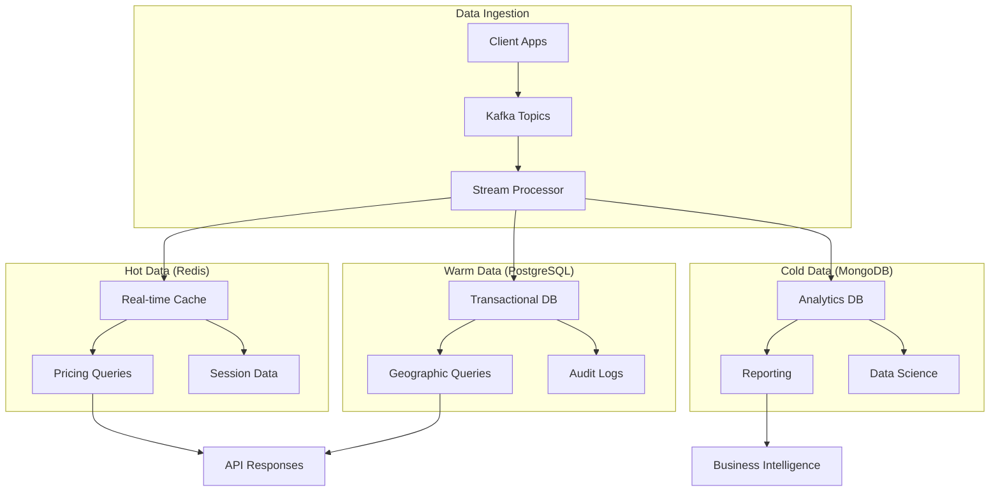

# Data Flow Architecture

## Overview
This document describes the data flow patterns and architecture for the Equilibrium Dynamic Pricing Platform, including real-time data processing, event streaming, and data synchronization across microservices.

## Data Flow Patterns

### 1. Real-Time Data Processing

#### Location Event Flow
```
Driver App → API Gateway → Auth Service → Geospatial Service → Stream Processor → Pricing Service
     ↓              ↓              ↓              ↓                ↓              ↓
  Location      Validation    JWT Token    S2 Cell        Supply/Demand    Price Update
  Update        & Routing     Validation   Calculation    Calculation      & Cache
     ↓              ↓              ↓              ↓                ↓              ↓
  WebSocket    Rate Limit    Session Mgmt Zone Mapping    State Update    Real-time
  Connection   & Auth        & RBAC        & Indexing      & Persistence   Notification
     ↓              ↓              ↓              ↓                ↓              ↓
  Real-time    Load Balance  User Context  Spatial Data   ML Pricing      i18n Service
  Updates      & Circuit     & Permissions Processing     Enhancement     Localization
```

#### Price Request Flow
```
Mobile App → API Gateway → Auth Service → Pricing Service → ML Service → Cache → Response
     ↓              ↓              ↓              ↓              ↓           ↓         ↓
  User Request   Auth & Rate    JWT Token    Price Calc   ML Prediction Redis    Price Quote
  (Pickup/Drop)  Limiting      Validation   Algorithm    Enhancement  Cache    & Metadata
     ↓              ↓              ↓              ↓              ↓           ↓         ↓
  Location Data  Validation    Session Mgmt Surge Multi   Confidence   Fast      WebSocket
  & Preferences  & Routing     & RBAC        Calculation   Scoring      Lookup    Update
     ↓              ↓              ↓              ↓              ↓           ↓         ↓
  i18n Context   Load Balance  User Context  Geospatial   Model Cache  TTL Mgmt  Notification
  Localization   & Circuit     & Permissions Processing   & Updates    & Invalidation Service
```

### 2. Event-Driven Architecture

#### Event Types
- **Location Events**: Driver location updates
- **Pricing Events**: Price changes and updates
- **User Events**: User actions and behaviors
- **System Events**: Service health and metrics

#### Event Flow
```
Event Source → Kafka Topic → Stream Processor → Event Handlers → Data Stores
     ↓              ↓              ↓                ↓              ↓
  Service        Partitioning   Event Processing   Business       Persistence
  Generation     & Ordering     & Transformation   Logic          & Indexing
     ↓              ↓              ↓                ↓              ↓
  Event Schema   Durability     State Management   Validation     Analytics
  Validation     & Replay       & Aggregation      & Routing      & Reporting
```

### 3. Data Synchronization

#### Cross-Service Data Sync
```
Service A → Event Bus → Service B → Service C
     ↓          ↓          ↓          ↓
  Data Change  Event      Event      Data
  Detection    Publishing Processing Update
     ↓          ↓          ↓          ↓
  Event        Message    Business   Cache
  Generation   Queue      Logic      Invalidation
     ↓          ↓          ↓          ↓
  Validation   Routing    State      Notification
  & Schema     & Delivery Update     & WebSocket
```

## Detailed Data Flows

### 1. Driver Location Update Flow

#### Step-by-Step Process
1. **Driver App** sends location update
2. **API Gateway** validates and routes request
3. **Geospatial Service** processes location data
4. **Stream Processor** calculates supply/demand
5. **Pricing Service** updates surge multipliers
6. **WebSocket Service** broadcasts updates
7. **Analytics Service** records metrics

#### Data Transformations
```python
# Raw location data
{
  "driver_id": "driver_123",
  "latitude": 37.7749,
  "longitude": -122.4194,
  "timestamp": "2025-01-16T10:00:00Z",
  "is_available": true
}

# After geospatial processing
{
  "driver_id": "driver_123",
  "s2_cell_id": "89c2594",
  "zone_id": "sf_downtown",
  "latitude": 37.7749,
  "longitude": -122.4194,
  "timestamp": "2025-01-16T10:00:00Z",
  "is_available": true
}

# After stream processing
{
  "zone_id": "sf_downtown",
  "supply_count": 15,
  "demand_count": 20,
  "surge_multiplier": 1.3,
  "timestamp": "2025-01-16T10:00:00Z"
}
```

### 2. Price Estimation Flow

#### Step-by-Step Process
1. **Mobile App** sends price request
2. **API Gateway** authenticates user
3. **Pricing Service** calculates base fare
4. **Geospatial Service** determines zone
5. **Cache** provides surge multiplier
6. **Pricing Service** calculates final fare
7. **Response** sent to client

#### Data Transformations
```python
# Price request
{
  "pickup_location": {"latitude": 37.7749, "longitude": -122.4194},
  "dropoff_location": {"latitude": 37.7849, "longitude": -122.4094},
  "vehicle_type": "standard",
  "user_id": "user_123"
}

# After processing
{
  "quote_id": "quote_abc123",
  "base_fare": 8.50,
  "surge_multiplier": 1.3,
  "final_fare": 11.05,
  "zone_info": {
    "zone_id": "sf_downtown",
    "demand_level": "high"
  }
}
```

### 3. Analytics Data Flow

#### Step-by-Step Process
1. **Services** generate events
2. **Event Bus** collects events
3. **Stream Processor** aggregates data
4. **Analytics Service** processes metrics
5. **MongoDB** stores analytics data
6. **API** serves analytics queries

#### Data Transformations
```python
# Raw event
{
  "event_type": "price_request",
  "user_id": "user_123",
  "zone_id": "sf_downtown",
  "timestamp": "2025-01-16T10:00:00Z"
}

# After aggregation
{
  "zone_id": "sf_downtown",
  "hour": "2025-01-16T10:00:00Z",
  "total_requests": 1250,
  "avg_surge_multiplier": 1.4,
  "unique_users": 890
}
```

## Data Storage Patterns

### 1. Polyglot Persistence

#### Service-Specific Databases
- **PostgreSQL + PostGIS**: Geospatial and transactional data
- **Redis**: Caching and session storage
- **MongoDB**: Analytics and document storage
- **Kafka**: Event streaming and message queuing

#### Data Partitioning
- **Geographic Partitioning**: By S2 cells or zones
- **Temporal Partitioning**: By time periods
- **User Partitioning**: By user ID ranges
- **Service Partitioning**: By service boundaries

### 2. Caching Strategy

#### Multi-Level Caching
```
Application Cache → Redis Cluster → Database
     ↓                ↓              ↓
  In-Memory        Distributed    Persistent
  Fast Access      High Availability  Storage
     ↓                ↓              ↓
  L1 Cache         L2 Cache        L3 Storage
  (Local)          (Shared)        (Persistent)
```

#### Cache Invalidation
- **Time-based**: TTL expiration
- **Event-based**: Cache invalidation on data changes
- **Version-based**: Cache versioning
- **Dependency-based**: Cache dependency tracking

### 3. Data Replication

#### Read Replicas
- **PostgreSQL**: Read replicas for analytics
- **MongoDB**: Replica sets for high availability
- **Redis**: Master-slave replication
- **Kafka**: Partition replication

#### Data Synchronization
- **Event-driven**: Real-time synchronization
- **Batch processing**: Periodic synchronization
- **Conflict resolution**: Last-write-wins or custom logic
- **Data consistency**: Eventual consistency model

## Real-Time Processing

### 1. Stream Processing Architecture

#### Apache Flink Processing
```python
# Stream processing pipeline
class LocationEventProcessor:
    def process_location_events(self, events):
        # 1. Parse and validate events
        validated_events = self.validate_events(events)
        
        # 2. Calculate S2 cells
        geocoded_events = self.calculate_s2_cells(validated_events)
        
        # 3. Update supply/demand state
        state_updates = self.update_supply_demand(geocoded_events)
        
        # 4. Calculate surge multipliers
        pricing_updates = self.calculate_surge_multipliers(state_updates)
        
        # 5. Emit pricing events
        self.emit_pricing_events(pricing_updates)
```

#### Window Operations
- **Tumbling Windows**: Fixed-size time windows
- **Sliding Windows**: Overlapping time windows
- **Session Windows**: Activity-based windows
- **Global Windows**: Unbounded processing

### 2. Event Sourcing

#### Event Store
```python
# Event structure
{
  "event_id": "evt_123",
  "event_type": "location_updated",
  "aggregate_id": "driver_123",
  "event_data": {...},
  "timestamp": "2025-01-16T10:00:00Z",
  "version": 1
}
```

#### Event Replay
- **Full Replay**: Rebuild state from all events
- **Incremental Replay**: Replay from checkpoint
- **Selective Replay**: Replay specific event types
- **Time-based Replay**: Replay from specific time

### 3. CQRS (Command Query Responsibility Segregation)

#### Command Side
- **Write Operations**: Create, update, delete
- **Event Sourcing**: Store events
- **Validation**: Business rule validation
- **Optimistic Locking**: Concurrency control

#### Query Side
- **Read Operations**: Query and search
- **Projections**: Denormalized views
- **Caching**: Query result caching
- **Materialized Views**: Pre-computed results

## Data Quality and Governance

### 1. Data Validation

#### Schema Validation
- **JSON Schema**: API request/response validation
- **Database Constraints**: Data integrity constraints
- **Business Rules**: Custom validation logic
- **Data Types**: Type checking and conversion

#### Data Quality Checks
- **Completeness**: Required field validation
- **Accuracy**: Data accuracy verification
- **Consistency**: Cross-service data consistency
- **Timeliness**: Data freshness checks

### 2. Data Lineage

#### Tracking Data Flow
- **Event Tracing**: Track event propagation
- **Data Lineage**: Track data transformations
- **Audit Trail**: Complete audit history
- **Impact Analysis**: Change impact assessment

#### Metadata Management
- **Schema Registry**: Centralized schema management
- **Data Catalog**: Data asset discovery
- **Lineage Tracking**: Data flow visualization
- **Quality Metrics**: Data quality monitoring

### 3. Data Security

#### Data Protection
- **Encryption**: Data encryption at rest and in transit
- **Access Control**: Role-based access control
- **Data Masking**: Sensitive data protection
- **Audit Logging**: Security event logging

#### Privacy Compliance
- **GDPR Compliance**: European data protection
- **CCPA Compliance**: California privacy law
- **Data Retention**: Automated data lifecycle
- **Right to Erasure**: Data deletion capabilities

## Performance Optimization

### 1. Data Processing Optimization

#### Batch Processing
- **Micro-batching**: Small batch processing
- **Parallel Processing**: Multi-threaded processing
- **Resource Optimization**: CPU and memory optimization
- **Pipeline Optimization**: Processing pipeline tuning

#### Real-Time Processing
- **Low Latency**: Sub-millisecond processing
- **High Throughput**: Millions of events per second
- **Backpressure Handling**: Flow control mechanisms
- **Fault Tolerance**: Error handling and recovery

### 2. Storage Optimization

#### Database Optimization
- **Indexing**: Strategic index creation
- **Partitioning**: Data partitioning strategies
- **Compression**: Data compression techniques
- **Archiving**: Historical data management

#### Cache Optimization
- **Cache Warming**: Proactive cache population
- **Cache Coherence**: Cache consistency management
- **Memory Management**: Cache memory optimization
- **Hit Ratio Optimization**: Cache hit ratio improvement

## Monitoring and Observability

### 1. Data Flow Monitoring

#### Metrics Collection
- **Throughput**: Events per second
- **Latency**: End-to-end processing time
- **Error Rate**: Processing error percentage
- **Backpressure**: Queue depth monitoring

#### Alerting
- **Threshold-based**: Metric threshold alerts
- **Anomaly Detection**: Unusual pattern detection
- **Business Logic**: Custom business alerts
- **Escalation**: Alert escalation procedures

### 2. Data Quality Monitoring

#### Quality Metrics
- **Data Completeness**: Missing data percentage
- **Data Accuracy**: Data accuracy scores
- **Data Freshness**: Data age monitoring
- **Schema Compliance**: Schema validation rates

#### Quality Dashboards
- **Real-time Monitoring**: Live quality metrics
- **Historical Trends**: Quality trend analysis
- **Alert Management**: Quality alert handling
- **Reporting**: Quality report generation

## Data Model and Storage

### Core Entity Schemas

#### 1. SurgeZone Schema

```sql
-- PostgreSQL + PostGIS Schema
CREATE TABLE surge_zones (
    zone_id VARCHAR(50) PRIMARY KEY,
    zone_name VARCHAR(100) NOT NULL,
    city VARCHAR(50) NOT NULL,
    country VARCHAR(50) NOT NULL,
    zone_type VARCHAR(20) NOT NULL CHECK (zone_type IN ('downtown', 'airport', 'stadium', 'residential', 'commercial')),
    
    -- Geographic boundaries using PostGIS
    boundary GEOMETRY(POLYGON, 4326) NOT NULL,
    center_point GEOMETRY(POINT, 4326) NOT NULL,
    s2_cell_ids TEXT[] NOT NULL, -- Array of S2 cell IDs covering the zone
    
    -- Pricing configuration
    base_fare DECIMAL(10,2) NOT NULL DEFAULT 0.00,
    minimum_fare DECIMAL(10,2) NOT NULL DEFAULT 0.00,
    maximum_surge_multiplier DECIMAL(4,2) NOT NULL DEFAULT 5.00,
    surge_algorithm VARCHAR(50) NOT NULL DEFAULT 'standard',
    
    -- Operational settings
    is_active BOOLEAN NOT NULL DEFAULT true,
    priority INTEGER NOT NULL DEFAULT 0,
    time_zone VARCHAR(50) NOT NULL DEFAULT 'UTC',
    
    -- Metadata
    created_at TIMESTAMP WITH TIME ZONE NOT NULL DEFAULT NOW(),
    updated_at TIMESTAMP WITH TIME ZONE NOT NULL DEFAULT NOW(),
    created_by VARCHAR(50) NOT NULL,
    updated_by VARCHAR(50) NOT NULL,
    
    -- Indexes
    CONSTRAINT valid_base_fare CHECK (base_fare >= 0),
    CONSTRAINT valid_minimum_fare CHECK (minimum_fare >= 0),
    CONSTRAINT valid_max_surge CHECK (maximum_surge_multiplier >= 1.0 AND maximum_surge_multiplier <= 10.0)
);

-- Spatial indexes for geographic queries
CREATE INDEX idx_surge_zones_boundary ON surge_zones USING GIST (boundary);
CREATE INDEX idx_surge_zones_center ON surge_zones USING GIST (center_point);
CREATE INDEX idx_surge_zones_s2_cells ON surge_zones USING GIN (s2_cell_ids);
CREATE INDEX idx_surge_zones_active ON surge_zones (is_active, priority);
```

```json
// MongoDB Document Schema for SurgeZone
{
  "_id": "sf_downtown_001",
  "zoneId": "sf_downtown_001",
  "zoneName": "San Francisco Downtown",
  "city": "San Francisco",
  "country": "USA",
  "zoneType": "downtown",
  
  "geography": {
    "boundary": {
      "type": "Polygon",
      "coordinates": [[[-122.4194, 37.7749], [-122.4094, 37.7849], ...]]
    },
    "centerPoint": {
      "type": "Point",
      "coordinates": [-122.4194, 37.7749]
    },
    "s2CellIds": ["89c2594", "89c2595", "89c2596"],
    "areaKm2": 2.5
  },
  
  "pricing": {
    "baseFare": 8.50,
    "minimumFare": 5.00,
    "maximumSurgeMultiplier": 5.00,
    "surgeAlgorithm": "ml_enhanced",
    "timeBasedMultipliers": {
      "rush_hour": 1.5,
      "night_time": 1.2,
      "weekend": 1.3
    }
  },
  
  "operational": {
    "isActive": true,
    "priority": 1,
    "timeZone": "America/Los_Angeles",
    "operatingHours": {
      "start": "06:00",
      "end": "23:00"
    }
  },
  
  "metadata": {
    "createdAt": "2025-01-16T10:00:00Z",
    "updatedAt": "2025-01-16T10:00:00Z",
    "createdBy": "system",
    "updatedBy": "admin",
    "version": 1
  }
}
```

#### 2. DriverLocationEvent Schema

```sql
-- PostgreSQL Schema for Driver Location Events
CREATE TABLE driver_location_events (
    event_id UUID PRIMARY KEY DEFAULT gen_random_uuid(),
    driver_id VARCHAR(50) NOT NULL,
    session_id VARCHAR(100) NOT NULL,
    
    -- Location data
    latitude DECIMAL(10, 8) NOT NULL,
    longitude DECIMAL(11, 8) NOT NULL,
    altitude DECIMAL(8, 2),
    accuracy DECIMAL(8, 2),
    heading DECIMAL(5, 2),
    speed DECIMAL(6, 2),
    
    -- Geographic processing
    s2_cell_id VARCHAR(20) NOT NULL,
    zone_id VARCHAR(50),
    geohash VARCHAR(12),
    
    -- Driver status
    is_available BOOLEAN NOT NULL DEFAULT false,
    is_online BOOLEAN NOT NULL DEFAULT false,
    vehicle_type VARCHAR(20) NOT NULL,
    driver_rating DECIMAL(3, 2),
    
    -- Event metadata
    event_type VARCHAR(20) NOT NULL CHECK (event_type IN ('location_update', 'status_change', 'heartbeat')),
    event_source VARCHAR(20) NOT NULL CHECK (event_source IN ('mobile_app', 'gps_device', 'manual')),
    timestamp TIMESTAMP WITH TIME ZONE NOT NULL DEFAULT NOW(),
    received_at TIMESTAMP WITH TIME ZONE NOT NULL DEFAULT NOW(),
    
    -- Processing status
    is_processed BOOLEAN NOT NULL DEFAULT false,
    processing_errors TEXT[],
    
    -- Indexes
    CONSTRAINT valid_latitude CHECK (latitude >= -90 AND latitude <= 90),
    CONSTRAINT valid_longitude CHECK (longitude >= -180 AND longitude <= 180),
    CONSTRAINT valid_rating CHECK (driver_rating >= 0 AND driver_rating <= 5)
);

-- Indexes for efficient querying
CREATE INDEX idx_driver_location_driver_id ON driver_location_events (driver_id, timestamp DESC);
CREATE INDEX idx_driver_location_zone_id ON driver_location_events (zone_id, timestamp DESC);
CREATE INDEX idx_driver_location_s2_cell ON driver_location_events (s2_cell_id, timestamp DESC);
CREATE INDEX idx_driver_location_available ON driver_location_events (is_available, zone_id, timestamp DESC);
CREATE INDEX idx_driver_location_processed ON driver_location_events (is_processed, timestamp DESC);
```

```json
// Kafka Event Schema for DriverLocationEvent
{
  "eventId": "evt_driver_loc_123456789",
  "eventType": "driver_location_update",
  "eventVersion": "1.0",
  "timestamp": "2025-01-16T10:00:00.123Z",
  "receivedAt": "2025-01-16T10:00:00.125Z",
  
  "driver": {
    "driverId": "driver_12345",
    "sessionId": "session_abc123",
    "vehicleType": "standard",
    "driverRating": 4.8,
    "isAvailable": true,
    "isOnline": true
  },
  
  "location": {
    "latitude": 37.7749,
    "longitude": -122.4194,
    "altitude": 15.5,
    "accuracy": 5.0,
    "heading": 45.0,
    "speed": 25.5
  },
  
  "geography": {
    "s2CellId": "89c2594",
    "zoneId": "sf_downtown_001",
    "geohash": "9q8yyk",
    "address": "123 Market St, San Francisco, CA"
  },
  
  "metadata": {
    "eventSource": "mobile_app",
    "appVersion": "2.1.0",
    "deviceId": "device_xyz789",
    "batteryLevel": 85,
    "networkType": "4G"
  },
  
  "processing": {
    "isProcessed": false,
    "processingErrors": [],
    "retryCount": 0
  }
}
```

#### 3. SupplyDemandSnapshot Schema

```sql
-- PostgreSQL Schema for Supply/Demand Snapshots
CREATE TABLE supply_demand_snapshots (
    snapshot_id UUID PRIMARY KEY DEFAULT gen_random_uuid(),
    zone_id VARCHAR(50) NOT NULL,
    snapshot_time TIMESTAMP WITH TIME ZONE NOT NULL,
    
    -- Supply metrics
    total_drivers INTEGER NOT NULL DEFAULT 0,
    available_drivers INTEGER NOT NULL DEFAULT 0,
    busy_drivers INTEGER NOT NULL DEFAULT 0,
    offline_drivers INTEGER NOT NULL DEFAULT 0,
    
    -- Demand metrics
    active_requests INTEGER NOT NULL DEFAULT 0,
    pending_requests INTEGER NOT NULL DEFAULT 0,
    completed_requests INTEGER NOT NULL DEFAULT 0,
    cancelled_requests INTEGER NOT NULL DEFAULT 0,
    
    -- Calculated metrics
    supply_demand_ratio DECIMAL(8, 4),
    surge_multiplier DECIMAL(4, 2) NOT NULL DEFAULT 1.00,
    demand_intensity VARCHAR(20) NOT NULL DEFAULT 'normal',
    supply_availability VARCHAR(20) NOT NULL DEFAULT 'normal',
    
    -- Time-based context
    hour_of_day INTEGER NOT NULL,
    day_of_week INTEGER NOT NULL,
    is_weekend BOOLEAN NOT NULL DEFAULT false,
    is_holiday BOOLEAN NOT NULL DEFAULT false,
    season VARCHAR(20),
    
    -- Weather context (if available)
    weather_condition VARCHAR(50),
    temperature DECIMAL(5, 2),
    precipitation_probability DECIMAL(5, 2),
    
    -- ML predictions
    predicted_demand INTEGER,
    predicted_supply INTEGER,
    confidence_score DECIMAL(3, 2),
    
    -- Metadata
    created_at TIMESTAMP WITH TIME ZONE NOT NULL DEFAULT NOW(),
    data_quality_score DECIMAL(3, 2) NOT NULL DEFAULT 1.00,
    
    -- Constraints
    CONSTRAINT valid_surge_multiplier CHECK (surge_multiplier >= 1.0 AND surge_multiplier <= 10.0),
    CONSTRAINT valid_hour CHECK (hour_of_day >= 0 AND hour_of_day <= 23),
    CONSTRAINT valid_day CHECK (day_of_week >= 0 AND day_of_week <= 6),
    CONSTRAINT valid_confidence CHECK (confidence_score >= 0.0 AND confidence_score <= 1.0)
);

-- Indexes for time-series queries
CREATE INDEX idx_supply_demand_zone_time ON supply_demand_snapshots (zone_id, snapshot_time DESC);
CREATE INDEX idx_supply_demand_time ON supply_demand_snapshots (snapshot_time DESC);
CREATE INDEX idx_supply_demand_surge ON supply_demand_snapshots (surge_multiplier, snapshot_time DESC);
CREATE INDEX idx_supply_demand_hour ON supply_demand_snapshots (hour_of_day, day_of_week);
```

```json
// Redis Cache Schema for SupplyDemandSnapshot
{
  "key": "supply_demand:sf_downtown_001:2025-01-16T10:00:00Z",
  "ttl": 300, // 5 minutes
  
  "zoneId": "sf_downtown_001",
  "snapshotTime": "2025-01-16T10:00:00Z",
  
  "supply": {
    "totalDrivers": 45,
    "availableDrivers": 32,
    "busyDrivers": 13,
    "offlineDrivers": 0,
    "averageResponseTime": 2.5,
    "averageDistance": 0.8
  },
  
  "demand": {
    "activeRequests": 28,
    "pendingRequests": 15,
    "completedRequests": 156,
    "cancelledRequests": 8,
    "averageWaitTime": 3.2,
    "peakDemandPeriod": "10:00-11:00"
  },
  
  "metrics": {
    "supplyDemandRatio": 1.14,
    "surgeMultiplier": 1.3,
    "demandIntensity": "high",
    "supplyAvailability": "normal",
    "marketEfficiency": 0.85
  },
  
  "context": {
    "hourOfDay": 10,
    "dayOfWeek": 1, // Monday
    "isWeekend": false,
    "isHoliday": false,
    "season": "winter",
    "weatherCondition": "clear",
    "temperature": 18.5,
    "precipitationProbability": 0.1
  },
  
  "predictions": {
    "predictedDemand": 35,
    "predictedSupply": 38,
    "confidenceScore": 0.87,
    "nextHourSurge": 1.4,
    "trendDirection": "increasing"
  },
  
  "metadata": {
    "dataQualityScore": 0.95,
    "lastUpdated": "2025-01-16T10:00:00Z",
    "source": "stream_processor",
    "version": 1
  }
}
```

#### 4. PricingEventLog Schema

```sql
-- PostgreSQL Schema for Pricing Event Logs
CREATE TABLE pricing_event_logs (
    log_id UUID PRIMARY KEY DEFAULT gen_random_uuid(),
    event_id VARCHAR(100) NOT NULL UNIQUE,
    event_type VARCHAR(50) NOT NULL,
    
    -- Request context
    user_id VARCHAR(50),
    driver_id VARCHAR(50),
    quote_id VARCHAR(100),
    session_id VARCHAR(100),
    
    -- Location context
    pickup_zone_id VARCHAR(50),
    dropoff_zone_id VARCHAR(50),
    pickup_latitude DECIMAL(10, 8),
    pickup_longitude DECIMAL(11, 8),
    dropoff_latitude DECIMAL(10, 8),
    dropoff_longitude DECIMAL(11, 8),
    distance_km DECIMAL(8, 3),
    estimated_duration_minutes INTEGER,
    
    -- Pricing details
    base_fare DECIMAL(10, 2) NOT NULL,
    surge_multiplier DECIMAL(4, 2) NOT NULL,
    final_fare DECIMAL(10, 2) NOT NULL,
    currency VARCHAR(3) NOT NULL DEFAULT 'USD',
    
    -- Pricing factors
    demand_factor DECIMAL(4, 2),
    supply_factor DECIMAL(4, 2),
    time_factor DECIMAL(4, 2),
    weather_factor DECIMAL(4, 2),
    traffic_factor DECIMAL(4, 2),
    ml_prediction_factor DECIMAL(4, 2),
    
    -- Event outcome
    event_status VARCHAR(20) NOT NULL CHECK (event_status IN ('requested', 'quoted', 'accepted', 'completed', 'cancelled', 'expired')),
    response_time_ms INTEGER,
    processing_time_ms INTEGER,
    
    -- Business context
    vehicle_type VARCHAR(20) NOT NULL,
    service_type VARCHAR(20) NOT NULL,
    is_surge_active BOOLEAN NOT NULL DEFAULT false,
    surge_reason VARCHAR(100),
    
    -- Timestamps
    event_timestamp TIMESTAMP WITH TIME ZONE NOT NULL,
    quote_expires_at TIMESTAMP WITH TIME ZONE,
    created_at TIMESTAMP WITH TIME ZONE NOT NULL DEFAULT NOW(),
    
    -- Metadata
    api_version VARCHAR(10),
    client_app_version VARCHAR(20),
    request_source VARCHAR(20),
    error_message TEXT,
    
    -- Indexes
    CONSTRAINT valid_base_fare CHECK (base_fare >= 0),
    CONSTRAINT valid_surge_multiplier CHECK (surge_multiplier >= 1.0),
    CONSTRAINT valid_final_fare CHECK (final_fare >= 0),
    CONSTRAINT valid_response_time CHECK (response_time_ms >= 0)
);

-- Indexes for analytics and monitoring
CREATE INDEX idx_pricing_logs_event_type ON pricing_event_logs (event_type, event_timestamp DESC);
CREATE INDEX idx_pricing_logs_user_id ON pricing_event_logs (user_id, event_timestamp DESC);
CREATE INDEX idx_pricing_logs_zone_id ON pricing_event_logs (pickup_zone_id, event_timestamp DESC);
CREATE INDEX idx_pricing_logs_surge ON pricing_event_logs (is_surge_active, surge_multiplier, event_timestamp DESC);
CREATE INDEX idx_pricing_logs_status ON pricing_event_logs (event_status, event_timestamp DESC);
CREATE INDEX idx_pricing_logs_timestamp ON pricing_event_logs (event_timestamp DESC);
```

```json
// MongoDB Document Schema for PricingEventLog
{
  "_id": "pricing_log_123456789",
  "eventId": "evt_pricing_123456789",
  "eventType": "price_quote_generated",
  "eventVersion": "1.0",
  "timestamp": "2025-01-16T10:00:00Z",
  
  "request": {
    "userId": "user_12345",
    "driverId": null,
    "quoteId": "quote_abc123",
    "sessionId": "session_xyz789",
    "requestSource": "mobile_app",
    "apiVersion": "v1.2",
    "clientAppVersion": "2.1.0"
  },
  
  "location": {
    "pickup": {
      "zoneId": "sf_downtown_001",
      "latitude": 37.7749,
      "longitude": -122.4194,
      "address": "123 Market St, San Francisco, CA"
    },
    "dropoff": {
      "zoneId": "sf_mission_001",
      "latitude": 37.7849,
      "longitude": -122.4094,
      "address": "456 Mission St, San Francisco, CA"
    },
    "distanceKm": 2.3,
    "estimatedDurationMinutes": 8
  },
  
  "pricing": {
    "baseFare": 8.50,
    "surgeMultiplier": 1.3,
    "finalFare": 11.05,
    "currency": "USD",
    "breakdown": {
      "baseFare": 8.50,
      "surgeAmount": 2.55,
      "taxes": 0.00,
      "fees": 0.00
    }
  },
  
  "factors": {
    "demandFactor": 1.2,
    "supplyFactor": 0.9,
    "timeFactor": 1.1,
    "weatherFactor": 1.0,
    "trafficFactor": 1.1,
    "mlPredictionFactor": 1.15,
    "totalFactor": 1.3
  },
  
  "outcome": {
    "eventStatus": "quoted",
    "responseTimeMs": 45,
    "processingTimeMs": 12,
    "quoteExpiresAt": "2025-01-16T10:00:30Z",
    "errorMessage": null
  },
  
  "business": {
    "vehicleType": "standard",
    "serviceType": "ride",
    "isSurgeActive": true,
    "surgeReason": "high_demand_rush_hour",
    "marketConditions": {
      "demandLevel": "high",
      "supplyLevel": "normal",
      "competitionLevel": "medium"
    }
  },
  
  "metadata": {
    "createdAt": "2025-01-16T10:00:00Z",
    "dataQualityScore": 0.98,
    "processingNode": "pricing-service-01",
    "correlationId": "corr_abc123"
  }
}
```

### Database Technology Justification

#### SQL vs NoSQL vs Streaming Platforms

##### 1. **PostgreSQL + PostGIS (SQL)**

**Use Cases:**
- SurgeZone boundaries and geographic data
- DriverLocationEvent transactional data
- SupplyDemandSnapshot time-series data
- PricingEventLog audit and compliance data

**Justification:**
- **ACID Compliance**: Critical for financial transactions and pricing accuracy
- **Spatial Extensions**: PostGIS provides advanced geographic querying capabilities
- **Complex Queries**: Support for complex joins and aggregations
- **Data Integrity**: Strong consistency guarantees for pricing data
- **Mature Ecosystem**: Proven reliability and extensive tooling

**Schema Benefits:**
```sql
-- Example: Complex geographic query with PostGIS
SELECT z.zone_id, z.zone_name, z.surge_multiplier
FROM surge_zones z
WHERE ST_Contains(z.boundary, ST_Point($1, $2))
  AND z.is_active = true
  AND z.zone_type = 'downtown'
ORDER BY z.priority;
```

##### 2. **MongoDB (NoSQL)**

**Use Cases:**
- Analytics and reporting data
- Flexible document storage for complex nested data
- Rapid prototyping and schema evolution
- Event sourcing and audit logs

**Justification:**
- **Schema Flexibility**: Easy to evolve schemas as requirements change
- **Document Storage**: Natural fit for JSON-like event data
- **Horizontal Scaling**: Built-in sharding for large datasets
- **Aggregation Pipeline**: Powerful analytics capabilities
- **Developer Productivity**: Fast development and iteration

**Schema Benefits:**
```javascript
// Example: Complex aggregation for analytics
db.pricing_event_logs.aggregate([
  {
    $match: {
      "timestamp": { $gte: ISODate("2025-01-16T00:00:00Z") },
      "eventStatus": "completed"
    }
  },
  {
    $group: {
      "_id": {
        "zoneId": "$location.pickup.zoneId",
        "hour": { $hour: "$timestamp" }
      },
      "totalFares": { $sum: "$pricing.finalFare" },
      "avgSurgeMultiplier": { $avg: "$pricing.surgeMultiplier" },
      "rideCount": { $sum: 1 }
    }
  }
]);
```

##### 3. **Redis (In-Memory Cache)**

**Use Cases:**
- Real-time pricing data caching
- Session management
- Rate limiting counters
- Temporary data storage

**Justification:**
- **Ultra-Low Latency**: Sub-millisecond response times
- **High Throughput**: Millions of operations per second
- **Data Structures**: Rich data types (hashes, sets, sorted sets)
- **Pub/Sub**: Real-time messaging capabilities
- **Persistence Options**: Configurable durability

**Schema Benefits:**
```redis
# Example: Cached pricing data with TTL
HSET pricing:sf_downtown_001:current 
  surge_multiplier 1.3 
  available_drivers 32 
  active_requests 28 
  last_updated "2025-01-16T10:00:00Z"
EXPIRE pricing:sf_downtown_001:current 300
```

##### 4. **Apache Kafka (Streaming Platform)**

**Use Cases:**
- Real-time event streaming
- Event sourcing
- Microservices communication
- Data pipeline integration

**Justification:**
- **High Throughput**: Millions of events per second
- **Durability**: Persistent, fault-tolerant message storage
- **Scalability**: Horizontal scaling with partitioning
- **Real-time Processing**: Low-latency event processing
- **Integration**: Connects with various data systems

**Schema Benefits:**
```json
// Example: Event schema with versioning
{
  "schema": {
    "type": "struct",
    "fields": [
      {"field": "eventId", "type": "string"},
      {"field": "eventType", "type": "string"},
      {"field": "timestamp", "type": "int64"},
      {"field": "data", "type": "struct"}
    ]
  }
}
```

#### Combination of Different Storage Technologies

##### **Polyglot Persistence Strategy**



##### **Data Flow Strategy**

1. **Write Path:**
   - Events → Kafka → Stream Processor → Multiple Databases
   - Real-time updates → Redis (hot data)
   - Transactional data → PostgreSQL (warm data)
   - Analytics data → MongoDB (cold data)

2. **Read Path:**
   - Real-time queries → Redis (sub-millisecond)
   - Complex queries → PostgreSQL (milliseconds)
   - Analytics queries → MongoDB (seconds)

3. **Data Synchronization:**
   - Event-driven updates across all stores
   - Cache invalidation strategies
   - Eventual consistency model

##### **Technology Selection Matrix**

| Data Type | Primary Store | Secondary Store | Justification |
|-----------|---------------|-----------------|---------------|
| **Real-time Pricing** | Redis | PostgreSQL | Speed + Durability |
| **Geographic Data** | PostgreSQL | Redis | Spatial queries + Cache |
| **Event Logs** | Kafka | MongoDB | Streaming + Analytics |
| **User Sessions** | Redis | PostgreSQL | Speed + Persistence |
| **Analytics** | MongoDB | PostgreSQL | Flexibility + Structure |
| **Audit Trails** | PostgreSQL | Kafka | Compliance + Streaming |

This polyglot persistence approach ensures optimal performance for each use case while maintaining data consistency and system reliability across the Equilibrium Dynamic Pricing Platform.

This data flow architecture ensures efficient, scalable, and reliable data processing across the Equilibrium platform, supporting real-time dynamic pricing with high availability and performance.

---

## 📞 Contact Information

**Project Owner & Developer:**
- **Email**: minh.nguyenkhac1983@gmail.com
- **Phone**: +84 837873388
- **Project**: Equilibrium Dynamic Pricing Platform

For technical support, data flow architecture questions, or collaboration inquiries, please contact the project owner directly.
