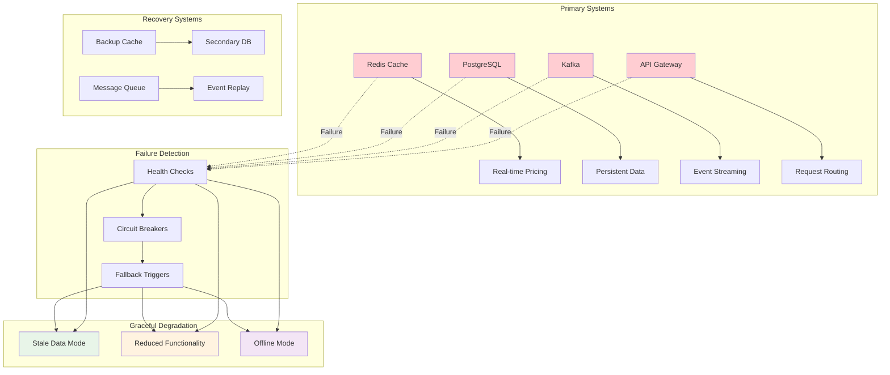

# Failure Handling & Graceful Degradation

## Overview

This document outlines the comprehensive failure handling and graceful degradation strategies for the Equilibrium Dynamic Pricing Platform, ensuring system resilience when primary components become unavailable.

## Architecture Diagram



## Failure Scenarios & Responses

### 1. Redis Cache Failure

#### Scenario
Primary Redis cache becomes unavailable, affecting real-time pricing data.

#### Detection
```python
import redis
import time
from typing import Dict, Any
from datetime import datetime, timedelta

class RedisFailureDetector:
    def __init__(self, redis_client: redis.Redis):
        self.redis_client = redis_client
        self.failure_threshold = 3
        self.failure_count = 0
        self.last_failure_time = None
        self.fallback_mode = False
    
    def check_redis_health(self) -> Dict[str, Any]:
        """Check Redis connectivity and performance"""
        try:
            start_time = time.time()
            
            # Test basic operations
            self.redis_client.ping()
            self.redis_client.set("health_check", "ok", ex=10)
            value = self.redis_client.get("health_check")
            
            response_time = (time.time() - start_time) * 1000
            
            if response_time > 100:  # More than 100ms
                return {
                    "status": "degraded",
                    "response_time_ms": response_time,
                    "message": "High latency detected"
                }
            
            # Reset failure count on success
            self.failure_count = 0
            self.fallback_mode = False
            
            return {
                "status": "healthy",
                "response_time_ms": response_time,
                "message": "Redis is healthy"
            }
            
        except Exception as e:
            self.failure_count += 1
            self.last_failure_time = datetime.now()
            
            if self.failure_count >= self.failure_threshold:
                self.fallback_mode = True
                return {
                    "status": "failed",
                    "error": str(e),
                    "fallback_mode": True,
                    "failure_count": self.failure_count
                }
            
            return {
                "status": "unhealthy",
                "error": str(e),
                "failure_count": self.failure_count
            }
```

#### Graceful Degradation
```python
class PricingServiceWithFallback:
    def __init__(self, redis_client, postgres_client):
        self.redis_client = redis_client
        self.postgres_client = postgres_client
        self.failure_detector = RedisFailureDetector(redis_client)
        self.stale_data_cache = {}
        self.last_db_fetch = {}
    
    async def get_pricing_data(self, zone_id: str) -> Dict[str, Any]:
        """Get pricing data with fallback to stale data"""
        health_status = self.failure_detector.check_redis_health()
        
        if health_status["status"] == "healthy":
            # Normal operation - get from Redis
            return await self._get_from_redis(zone_id)
        
        elif health_status["status"] == "degraded":
            # High latency - try Redis with timeout, fallback to DB
            return await self._get_with_timeout_fallback(zone_id)
        
        else:
            # Redis failed - use stale data or database
            return await self._get_fallback_data(zone_id)
    
    async def _get_from_redis(self, zone_id: str) -> Dict[str, Any]:
        """Get fresh data from Redis"""
        try:
            data = await self.redis_client.hgetall(f"pricing:{zone_id}")
            if data:
                return {
                    "data": data,
                    "source": "redis",
                    "freshness": "real-time",
                    "timestamp": datetime.now().isoformat()
                }
        except Exception as e:
            logger.error(f"Redis fetch failed: {e}")
            raise
    
    async def _get_with_timeout_fallback(self, zone_id: str) -> Dict[str, Any]:
        """Get data with timeout, fallback to database"""
        try:
            # Try Redis with short timeout
            data = await asyncio.wait_for(
                self._get_from_redis(zone_id), 
                timeout=0.1  # 100ms timeout
            )
            return data
        except asyncio.TimeoutError:
            logger.warning(f"Redis timeout for zone {zone_id}, using fallback")
            return await self._get_fallback_data(zone_id)
    
    async def _get_fallback_data(self, zone_id: str) -> Dict[str, Any]:
        """Get fallback data from database or stale cache"""
        # First, try to get from database
        try:
            db_data = await self._get_from_database(zone_id)
            if db_data:
                return {
                    "data": db_data,
                    "source": "database",
                    "freshness": "stale",
                    "timestamp": db_data.get("updated_at"),
                    "fallback_reason": "redis_unavailable"
                }
        except Exception as e:
            logger.error(f"Database fetch failed: {e}")
        
        # Last resort - use stale cache
        if zone_id in self.stale_data_cache:
            stale_data = self.stale_data_cache[zone_id]
            return {
                "data": stale_data,
                "source": "stale_cache",
                "freshness": "very_stale",
                "timestamp": stale_data.get("cached_at"),
                "fallback_reason": "all_systems_unavailable"
            }
        
        # Ultimate fallback - default pricing
        return self._get_default_pricing(zone_id)
    
    async def _get_from_database(self, zone_id: str) -> Dict[str, Any]:
        """Get pricing data from PostgreSQL"""
        try:
            query = """
            SELECT zone_id, base_fare, current_multiplier, supply_count, 
                   demand_count, last_updated
            FROM current_zone_status 
            WHERE zone_id = $1
            """
            
            result = await self.postgres_client.fetchrow(query, zone_id)
            if result:
                # Update stale cache for future use
                self.stale_data_cache[zone_id] = {
                    "base_fare": float(result["base_fare"]),
                    "surge_multiplier": float(result["current_multiplier"]),
                    "supply_count": result["supply_count"],
                    "demand_count": result["demand_count"],
                    "cached_at": result["last_updated"].isoformat()
                }
                
                return dict(result)
            
            return None
            
        except Exception as e:
            logger.error(f"Database query failed: {e}")
            raise
    
    def _get_default_pricing(self, zone_id: str) -> Dict[str, Any]:
        """Get default pricing when all systems fail"""
        return {
            "data": {
                "zone_id": zone_id,
                "base_fare": 12.50,
                "surge_multiplier": 1.0,
                "supply_count": 0,
                "demand_count": 0,
                "confidence": 0.1
            },
            "source": "default",
            "freshness": "default",
            "timestamp": datetime.now().isoformat(),
            "fallback_reason": "all_systems_failed",
            "warning": "Using default pricing - system degraded"
        }
```

### 2. Database Connection Failure

#### Scenario
PostgreSQL becomes unavailable, affecting persistent data operations.

#### Detection & Fallback
```python
import asyncpg
import json
from typing import Dict, List, Any

class DatabaseFailureHandler:
    def __init__(self, primary_db: asyncpg.Pool, backup_db: asyncpg.Pool = None):
        self.primary_db = primary_db
        self.backup_db = backup_db
        self.primary_failed = False
        self.failure_time = None
        self.retry_count = 0
        self.max_retries = 3
    
    async def execute_with_fallback(self, query: str, *args) -> Any:
        """Execute query with database failover"""
        if not self.primary_failed:
            try:
                # Try primary database
                result = await self.primary_db.fetch(query, *args)
                self.retry_count = 0  # Reset on success
                return result
            except Exception as e:
                logger.error(f"Primary database failed: {e}")
                self.primary_failed = True
                self.failure_time = datetime.now()
                self.retry_count += 1
        
        # Use backup database if available
        if self.backup_db:
            try:
                logger.info("Using backup database")
                result = await self.backup_db.fetch(query, *args)
                return result
            except Exception as e:
                logger.error(f"Backup database also failed: {e}")
        
        # Try to reconnect to primary
        if self.retry_count < self.max_retries:
            try:
                await self.primary_db.close()
                # Recreate connection pool
                self.primary_db = await asyncpg.create_pool(
                    host="localhost",
                    port=5432,
                    database="equilibrium",
                    user="equilibrium",
                    password="equilibrium123",
                    min_size=1,
                    max_size=10
                )
                self.primary_failed = False
                logger.info("Primary database reconnected")
                return await self.execute_with_fallback(query, *args)
            except Exception as e:
                logger.error(f"Failed to reconnect to primary: {e}")
        
        # Ultimate fallback - return cached data or defaults
        return await self._get_cached_or_default_data(query, *args)
    
    async def _get_cached_or_default_data(self, query: str, *args) -> List[Dict]:
        """Get cached data or return defaults when all databases fail"""
        # This would typically query a local cache or return sensible defaults
        if "surge_zones" in query:
            return [{
                "zone_id": "default_zone",
                "base_fare": 12.50,
                "current_multiplier": 1.0,
                "supply_count": 5,
                "demand_count": 3,
                "is_fallback": True
            }]
        
        return []
```

### 3. Kafka Streaming Failure

#### Scenario
Kafka becomes unavailable, affecting real-time event processing.

#### Graceful Degradation
```python
import json
from typing import Dict, List
from dataclasses import dataclass
import asyncio

@dataclass
class EventBuffer:
    events: List[Dict]
    max_size: int = 10000
    max_age_seconds: int = 300  # 5 minutes

class KafkaFailureHandler:
    def __init__(self, kafka_producer, event_buffer: EventBuffer):
        self.kafka_producer = kafka_producer
        self.event_buffer = event_buffer
        self.kafka_available = True
        self.failure_time = None
        self.batch_size = 100
    
    async def send_event_with_fallback(self, topic: str, event: Dict):
        """Send event with fallback to local buffer"""
        if self.kafka_available:
            try:
                await self.kafka_producer.send(topic, json.dumps(event))
                return {"status": "sent", "method": "kafka"}
            except Exception as e:
                logger.error(f"Kafka send failed: {e}")
                self.kafka_available = False
                self.failure_time = datetime.now()
        
        # Fallback to local buffer
        return await self._buffer_event(topic, event)
    
    async def _buffer_event(self, topic: str, event: Dict):
        """Buffer event locally when Kafka is unavailable"""
        # Add metadata to event
        buffered_event = {
            **event,
            "buffered_at": datetime.now().isoformat(),
            "topic": topic,
            "retry_count": 0
        }
        
        # Add to buffer
        self.event_buffer.events.append(buffered_event)
        
        # Maintain buffer size
        if len(self.event_buffer.events) > self.event_buffer.max_size:
            # Remove oldest events
            self.event_buffer.events = self.event_buffer.events[-self.event_buffer.max_size:]
        
        logger.info(f"Event buffered locally. Buffer size: {len(self.event_buffer.events)}")
        
        return {"status": "buffered", "method": "local_buffer"}
    
    async def retry_buffered_events(self):
        """Retry sending buffered events when Kafka recovers"""
        if not self.kafka_available or not self.event_buffer.events:
            return
        
        retry_batch = self.event_buffer.events[:self.batch_size]
        successful_sends = 0
        
        for event in retry_batch:
            try:
                await self.kafka_producer.send(
                    event["topic"], 
                    json.dumps(event)
                )
                successful_sends += 1
                self.event_buffer.events.remove(event)
            except Exception as e:
                logger.error(f"Retry failed for event {event.get('event_id')}: {e}")
                event["retry_count"] += 1
                
                # Remove events that have been retried too many times
                if event["retry_count"] > 5:
                    self.event_buffer.events.remove(event)
                    logger.warning(f"Discarding event after 5 retries: {event.get('event_id')}")
        
        if successful_sends > 0:
            logger.info(f"Successfully retried {successful_sends} buffered events")
        
        # Check if we should mark Kafka as available
        if successful_sends == len(retry_batch) and len(retry_batch) > 0:
            self.kafka_available = True
            logger.info("Kafka marked as available again")
```

## End-to-End Failure Handling

### Complete System Failure Response
```python
class SystemFailureOrchestrator:
    def __init__(self):
        self.components = {
            "redis": RedisFailureDetector(redis_client),
            "database": DatabaseFailureHandler(primary_db, backup_db),
            "kafka": KafkaFailureHandler(kafka_producer, event_buffer),
            "api_gateway": APIGatewayHealthChecker()
        }
        self.system_mode = "normal"  # normal, degraded, emergency
        self.failure_history = []
    
    async def handle_system_failure(self, component: str, failure_type: str):
        """Handle system-wide failure scenarios"""
        failure_event = {
            "component": component,
            "failure_type": failure_type,
            "timestamp": datetime.now().isoformat(),
            "system_mode_before": self.system_mode
        }
        
        self.failure_history.append(failure_event)
        
        # Determine new system mode
        if self.system_mode == "normal":
            self.system_mode = "degraded"
        elif self.system_mode == "degraded":
            self.system_mode = "emergency"
        
        # Implement appropriate degradation strategies
        await self._implement_degradation_strategies()
        
        # Notify monitoring systems
        await self._notify_monitoring_systems(failure_event)
        
        # Log failure for analysis
        logger.critical(f"System failure: {component} - {failure_type}")
    
    async def _implement_degradation_strategies(self):
        """Implement degradation strategies based on system mode"""
        if self.system_mode == "degraded":
            await self._enable_degraded_mode()
        elif self.system_mode == "emergency":
            await self._enable_emergency_mode()
    
    async def _enable_degraded_mode(self):
        """Enable degraded mode with reduced functionality"""
        logger.info("Enabling degraded mode")
        
        # Reduce API response complexity
        await self._reduce_api_complexity()
        
        # Increase cache TTL
        await self._increase_cache_ttl()
        
        # Disable non-critical features
        await self._disable_non_critical_features()
    
    async def _enable_emergency_mode(self):
        """Enable emergency mode with minimal functionality"""
        logger.critical("Enabling emergency mode")
        
        # Use only default pricing
        await self._use_default_pricing_only()
        
        # Disable real-time features
        await self._disable_realtime_features()
        
        # Reduce API endpoints
        await self._reduce_api_endpoints()
    
    async def _use_default_pricing_only(self):
        """Use only default pricing in emergency mode"""
        # Override pricing service to return only default values
        default_pricing = {
            "base_fare": 12.50,
            "surge_multiplier": 1.0,
            "confidence": 0.1,
            "mode": "emergency",
            "timestamp": datetime.now().isoformat()
        }
        
        # Cache default pricing for quick access
        try:
            await redis_client.setex("emergency_pricing", 60, json.dumps(default_pricing))
        except:
            pass  # Even Redis might be down
    
    async def _disable_realtime_features(self):
        """Disable real-time features in emergency mode"""
        # Disable WebSocket connections
        # Disable live updates
        # Use only cached data
        pass
    
    async def _reduce_api_endpoints(self):
        """Reduce available API endpoints in emergency mode"""
        # Only keep essential endpoints:
        # - Health check
        # - Basic pricing (with defaults)
        # - Authentication
        pass
```

## Recovery Strategies

### Automatic Recovery
```python
class SystemRecoveryManager:
    def __init__(self):
        self.recovery_attempts = {}
        self.recovery_schedule = {}
    
    async def attempt_recovery(self, component: str):
        """Attempt to recover a failed component"""
        if component not in self.recovery_attempts:
            self.recovery_attempts[component] = 0
        
        self.recovery_attempts[component] += 1
        
        if self.recovery_attempts[component] > 5:
            logger.error(f"Max recovery attempts reached for {component}")
            return False
        
        try:
            if component == "redis":
                return await self._recover_redis()
            elif component == "database":
                return await self._recover_database()
            elif component == "kafka":
                return await self._recover_kafka()
            
            return False
            
        except Exception as e:
            logger.error(f"Recovery attempt failed for {component}: {e}")
            return False
    
    async def _recover_redis(self) -> bool:
        """Attempt to recover Redis connection"""
        try:
            # Test connection
            await redis_client.ping()
            
            # Verify functionality
            await redis_client.set("recovery_test", "ok", ex=10)
            value = await redis_client.get("recovery_test")
            
            if value == "ok":
                logger.info("Redis recovery successful")
                return True
            
            return False
            
        except Exception as e:
            logger.error(f"Redis recovery failed: {e}")
            return False
    
    async def schedule_recovery(self, component: str, delay_seconds: int = 30):
        """Schedule recovery attempt with exponential backoff"""
        if component in self.recovery_schedule:
            return  # Already scheduled
        
        delay = delay_seconds * (2 ** (self.recovery_attempts.get(component, 0)))
        
        async def delayed_recovery():
            await asyncio.sleep(delay)
            success = await self.attempt_recovery(component)
            
            if success:
                del self.recovery_schedule[component]
                self.recovery_attempts[component] = 0
            else:
                del self.recovery_schedule[component]
                # Schedule next attempt
                await self.schedule_recovery(component, delay_seconds)
        
        self.recovery_schedule[component] = asyncio.create_task(delayed_recovery())
```

## Monitoring & Alerting

### Failure Detection & Alerting
```python
class FailureMonitoringSystem:
    def __init__(self):
        self.alert_thresholds = {
            "redis_latency_ms": 100,
            "database_latency_ms": 500,
            "kafka_lag_seconds": 30,
            "api_response_time_ms": 1000
        }
        self.alert_channels = ["email", "slack", "pagerduty"]
    
    async def monitor_system_health(self):
        """Continuously monitor system health"""
        while True:
            try:
                health_status = await self._check_all_components()
                await self._process_health_status(health_status)
                await asyncio.sleep(10)  # Check every 10 seconds
            except Exception as e:
                logger.error(f"Health monitoring error: {e}")
                await asyncio.sleep(30)  # Longer delay on error
    
    async def _check_all_components(self) -> Dict[str, Any]:
        """Check health of all system components"""
        return {
            "redis": await self._check_redis_health(),
            "database": await self._check_database_health(),
            "kafka": await self._check_kafka_health(),
            "api_gateway": await self._check_api_health()
        }
    
    async def _process_health_status(self, health_status: Dict[str, Any]):
        """Process health status and trigger alerts if needed"""
        for component, status in health_status.items():
            if status["status"] == "unhealthy":
                await self._trigger_alert(component, "unhealthy", status)
            elif status["status"] == "degraded":
                await self._trigger_alert(component, "degraded", status)
    
    async def _trigger_alert(self, component: str, severity: str, details: Dict):
        """Trigger alert for component failure"""
        alert = {
            "component": component,
            "severity": severity,
            "details": details,
            "timestamp": datetime.now().isoformat(),
            "system_mode": self._get_system_mode()
        }
        
        # Send to all configured channels
        for channel in self.alert_channels:
            await self._send_alert(channel, alert)
        
        logger.warning(f"Alert triggered: {component} - {severity}")
```

## Performance Impact Analysis

### Degradation Metrics
```python
class DegradationMetrics:
    def __init__(self):
        self.metrics = {
            "normal_mode": {
                "avg_response_time_ms": 50,
                "throughput_rps": 1000,
                "error_rate_percent": 0.1,
                "availability_percent": 99.9
            },
            "degraded_mode": {
                "avg_response_time_ms": 200,
                "throughput_rps": 500,
                "error_rate_percent": 1.0,
                "availability_percent": 99.0
            },
            "emergency_mode": {
                "avg_response_time_ms": 500,
                "throughput_rps": 100,
                "error_rate_percent": 5.0,
                "availability_percent": 95.0
            }
        }
    
    def get_expected_performance(self, mode: str) -> Dict[str, float]:
        """Get expected performance metrics for system mode"""
        return self.metrics.get(mode, self.metrics["emergency_mode"])
    
    def calculate_degradation_impact(self, current_mode: str) -> Dict[str, float]:
        """Calculate impact of current degradation mode"""
        normal_perf = self.metrics["normal_mode"]
        current_perf = self.metrics[current_mode]
        
        return {
            "response_time_degradation": 
                (current_perf["avg_response_time_ms"] - normal_perf["avg_response_time_ms"]) / normal_perf["avg_response_time_ms"] * 100,
            "throughput_degradation": 
                (normal_perf["throughput_rps"] - current_perf["throughput_rps"]) / normal_perf["throughput_rps"] * 100,
            "error_rate_increase": 
                (current_perf["error_rate_percent"] - normal_perf["error_rate_percent"]) / normal_perf["error_rate_percent"] * 100,
            "availability_decrease": 
                (normal_perf["availability_percent"] - current_perf["availability_percent"]) / normal_perf["availability_percent"] * 100
        }
```

This comprehensive failure handling system ensures that:

1. **System continues to operate** even when primary components fail
2. **Graceful degradation** maintains core functionality with reduced performance
3. **Automatic recovery** attempts to restore full functionality
4. **Monitoring and alerting** provides visibility into system health
5. **Performance impact** is measured and communicated to stakeholders

The system can handle multiple failure scenarios simultaneously and provides clear degradation paths to maintain service availability.
