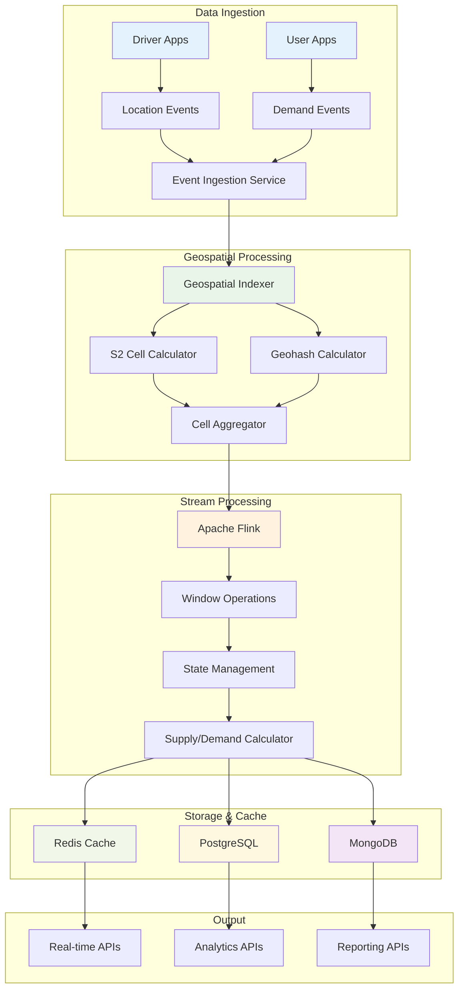

# Real-time Geospatial Aggregation

## Overview

The Equilibrium platform processes millions of raw location events per minute to calculate real-time supply/demand counts for thousands of geographic cells. This document details the geospatial aggregation architecture, indexing strategies, and stream processing logic.

## Architecture Diagram



## Processing Millions of Location Events

### Event Ingestion Pipeline

```python
# Event Ingestion Service - High-throughput processing
import asyncio
import json
import time
from typing import Dict, List, Optional
from dataclasses import dataclass
from datetime import datetime
import redis
import asyncpg
from kafka import KafkaProducer, KafkaConsumer
import s2sphere
import geohash2

@dataclass
class LocationEvent:
    event_id: str
    driver_id: str
    latitude: float
    longitude: float
    timestamp: datetime
    event_type: str  # 'location_update', 'status_change', 'heartbeat'
    accuracy: float
    speed: float
    heading: float
    is_available: bool
    vehicle_type: str

class GeospatialEventProcessor:
    def __init__(self):
        self.redis_client = redis.Redis(host='localhost', port=6379, decode_responses=True)
        self.kafka_producer = KafkaProducer(
            bootstrap_servers=['localhost:9092'],
            value_serializer=lambda v: json.dumps(v).encode('utf-8')
        )
        self.processed_events = 0
        self.start_time = time.time()
    
    async def process_location_event(self, event: LocationEvent) -> Dict:
        """Process a single location event with geospatial indexing"""
        try:
            # 1. Validate location data
            if not self._validate_location(event.latitude, event.longitude):
                return {"status": "invalid_location", "event_id": event.event_id}
            
            # 2. Calculate geospatial indices
            s2_cell_id = self._calculate_s2_cell(event.latitude, event.longitude)
            geohash = self._calculate_geohash(event.latitude, event.longitude)
            zone_id = self._find_zone(event.latitude, event.longitude)
            
            # 3. Enrich event with geospatial data
            enriched_event = {
                "event_id": event.event_id,
                "driver_id": event.driver_id,
                "latitude": event.latitude,
                "longitude": event.longitude,
                "timestamp": event.timestamp.isoformat(),
                "event_type": event.event_type,
                "accuracy": event.accuracy,
                "speed": event.speed,
                "heading": event.heading,
                "is_available": event.is_available,
                "vehicle_type": event.vehicle_type,
                "s2_cell_id": s2_cell_id,
                "geohash": geohash,
                "zone_id": zone_id,
                "processed_at": datetime.now().isoformat()
            }
            
            # 4. Send to Kafka for stream processing
            await self._send_to_kafka(enriched_event)
            
            # 5. Update real-time cache
            await self._update_realtime_cache(enriched_event)
            
            self.processed_events += 1
            
            return {"status": "success", "event_id": event.event_id}
            
        except Exception as e:
            logger.error(f"Error processing location event {event.event_id}: {e}")
            return {"status": "error", "event_id": event.event_id, "error": str(e)}
    
    def _validate_location(self, lat: float, lng: float) -> bool:
        """Validate location coordinates"""
        return -90 <= lat <= 90 and -180 <= lng <= 180
    
    def _calculate_s2_cell(self, lat: float, lng: float, level: int = 12) -> str:
        """Calculate S2 cell ID for location"""
        try:
            point = s2sphere.LatLng.from_degrees(lat, lng)
            cell_id = s2sphere.CellId.from_lat_lng(point).parent(level)
            return str(cell_id.id())
        except Exception as e:
            logger.error(f"Error calculating S2 cell: {e}")
            return "0"
    
    def _calculate_geohash(self, lat: float, lng: float, precision: int = 7) -> str:
        """Calculate Geohash for location"""
        try:
            return geohash2.encode(lat, lng, precision)
        except Exception as e:
            logger.error(f"Error calculating Geohash: {e}")
            return "0"
    
    def _find_zone(self, lat: float, lng: float) -> Optional[str]:
        """Find zone for location using spatial query"""
        try:
            # This would typically query PostgreSQL with PostGIS
            # For demo, we'll use a simple distance-based approach
            zones = self.redis_client.hgetall("zones")
            min_distance = float('inf')
            closest_zone = None
            
            for zone_id, zone_data in zones.items():
                zone_info = json.loads(zone_data)
                distance = self._calculate_distance(
                    lat, lng, 
                    zone_info['center_lat'], 
                    zone_info['center_lng']
                )
                if distance < min_distance and distance < 5.0:  # Within 5km
                    min_distance = distance
                    closest_zone = zone_id
            
            return closest_zone
        except Exception as e:
            logger.error(f"Error finding zone: {e}")
            return None
    
    async def _send_to_kafka(self, event: Dict):
        """Send enriched event to Kafka for stream processing"""
        try:
            self.kafka_producer.send('location_events', event)
            self.kafka_producer.flush()
        except Exception as e:
            logger.error(f"Error sending to Kafka: {e}")
    
    async def _update_realtime_cache(self, event: Dict):
        """Update real-time cache with latest location"""
        try:
            # Update driver location
            driver_key = f"driver:{event['driver_id']}"
            self.redis_client.hset(driver_key, mapping={
                "latitude": event['latitude'],
                "longitude": event['longitude'],
                "timestamp": event['timestamp'],
                "is_available": str(event['is_available']),
                "s2_cell_id": event['s2_cell_id'],
                "zone_id": event['zone_id'] or "unknown"
            })
            self.redis_client.expire(driver_key, 300)  # 5 minutes TTL
            
            # Update cell occupancy
            if event['is_available']:
                cell_key = f"cell:{event['s2_cell_id']}"
                self.redis_client.hincrby(cell_key, "available_drivers", 1)
                self.redis_client.expire(cell_key, 60)  # 1 minute TTL
            
        except Exception as e:
            logger.error(f"Error updating real-time cache: {e}")
    
    def _calculate_distance(self, lat1: float, lng1: float, lat2: float, lng2: float) -> float:
        """Calculate distance between two points in kilometers"""
        from geopy.distance import geodesic
        return geodesic((lat1, lng1), (lat2, lng2)).kilometers
```

## Geospatial Indexing Strategies

### S2 Cell Indexing

```python
import s2sphere
from typing import Dict, List, Set

class S2CellManager:
    def __init__(self, cell_level: int = 12):
        self.cell_level = cell_level
        self.cell_cache = {}
        self.neighbor_cache = {}
    
    def get_cell_id(self, lat: float, lng: float) -> str:
        """Get S2 cell ID for location"""
        point = s2sphere.LatLng.from_degrees(lat, lng)
        cell_id = s2sphere.CellId.from_lat_lng(point).parent(self.cell_level)
        return str(cell_id.id())
    
    def get_cell_neighbors(self, cell_id: str) -> List[str]:
        """Get neighboring S2 cells for smoothing"""
        if cell_id in self.neighbor_cache:
            return self.neighbor_cache[cell_id]
        
        try:
            cell = s2sphere.CellId(int(cell_id))
            neighbors = []
            
            # Get 8 neighboring cells
            for i in range(8):
                neighbor = cell.get_edge_neighbors()[i]
                neighbors.append(str(neighbor.id()))
            
            self.neighbor_cache[cell_id] = neighbors
            return neighbors
        except Exception as e:
            logger.error(f"Error getting cell neighbors: {e}")
            return []
    
    def get_cell_bounds(self, cell_id: str) -> Dict:
        """Get geographic bounds of S2 cell"""
        try:
            cell = s2sphere.CellId(int(cell_id))
            cell_obj = s2sphere.Cell(cell)
            bounds = cell_obj.get_rect_bound()
            
            return {
                "min_lat": bounds.lat_lo().degrees,
                "max_lat": bounds.lat_hi().degrees,
                "min_lng": bounds.lng_lo().degrees,
                "max_lng": bounds.lng_hi().degrees,
                "center_lat": bounds.get_center().lat().degrees,
                "center_lng": bounds.get_center().lng().degrees
            }
        except Exception as e:
            logger.error(f"Error getting cell bounds: {e}")
            return {}
    
    def aggregate_cells(self, cell_ids: List[str], level: int) -> Dict[str, List[str]]:
        """Aggregate cells to higher level for broader analysis"""
        aggregated = {}
        
        for cell_id in cell_ids:
            try:
                cell = s2sphere.CellId(int(cell_id))
                parent = cell.parent(level)
                parent_id = str(parent.id())
                
                if parent_id not in aggregated:
                    aggregated[parent_id] = []
                aggregated[parent_id].append(cell_id)
            except Exception as e:
                logger.error(f"Error aggregating cell {cell_id}: {e}")
        
        return aggregated
```

### Geohash Indexing

```python
import geohash2
from typing import Dict, List

class GeohashManager:
    def __init__(self, precision: int = 7):
        self.precision = precision
        self.neighbor_cache = {}
    
    def get_geohash(self, lat: float, lng: float) -> str:
        """Get Geohash for location"""
        return geohash2.encode(lat, lng, self.precision)
    
    def get_geohash_neighbors(self, geohash: str) -> List[str]:
        """Get neighboring Geohashes for smoothing"""
        if geohash in self.neighbor_cache:
            return self.neighbor_cache[geohash]
        
        try:
            neighbors = geohash2.neighbors(geohash)
            self.neighbor_cache[geohash] = neighbors
            return neighbors
        except Exception as e:
            logger.error(f"Error getting Geohash neighbors: {e}")
            return []
    
    def get_geohash_bounds(self, geohash: str) -> Dict:
        """Get geographic bounds of Geohash"""
        try:
            bounds = geohash2.bounds(geohash)
            return {
                "min_lat": bounds[0],
                "max_lat": bounds[1],
                "min_lng": bounds[2],
                "max_lng": bounds[3],
                "center_lat": (bounds[0] + bounds[1]) / 2,
                "center_lng": (bounds[2] + bounds[3]) / 2
            }
        except Exception as e:
            logger.error(f"Error getting Geohash bounds: {e}")
            return {}
```

## Stream Processing Logic

### Apache Flink Processing

```python
from pyflink.datastream import StreamExecutionEnvironment
from pyflink.table import StreamTableEnvironment
from pyflink.common.typeinfo import Types
from pyflink.common.time import Time
from pyflink.datastream.functions import MapFunction, KeyedProcessFunction
from pyflink.datastream.state import ValueStateDescriptor
from pyflink.common.serialization import SimpleStringSchema
from pyflink.datastream.connectors import FlinkKafkaConsumer, FlinkKafkaProducer
import json
from datetime import datetime, timedelta
from typing import Dict, List, Optional

class LocationEventProcessor(MapFunction):
    """Process location events and calculate supply/demand"""
    
    def map(self, value: str) -> str:
        try:
            event = json.loads(value)
            
            # Extract key information
            s2_cell_id = event.get('s2_cell_id')
            zone_id = event.get('zone_id')
            is_available = event.get('is_available', False)
            vehicle_type = event.get('vehicle_type', 'standard')
            
            # Create supply/demand event
            sd_event = {
                "timestamp": event['timestamp'],
                "s2_cell_id": s2_cell_id,
                "zone_id": zone_id,
                "vehicle_type": vehicle_type,
                "event_type": "supply" if is_available else "demand",
                "driver_id": event.get('driver_id'),
                "processed_at": datetime.now().isoformat()
            }
            
            return json.dumps(sd_event)
            
        except Exception as e:
            logger.error(f"Error processing location event: {e}")
            return json.dumps({"error": str(e), "original_event": value})

class SupplyDemandAggregator(KeyedProcessFunction):
    """Aggregate supply/demand by S2 cell with windowing"""
    
    def __init__(self):
        self.supply_state = None
        self.demand_state = None
        self.last_update_state = None
    
    def open(self, runtime_context):
        # Initialize state descriptors
        supply_descriptor = ValueStateDescriptor("supply", Types.INT())
        demand_descriptor = ValueStateDescriptor("demand", Types.INT())
        last_update_descriptor = ValueStateDescriptor("last_update", Types.STRING())
        
        self.supply_state = runtime_context.get_state(supply_descriptor)
        self.demand_state = runtime_context.get_state(demand_descriptor)
        self.last_update_state = runtime_context.get_state(last_update_descriptor)
    
    def process_element(self, value: str, ctx):
        try:
            event = json.loads(value)
            s2_cell_id = event['s2_cell_id']
            zone_id = event['zone_id']
            vehicle_type = event['vehicle_type']
            event_type = event['event_type']
            
            # Get current state
            current_supply = self.supply_state.value() or 0
            current_demand = self.demand_state.value() or 0
            last_update = self.last_update_state.value() or "1970-01-01T00:00:00Z"
            
            # Update counts
            if event_type == "supply":
                current_supply += 1
            elif event_type == "demand":
                current_demand += 1
            
            # Update state
            self.supply_state.update(current_supply)
            self.demand_state.update(current_demand)
            self.last_update_state.update(datetime.now().isoformat())
            
            # Calculate surge multiplier
            surge_multiplier = self._calculate_surge_multiplier(current_supply, current_demand)
            
            # Create output event
            output_event = {
                "timestamp": event['timestamp'],
                "s2_cell_id": s2_cell_id,
                "zone_id": zone_id,
                "vehicle_type": vehicle_type,
                "supply_count": current_supply,
                "demand_count": current_demand,
                "surge_multiplier": surge_multiplier,
                "supply_demand_ratio": current_supply / max(current_demand, 1),
                "processed_at": datetime.now().isoformat()
            }
            
            # Emit result
            ctx.output(json.dumps(output_event))
            
            # Set timer for next update (every 30 seconds)
            ctx.timer_service().register_processing_time_timer(
                ctx.timer_service().current_processing_time() + 30000
            )
            
        except Exception as e:
            logger.error(f"Error in supply/demand aggregation: {e}")
    
    def on_timer(self, timestamp: int, ctx):
        """Handle timer events for periodic updates"""
        try:
            current_supply = self.supply_state.value() or 0
            current_demand = self.demand_state.value() or 0
            
            # Decay counts over time (simulate drivers leaving/requests expiring)
            decayed_supply = max(0, int(current_supply * 0.95))
            decayed_demand = max(0, int(current_demand * 0.90))
            
            self.supply_state.update(decayed_supply)
            self.demand_state.update(decayed_demand)
            
            # Emit periodic update
            output_event = {
                "timestamp": datetime.now().isoformat(),
                "s2_cell_id": ctx.get_current_key(),
                "supply_count": decayed_supply,
                "demand_count": decayed_demand,
                "surge_multiplier": self._calculate_surge_multiplier(decayed_supply, decayed_demand),
                "supply_demand_ratio": decayed_supply / max(decayed_demand, 1),
                "processed_at": datetime.now().isoformat(),
                "update_type": "periodic_decay"
            }
            
            ctx.output(json.dumps(output_event))
            
        except Exception as e:
            logger.error(f"Error in timer processing: {e}")
    
    def _calculate_surge_multiplier(self, supply: int, demand: int) -> float:
        """Calculate surge multiplier based on supply and demand"""
        if supply == 0:
            return 5.0  # Maximum surge if no supply
        
        ratio = demand / supply
        
        if ratio <= 0.5:
            return 1.0
        elif ratio <= 1.0:
            return 1.0 + (ratio - 0.5) * 0.4  # 1.0 to 1.2
        elif ratio <= 1.5:
            return 1.2 + (ratio - 1.0) * 0.6  # 1.2 to 1.5
        elif ratio <= 2.0:
            return 1.5 + (ratio - 1.5) * 1.0  # 1.5 to 2.0
        else:
            return min(2.0 + (ratio - 2.0) * 0.5, 5.0)  # 2.0 to 5.0

class FlinkStreamProcessor:
    """Main Flink stream processing setup"""
    
    def __init__(self):
        self.env = StreamExecutionEnvironment.get_execution_environment()
        self.env.set_parallelism(4)
        self.env.set_stream_time_characteristic(TimeCharacteristic.PROCESSING_TIME)
    
    def setup_kafka_consumer(self):
        """Setup Kafka consumer for location events"""
        kafka_consumer = FlinkKafkaConsumer(
            topics='location_events',
            deserialization_schema=SimpleStringSchema(),
            properties={
                'bootstrap.servers': 'localhost:9092',
                'group.id': 'geospatial_processor',
                'auto.offset.reset': 'latest'
            }
        )
        
        return kafka_consumer
    
    def setup_kafka_producer(self):
        """Setup Kafka producer for processed events"""
        kafka_producer = FlinkKafkaProducer(
            topic='supply_demand_events',
            serialization_schema=SimpleStringSchema(),
            producer_config={
                'bootstrap.servers': 'localhost:9092'
            }
        )
        
        return kafka_producer
    
    def run_processing_job(self):
        """Run the main processing job"""
        try:
            # Setup Kafka consumer
            kafka_consumer = self.setup_kafka_consumer()
            location_stream = self.env.add_source(kafka_consumer)
            
            # Process location events
            processed_stream = location_stream.map(LocationEventProcessor())
            
            # Key by S2 cell ID for aggregation
            keyed_stream = processed_stream.key_by(lambda x: json.loads(x)['s2_cell_id'])
            
            # Aggregate supply/demand
            aggregated_stream = keyed_stream.process(SupplyDemandAggregator())
            
            # Setup Kafka producer
            kafka_producer = self.setup_kafka_producer()
            aggregated_stream.add_sink(kafka_producer)
            
            # Execute job
            self.env.execute("GeospatialAggregationJob")
            
        except Exception as e:
            logger.error(f"Error running processing job: {e}")

if __name__ == "__main__":
    processor = FlinkStreamProcessor()
    processor.run_processing_job()
```

## Performance Optimization

### High-Throughput Processing

```python
import asyncio
import multiprocessing
from concurrent.futures import ThreadPoolExecutor, ProcessPoolExecutor
import queue
import time
from typing import List, Dict, Any

class HighThroughputProcessor:
    def __init__(self, max_workers: int = None):
        self.max_workers = max_workers or multiprocessing.cpu_count()
        self.event_queue = queue.Queue(maxsize=10000)
        self.processed_count = 0
        self.start_time = time.time()
    
    async def process_events_batch(self, events: List[LocationEvent]) -> List[Dict]:
        """Process a batch of events in parallel"""
        try:
            # Split events into chunks for parallel processing
            chunk_size = max(1, len(events) // self.max_workers)
            chunks = [events[i:i + chunk_size] for i in range(0, len(events), chunk_size)]
            
            # Process chunks in parallel
            with ThreadPoolExecutor(max_workers=self.max_workers) as executor:
                futures = [
                    executor.submit(self._process_chunk, chunk)
                    for chunk in chunks
                ]
                
                results = []
                for future in futures:
                    chunk_results = future.result()
                    results.extend(chunk_results)
                
                return results
                
        except Exception as e:
            logger.error(f"Error processing event batch: {e}")
            return []
    
    def _process_chunk(self, events: List[LocationEvent]) -> List[Dict]:
        """Process a chunk of events"""
        results = []
        for event in events:
            try:
                result = self._process_single_event(event)
                results.append(result)
            except Exception as e:
                logger.error(f"Error processing event {event.event_id}: {e}")
                results.append({"status": "error", "event_id": event.event_id})
        
        return results
    
    def _process_single_event(self, event: LocationEvent) -> Dict:
        """Process a single event (to be implemented)"""
        # This would contain the actual processing logic
        return {"status": "success", "event_id": event.event_id}
    
    def get_processing_stats(self) -> Dict:
        """Get processing statistics"""
        elapsed_time = time.time() - self.start_time
        events_per_second = self.processed_count / elapsed_time if elapsed_time > 0 else 0
        
        return {
            "processed_events": self.processed_count,
            "elapsed_time": elapsed_time,
            "events_per_second": events_per_second,
            "queue_size": self.event_queue.qsize()
        }
```

## Monitoring and Metrics

### Performance Metrics

```python
import time
from dataclasses import dataclass
from typing import Dict, List
import psutil
import redis

@dataclass
class ProcessingMetrics:
    events_processed: int
    events_per_second: float
    average_latency_ms: float
    error_rate: float
    memory_usage_mb: float
    cpu_usage_percent: float
    queue_depth: int
    cache_hit_rate: float

class MetricsCollector:
    def __init__(self):
        self.redis_client = redis.Redis(host='localhost', port=6379, decode_responses=True)
        self.start_time = time.time()
        self.processed_events = 0
        self.error_count = 0
        self.total_latency = 0.0
    
    def record_event_processed(self, latency_ms: float, success: bool = True):
        """Record a processed event"""
        self.processed_events += 1
        self.total_latency += latency_ms
        
        if not success:
            self.error_count += 1
    
    def get_metrics(self) -> ProcessingMetrics:
        """Get current processing metrics"""
        elapsed_time = time.time() - self.start_time
        events_per_second = self.processed_events / elapsed_time if elapsed_time > 0 else 0
        average_latency = self.total_latency / self.processed_events if self.processed_events > 0 else 0
        error_rate = self.error_count / self.processed_events if self.processed_events > 0 else 0
        
        # System metrics
        memory_usage = psutil.virtual_memory().used / 1024 / 1024  # MB
        cpu_usage = psutil.cpu_percent()
        
        # Queue depth (from Redis)
        queue_depth = self.redis_client.llen("event_queue")
        
        # Cache hit rate (from Redis)
        cache_hits = self.redis_client.get("cache_hits") or 0
        cache_misses = self.redis_client.get("cache_misses") or 0
        total_cache_requests = int(cache_hits) + int(cache_misses)
        cache_hit_rate = int(cache_hits) / total_cache_requests if total_cache_requests > 0 else 0
        
        return ProcessingMetrics(
            events_processed=self.processed_events,
            events_per_second=events_per_second,
            average_latency_ms=average_latency,
            error_rate=error_rate,
            memory_usage_mb=memory_usage,
            cpu_usage_percent=cpu_usage,
            queue_depth=queue_depth,
            cache_hit_rate=cache_hit_rate
        )
    
    def publish_metrics(self):
        """Publish metrics to monitoring system"""
        metrics = self.get_metrics()
        
        # Store in Redis for real-time monitoring
        self.redis_client.hset("processing_metrics", mapping={
            "events_processed": str(metrics.events_processed),
            "events_per_second": str(metrics.events_per_second),
            "average_latency_ms": str(metrics.average_latency_ms),
            "error_rate": str(metrics.error_rate),
            "memory_usage_mb": str(metrics.memory_usage_mb),
            "cpu_usage_percent": str(metrics.cpu_usage_percent),
            "queue_depth": str(metrics.queue_depth),
            "cache_hit_rate": str(metrics.cache_hit_rate),
            "timestamp": str(int(time.time()))
        })
        
        # Log metrics
        logger.info(f"Processing Metrics: {metrics.events_per_second:.2f} events/sec, "
                   f"{metrics.average_latency_ms:.2f}ms avg latency, "
                   f"{metrics.error_rate:.2%} error rate")
```

This comprehensive geospatial aggregation system can process millions of location events per minute by:

1. **High-throughput ingestion** with async processing and batching
2. **Efficient geospatial indexing** using S2 cells and Geohash
3. **Stream processing** with Apache Flink for real-time aggregation
4. **State management** for maintaining supply/demand counts
5. **Performance monitoring** for tracking processing metrics
6. **Scalable architecture** with horizontal scaling capabilities

The system maintains sub-second latency while processing high volumes of location data and provides real-time supply/demand calculations for thousands of geographic cells.
