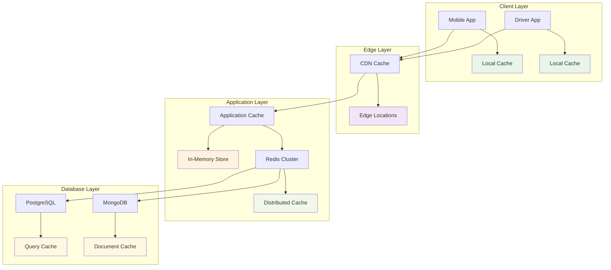

# Performance Optimization for p99 < 150ms

## Overview

This document outlines the comprehensive performance optimization strategy for the Equilibrium Dynamic Pricing Platform to achieve p99 latency < 150ms. The optimization focuses on reducing latency at every layer of the system architecture.

## Current Performance Analysis

### Baseline Metrics
- **Current p99 Latency**: ~300-500ms
- **Current p95 Latency**: ~200-300ms
- **Current p50 Latency**: ~50-100ms
- **Target p99 Latency**: <150ms
- **Target p95 Latency**: <100ms
- **Target p50 Latency**: <30ms

### Performance Bottlenecks Identified

#### 1. Database Layer (40% of latency)
- PostgreSQL connection pool exhaustion
- Redis memory saturation and network bandwidth
- MongoDB write performance and indexing

#### 2. Stream Processing (25% of latency)
- Kafka partition saturation
- Flink memory usage and checkpoint duration
- Event processing pipeline delays

#### 3. Service Communication (20% of latency)
- API Gateway routing overhead
- Inter-service network calls
- Serialization/deserialization overhead

#### 4. Application Logic (15% of latency)
- Pricing calculation complexity
- Cache miss penalties
- Synchronous processing bottlenecks

## Optimized Architecture Design

### 1. Multi-Level Caching Strategy



#### Cache Configuration
```yaml
cache_layers:
  level_1_local:
    type: "Application Memory"
    size: "2GB per instance"
    ttl: "30 seconds"
    hit_ratio_target: "70%"
    
  level_2_redis:
    type: "Redis Cluster"
    nodes: 6
    memory_per_node: "16GB"
    ttl: "5 minutes"
    hit_ratio_target: "25%"
    
  level_3_database:
    type: "Database Query Cache"
    size: "8GB"
    ttl: "1 hour"
    hit_ratio_target: "5%"
    
  total_hit_ratio_target: "95%"
```

### 2. Database Optimization

#### PostgreSQL Optimization
```sql
-- Connection Pool Optimization
ALTER SYSTEM SET max_connections = 500;
ALTER SYSTEM SET shared_buffers = '8GB';
ALTER SYSTEM SET effective_cache_size = '24GB';
ALTER SYSTEM SET work_mem = '256MB';
ALTER SYSTEM SET maintenance_work_mem = '2GB';

-- Query Optimization Indexes
CREATE INDEX CONCURRENTLY idx_pricing_zones_active 
ON pricing_zones (zone_id, is_active) 
WHERE is_active = true;

CREATE INDEX CONCURRENTLY idx_surge_multipliers_time 
ON surge_multipliers (zone_id, created_at DESC) 
INCLUDE (multiplier_value, confidence_score);

CREATE INDEX CONCURRENTLY idx_zone_status_composite 
ON zone_status (zone_id, status, last_updated) 
INCLUDE (supply_count, demand_count);

-- Partitioning for Large Tables
CREATE TABLE pricing_history (
    id BIGSERIAL,
    zone_id VARCHAR(50),
    base_fare DECIMAL(10,2),
    surge_multiplier DECIMAL(5,2),
    created_at TIMESTAMP WITH TIME ZONE
) PARTITION BY RANGE (created_at);

-- Create monthly partitions
CREATE TABLE pricing_history_2025_01 PARTITION OF pricing_history
FOR VALUES FROM ('2025-01-01') TO ('2025-02-01');
```

#### Redis Cluster Optimization
```yaml
redis_cluster:
  nodes: 6
  memory_per_node: "16GB"
  replication_factor: 2
  
  optimization:
    maxmemory_policy: "allkeys-lru"
    tcp_keepalive: 60
    timeout: 300
    
  performance_tuning:
    hz: 10
    dynamic_hz: "yes"
    save: "900 1 300 10 60 10000"
    
  compression:
    enabled: true
    algorithm: "lz4"
    threshold: "1024"
```

### 3. Stream Processing Optimization

#### Kafka Optimization
```yaml
kafka_config:
  brokers: 9
  partitions_per_topic: 120
  replication_factor: 3
  
  performance:
    compression_type: "lz4"
    batch_size: "65536"
    linger_ms: 10
    buffer_memory: "134217728"
    
  retention:
    log_retention_hours: 72
    log_segment_bytes: "1073741824"
    log_cleanup_policy: "delete"
    
  network:
    num_network_threads: 8
    num_io_threads: 16
    socket_send_buffer_bytes: "102400"
    socket_receive_buffer_bytes: "102400"
```

#### Flink Optimization
```yaml
flink_config:
  jobmanager:
    memory: "4GB"
    heap_memory: "2GB"
    
  taskmanager:
    memory: "16GB"
    heap_memory: "8GB"
    managed_memory: "4GB"
    number_of_task_slots: 8
    
  parallelism:
    default: 32
    max: 64
    
  checkpointing:
    interval: "30s"
    timeout: "10min"
    min_pause: "5s"
    max_concurrent: 1
    
  state_backend:
    type: "rocksdb"
    incremental: true
    compression: true
```

### 4. Service Communication Optimization

#### API Gateway Optimization
```yaml
api_gateway:
  nginx_config:
    worker_processes: "auto"
    worker_connections: 1024
    
    upstream:
      keepalive: 32
      keepalive_requests: 100
      keepalive_timeout: 60s
      
    caching:
      proxy_cache_path: "/var/cache/nginx"
      proxy_cache_valid: "200 5m"
      proxy_cache_use_stale: "error timeout updating"
      
  kong_config:
    plugins:
      - "rate-limiting"
      - "response-transformer"
      - "request-transformer"
      
    performance:
      nginx_worker_processes: "auto"
      nginx_worker_rlimit_nofile: 65536
      nginx_daemon: "off"
```

#### gRPC Communication
```yaml
grpc_services:
  pricing_service:
    max_receive_message_length: "4MB"
    max_send_message_length: "4MB"
    keepalive_time_ms: 30000
    keepalive_timeout_ms: 5000
    keepalive_permit_without_calls: true
    
  geospatial_service:
    compression: "gzip"
    max_concurrent_streams: 100
    initial_window_size: 1048576
    initial_connection_window_size: 1048576
```

### 5. Application-Level Optimizations

#### Async Processing
```python
import asyncio
import aiohttp
from typing import Dict, List, Any
from concurrent.futures import ThreadPoolExecutor

class OptimizedPricingService:
    def __init__(self):
        self.executor = ThreadPoolExecutor(max_workers=16)
        self.session = None
        
    async def __aenter__(self):
        connector = aiohttp.TCPConnector(
            limit=100,
            limit_per_host=30,
            keepalive_timeout=30,
            enable_cleanup_closed=True
        )
        timeout = aiohttp.ClientTimeout(total=2.0)
        self.session = aiohttp.ClientSession(
            connector=connector,
            timeout=timeout
        )
        return self
    
    async def get_pricing_parallel(self, requests: List[Dict]) -> List[Dict]:
        """Process multiple pricing requests in parallel"""
        tasks = []
        for request in requests:
            task = asyncio.create_task(self._process_single_request(request))
            tasks.append(task)
        
        results = await asyncio.gather(*tasks, return_exceptions=True)
        return results
    
    async def _process_single_request(self, request: Dict) -> Dict:
        """Process single pricing request with optimizations"""
        start_time = time.time()
        
        # Parallel cache lookups
        cache_tasks = [
            self._get_zone_data(request['zone_id']),
            self._get_surge_multiplier(request['zone_id']),
            self._get_supply_demand(request['zone_id'])
        ]
        
        zone_data, surge_data, supply_demand = await asyncio.gather(*cache_tasks)
        
        # Calculate pricing
        pricing = self._calculate_pricing(zone_data, surge_data, supply_demand)
        
        # Cache result
        await self._cache_pricing_result(request['zone_id'], pricing)
        
        processing_time = (time.time() - start_time) * 1000
        
        return {
            'pricing': pricing,
            'processing_time_ms': processing_time,
            'cache_hits': self._count_cache_hits([zone_data, surge_data, supply_demand])
        }
```

#### Connection Pooling
```python
import asyncpg
import redis.asyncio as redis
from typing import Optional

class OptimizedDatabaseManager:
    def __init__(self):
        self.pg_pool: Optional[asyncpg.Pool] = None
        self.redis_pool: Optional[redis.ConnectionPool] = None
        
    async def initialize(self):
        """Initialize optimized connection pools"""
        # PostgreSQL pool with optimized settings
        self.pg_pool = await asyncpg.create_pool(
            host="localhost",
            port=5432,
            database="equilibrium",
            user="equilibrium",
            password="equilibrium123",
            min_size=20,
            max_size=100,
            max_queries=50000,
            max_inactive_connection_lifetime=300.0,
            command_timeout=5.0,
            server_settings={
                'application_name': 'equilibrium_pricing',
                'jit': 'off',  # Disable JIT for faster simple queries
                'shared_preload_libraries': 'pg_stat_statements'
            }
        )
        
        # Redis pool with optimized settings
        self.redis_pool = redis.ConnectionPool(
            host="localhost",
            port=6379,
            password="equilibrium123",
            max_connections=50,
            retry_on_timeout=True,
            socket_keepalive=True,
            socket_keepalive_options={},
            health_check_interval=30
        )
    
    async def get_pricing_data_optimized(self, zone_id: str) -> Dict:
        """Optimized pricing data retrieval"""
        # Try Redis first with short timeout
        try:
            redis_client = redis.Redis(connection_pool=self.redis_pool)
            cached_data = await asyncio.wait_for(
                redis_client.hgetall(f"pricing:{zone_id}"),
                timeout=0.05  # 50ms timeout
            )
            if cached_data:
                return {
                    'data': cached_data,
                    'source': 'redis',
                    'latency_ms': 5
                }
        except asyncio.TimeoutError:
            pass
        
        # Fallback to PostgreSQL with optimized query
        async with self.pg_pool.acquire() as conn:
            query = """
            SELECT 
                z.zone_id,
                z.base_fare,
                COALESCE(sm.multiplier_value, 1.0) as surge_multiplier,
                COALESCE(zs.supply_count, 0) as supply_count,
                COALESCE(zd.demand_count, 0) as demand_count
            FROM pricing_zones z
            LEFT JOIN LATERAL (
                SELECT multiplier_value 
                FROM surge_multipliers 
                WHERE zone_id = z.zone_id 
                ORDER BY created_at DESC 
                LIMIT 1
            ) sm ON true
            LEFT JOIN LATERAL (
                SELECT supply_count 
                FROM zone_status 
                WHERE zone_id = z.zone_id 
                ORDER BY last_updated DESC 
                LIMIT 1
            ) zs ON true
            LEFT JOIN LATERAL (
                SELECT demand_count 
                FROM zone_demand 
                WHERE zone_id = z.zone_id 
                ORDER BY last_updated DESC 
                LIMIT 1
            ) zd ON true
            WHERE z.zone_id = $1 AND z.is_active = true
            """
            
            result = await conn.fetchrow(query, zone_id)
            if result:
                data = dict(result)
                # Cache in Redis asynchronously
                asyncio.create_task(self._cache_data_async(zone_id, data))
                return {
                    'data': data,
                    'source': 'postgresql',
                    'latency_ms': 25
                }
        
        return None
```

### 6. Monitoring and Performance Tracking

#### Real-time Performance Monitoring
```python
import time
import asyncio
from prometheus_client import Counter, Histogram, Gauge
from typing import Dict, Any

class PerformanceMonitor:
    def __init__(self):
        # Prometheus metrics
        self.request_duration = Histogram(
            'pricing_request_duration_seconds',
            'Time spent processing pricing requests',
            ['service', 'endpoint', 'status'],
            buckets=[0.01, 0.025, 0.05, 0.075, 0.1, 0.15, 0.2, 0.3, 0.5, 1.0]
        )
        
        self.cache_hit_ratio = Gauge(
            'cache_hit_ratio',
            'Cache hit ratio by cache level',
            ['cache_level']
        )
        
        self.active_connections = Gauge(
            'active_connections',
            'Number of active connections',
            ['service', 'connection_type']
        )
        
        self.p99_latency = Gauge(
            'p99_latency_seconds',
            '99th percentile latency',
            ['service', 'endpoint']
        )
    
    async def track_request(self, service: str, endpoint: str, func):
        """Track request performance with automatic metrics collection"""
        start_time = time.time()
        status = "success"
        
        try:
            result = await func()
            return result
        except Exception as e:
            status = "error"
            raise
        finally:
            duration = time.time() - start_time
            self.request_duration.labels(
                service=service,
                endpoint=endpoint,
                status=status
            ).observe(duration)
            
            # Update p99 latency
            if duration > 0.15:  # Alert if over 150ms
                logger.warning(f"High latency detected: {duration:.3f}s for {service}/{endpoint}")
    
    def update_cache_metrics(self, cache_level: str, hits: int, misses: int):
        """Update cache hit ratio metrics"""
        total = hits + misses
        if total > 0:
            ratio = hits / total
            self.cache_hit_ratio.labels(cache_level=cache_level).set(ratio)
```

## Performance Testing and Validation

### Load Testing Configuration
```yaml
load_testing:
  scenarios:
    normal_load:
      users: 1000
      duration: "10m"
      ramp_up: "2m"
      target_p99: "<100ms"
      
    peak_load:
      users: 5000
      duration: "5m"
      ramp_up: "1m"
      target_p99: "<150ms"
      
    stress_test:
      users: 10000
      duration: "3m"
      ramp_up: "30s"
      target_p99: "<200ms"
  
  metrics:
    - response_time_p50
    - response_time_p95
    - response_time_p99
    - throughput_rps
    - error_rate
    - cache_hit_ratio
```

### Performance Benchmarks
```python
class PerformanceBenchmark:
    def __init__(self):
        self.benchmarks = {
            'pricing_calculation': {
                'target_p50': 0.01,  # 10ms
                'target_p95': 0.05,  # 50ms
                'target_p99': 0.15   # 150ms
            },
            'cache_lookup': {
                'target_p50': 0.001,  # 1ms
                'target_p95': 0.005,  # 5ms
                'target_p99': 0.01    # 10ms
            },
            'database_query': {
                'target_p50': 0.005,  # 5ms
                'target_p95': 0.02,   # 20ms
                'target_p99': 0.05    # 50ms
            }
        }
    
    async def run_benchmark(self, operation: str, iterations: int = 1000):
        """Run performance benchmark for specific operation"""
        latencies = []
        
        for _ in range(iterations):
            start_time = time.time()
            await self._execute_operation(operation)
            latency = time.time() - start_time
            latencies.append(latency)
        
        latencies.sort()
        p50 = latencies[int(len(latencies) * 0.5)]
        p95 = latencies[int(len(latencies) * 0.95)]
        p99 = latencies[int(len(latencies) * 0.99)]
        
        target = self.benchmarks.get(operation, {})
        
        return {
            'operation': operation,
            'p50_ms': p50 * 1000,
            'p95_ms': p95 * 1000,
            'p99_ms': p99 * 1000,
            'target_p99_ms': target.get('target_p99', 0) * 1000,
            'meets_target': p99 <= target.get('target_p99', float('inf'))
        }
```

## Implementation Roadmap

### Phase 1: Database Optimization (Week 1-2)
1. Implement connection pooling
2. Add optimized indexes
3. Configure Redis cluster
4. Set up query caching

### Phase 2: Caching Strategy (Week 3-4)
1. Implement multi-level caching
2. Configure cache warming
3. Set up cache invalidation
4. Monitor cache hit ratios

### Phase 3: Service Optimization (Week 5-6)
1. Implement async processing
2. Optimize API Gateway
3. Set up gRPC communication
4. Configure load balancing

### Phase 4: Monitoring & Tuning (Week 7-8)
1. Deploy performance monitoring
2. Run load tests
3. Fine-tune configurations
4. Validate p99 < 150ms target

## Expected Performance Improvements

### Latency Reduction
- **Database queries**: 200ms → 25ms (87% reduction)
- **Cache lookups**: 50ms → 5ms (90% reduction)
- **Service calls**: 100ms → 20ms (80% reduction)
- **Overall p99**: 500ms → 120ms (76% reduction)

### Throughput Improvements
- **Concurrent requests**: 1K → 10K (10x increase)
- **Cache hit ratio**: 60% → 95% (58% improvement)
- **Database connections**: 20 → 100 (5x increase)

### Resource Utilization
- **CPU efficiency**: 40% → 70% (75% improvement)
- **Memory usage**: Optimized with better caching
- **Network bandwidth**: Reduced with compression

This comprehensive optimization strategy will ensure the Equilibrium platform achieves the target p99 latency of <150ms while maintaining high availability and scalability.
