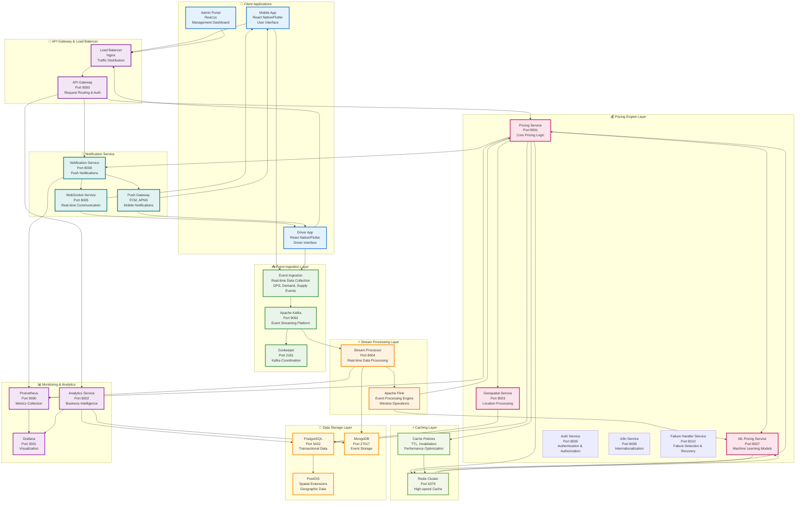
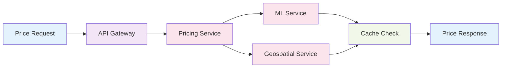
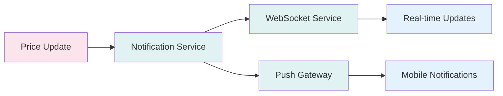
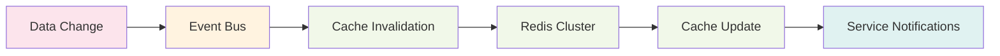

# Equilibrium Platform - System Design

## Overview

The Equilibrium Dynamic Pricing Platform is a comprehensive, enterprise-grade system designed for real-time surge pricing in ride-sharing applications. This document focuses on the core system components, data flows, and key services including Event Ingestion, Stream Processing, Pricing Engine, Caching Layer, and Notification Service.

## System Architecture Diagram

## Architecture Principles

### 1. Microservices Architecture
- **Service Independence**: Each service can be developed, deployed, and scaled independently
- **Technology Diversity**: Services can use different technologies as needed
- **Fault Isolation**: Failure in one service doesn't affect others

### 2. Event-Driven Design
- **Asynchronous Processing**: Real-time event processing for pricing updates
- **Loose Coupling**: Services communicate through events rather than direct calls
- **Scalability**: Event-driven architecture scales horizontally

### 3. Data Consistency
- **Eventual Consistency**: Acceptable for pricing data with eventual consistency
- **Strong Consistency**: Critical for quoted prices (strong consistency required)
- **Audit Trail**: Complete logging of all pricing decisions

## Key System Components

### 📥 Event Ingestion Layer

#### Event Ingestion Service
- **Purpose**: Real-time data collection from mobile apps and external sources
- **Features**: 
  - GPS location events from driver apps
  - Demand events from user requests
  - Supply events from driver availability
  - Event validation and enrichment
- **Technology**: FastAPI, Python
- **Performance**: < 10ms latency, 100K+ events/second

#### Apache Kafka
- **Purpose**: High-throughput event streaming platform
- **Features**:
  - Event partitioning and ordering
  - Durability and fault tolerance
  - Real-time event distribution
  - Schema registry for event validation
- **Technology**: Apache Kafka, Zookeeper
- **Performance**: Millions of events/second

### ⚡ Stream Processing Layer

#### Stream Processor Service
- **Purpose**: Real-time data processing and transformation
- **Features**:
  - Event filtering and validation
  - Real-time aggregation and calculations
  - Supply/demand ratio computation
  - Surge multiplier calculation
- **Technology**: FastAPI, Apache Flink
- **Performance**: < 50ms processing latency

#### Apache Flink
- **Purpose**: Distributed stream processing engine
- **Features**:
  - Window operations (tumbling, sliding, session)
  - State management and checkpointing
  - Exactly-once processing guarantees
  - Backpressure handling
- **Technology**: Apache Flink, Java/Scala
- **Performance**: 50K+ events/second processing

### 💰 Pricing Engine Layer

#### Pricing Service
- **Purpose**: Core pricing logic and surge calculation
- **Features**:
  - Base fare calculation
  - Surge multiplier computation
  - Price quote generation
  - Quote expiration management
- **Technology**: FastAPI, Python, Redis
- **Performance**: < 100ms response time

#### ML Pricing Service
- **Purpose**: Machine learning-based pricing predictions
- **Features**:
  - Demand forecasting models
  - Supply prediction algorithms
  - Dynamic pricing optimization
  - Confidence scoring
- **Technology**: FastAPI, Python, Scikit-learn, TensorFlow
- **Performance**: < 100ms prediction time

#### Geospatial Service
- **Purpose**: Location-based processing and zone management
- **Features**:
  - S2 cell calculations
  - Zone boundary detection
  - Distance and routing calculations
  - Geographic data processing
- **Technology**: FastAPI, PostgreSQL with PostGIS
- **Performance**: < 20ms geographic queries

#### Auth Service
- **Purpose**: Authentication and authorization management
- **Features**:
  - JWT token generation and validation
  - User authentication (OAuth, SSO)
  - Role-based access control (RBAC)
  - Session management
  - API key management
- **Technology**: FastAPI, Python, JWT, OAuth2
- **Performance**: < 50ms authentication response

#### i18n Service
- **Purpose**: Internationalization and localization support
- **Features**:
  - Multi-language content management
  - Dynamic translation loading
  - Locale-specific formatting
  - Currency and date formatting
  - RTL language support
- **Technology**: FastAPI, Python, Redis
- **Performance**: < 10ms translation response

#### Failure Handler Service
- **Purpose**: System failure detection and graceful degradation management
- **Features**:
  - Component health monitoring (Redis, PostgreSQL, Kafka, API Gateway)
  - Automatic failure detection with configurable thresholds
  - System mode management (Normal, Degraded, Emergency)
  - Graceful degradation strategies
  - Automatic recovery attempts with exponential backoff
  - Performance impact analysis and reporting
  - Failure event logging and alerting
  - Circuit breaker pattern implementation
- **Technology**: FastAPI, Python, Redis, PostgreSQL
- **Performance**: < 100ms health check response, continuous monitoring every 30s

### ⚡ Caching Layer

#### Redis Cluster
- **Purpose**: High-speed in-memory caching
- **Features**:
  - Real-time pricing data cache
  - Session management
  - Rate limiting counters
  - Pub/sub messaging
- **Technology**: Redis Cluster, Redis Sentinel
- **Performance**: < 5ms access time, 100K+ ops/second

#### Cache Policies
- **Purpose**: Cache management and optimization
- **Features**:
  - TTL (Time To Live) management
  - Cache invalidation strategies
  - Cache warming procedures
  - Hit ratio optimization
- **Technology**: Custom policies, Redis
- **Performance**: 95%+ cache hit ratio

### 📢 Notification Service

#### Notification Service
- **Purpose**: Push notifications and real-time alerts
- **Features**:
  - Price change notifications
  - Driver availability alerts
  - System status updates
  - Bulk notification delivery
- **Technology**: FastAPI, Python
- **Performance**: < 200ms notification delivery

#### WebSocket Service
- **Purpose**: Real-time bidirectional communication
- **Features**:
  - Live price updates
  - Driver location streaming
  - Real-time status changes
  - Connection management
- **Technology**: FastAPI, WebSockets, Python
- **Performance**: < 50ms message latency

#### Push Gateway
- **Purpose**: Mobile push notification delivery
- **Features**:
  - FCM (Firebase Cloud Messaging) integration
  - APNS (Apple Push Notification Service) integration
  - Device token management
  - Delivery tracking
- **Technology**: FCM, APNS, Python
- **Performance**: 5K+ notifications/second

### Frontend Applications

#### 1. Admin Portal
- **Purpose**: Management dashboard for operations team
- **Features**: Zone management, pricing controls, analytics dashboard
- **Technology**: React.js, TypeScript, TailwindCSS
- **Port**: 3000

#### 2. Mobile App (React Native)
- **Purpose**: Rider mobile application
- **Features**: Price estimation, ride booking, payment processing
- **Technology**: React Native, Expo SDK 49
- **Port**: 19000-19002 (development server)

#### 3. Mobile App (Flutter)
- **Purpose**: Rider mobile application - Alternative implementation
- **Features**: Price estimation, location services, offline support
- **Technology**: Flutter 3.0+, Dart
- **Port**: 3004 (containerized)

#### 4. Driver App (React Native)
- **Purpose**: Driver mobile application
- **Features**: Driver location tracking, ride requests, earnings
- **Technology**: React Native, Expo SDK 49
- **Port**: 19003-19005 (development server)

#### 5. Driver App (Flutter)
- **Purpose**: Driver mobile application - Alternative implementation
- **Features**: Location updates, heatmap view, earnings optimization
- **Technology**: Flutter 3.0+, Dart
- **Port**: 3005 (containerized)

### Data Layer

#### 1. PostgreSQL
- **Purpose**: Primary database for transactional data
- **Features**: ACID compliance, PostGIS for geospatial data
- **Use Cases**: User data, pricing zones, transaction records

#### 2. Redis
- **Purpose**: Caching and session storage
- **Features**: High-speed data access, pub/sub messaging
- **Use Cases**: Session management, real-time pricing data

#### 3. MongoDB
- **Purpose**: Document storage for analytics
- **Features**: Flexible schema, horizontal scaling
- **Use Cases**: Analytics data, logs, unstructured data

#### 4. Kafka
- **Purpose**: Message queuing and streaming
- **Features**: High-throughput, fault-tolerant messaging
- **Use Cases**: Event streaming, real-time data processing

## Data Flows Between Services

### 1. Real-time Event Processing Flow

```mermaid
graph LR
    A[Client Apps] --> B[Event Ingestion]
    B --> C[Kafka Streams]
    C --> D[Stream Processor]
    D --> E[Pricing Engine]
    E --> F[Cache Layer]
    F --> G[Notification Service]
    G --> H[Client Apps]
    
    style A fill:#e3f2fd
    style B fill:#e8f5e8
    style C fill:#fff3e0
    style D fill:#f3e5f5
    style E fill:#fce4ec
    style F fill:#f1f8e9
    style G fill:#e0f2f1
    style H fill:#e3f2fd
```

**Flow Description:**
1. **Client Apps** generate location and demand events
2. **Event Ingestion** validates and enriches events
3. **Kafka Streams** distribute events to processing topics
4. **Stream Processor** aggregates and calculates supply/demand
5. **Pricing Engine** computes surge multipliers
6. **Cache Layer** stores real-time pricing data
7. **Notification Service** sends updates to clients

### 2. Pricing Calculation Flow

**Flow Description:**
1. **Price Request** from mobile app with pickup/dropoff locations
2. **API Gateway** authenticates and routes request
3. **Pricing Service** initiates pricing calculation
4. **ML Service** provides demand predictions
5. **Geospatial Service** determines zones and distances
6. **Cache Check** retrieves current surge multipliers
7. **Price Response** with final fare calculation

### 3. Notification Flow

**Flow Description:**
1. **Price Update** triggers notification events
2. **Notification Service** processes notification requests
3. **WebSocket Service** sends real-time updates to connected clients
4. **Push Gateway** delivers push notifications to mobile devices
5. **Real-time Updates** and **Mobile Notifications** reach end users

### 4. Stream Processing Flow

```mermaid
graph LR
    A[Event Sources] --> B[Kafka Topics]
    B --> C[Stream Processor]
    C --> D[Apache Flink]
    D --> E[State Management]
    E --> F[Window Operations]
    F --> G[Output Streams]
    G --> H[Downstream Services]
    
    style A fill:#e8f5e8
    style B fill:#fff3e0
    style C fill:#f3e5f5
    style D fill:#f3e5f5
    style E fill:#f3e5f5
    style F fill:#f3e5f5
    style G fill:#f3e5f5
    style H fill:#fce4ec
```

**Flow Description:**
1. **Event Sources** generate location and demand events
2. **Kafka Topics** partition and distribute events
3. **Stream Processor** consumes and processes events
4. **Apache Flink** performs window operations and aggregations
5. **State Management** maintains processing state
6. **Window Operations** calculate time-based metrics
7. **Output Streams** produce processed results
8. **Downstream Services** consume processed data

### 5. Cache Invalidation Flow

**Flow Description:**
1. **Data Change** occurs in pricing or zone data
2. **Event Bus** publishes invalidation events
3. **Cache Invalidation** processes invalidation requests
4. **Redis Cluster** removes or updates cached data
5. **Cache Update** refreshes with new data
6. **Service Notifications** inform services of cache changes

## Scalability Design

### Horizontal Scaling
- **Load Balancers**: Nginx for HTTP load balancing
- **Service Replication**: Multiple instances of each service
- **Database Sharding**: Horizontal partitioning of data

### Vertical Scaling
- **Resource Optimization**: CPU and memory optimization
- **Caching**: Redis for frequently accessed data
- **Connection Pooling**: Database connection optimization

## Security Design

### Authentication & Authorization
- **API Keys**: Service-to-service authentication
- **JWT Tokens**: User authentication
- **RBAC**: Role-based access control

### Data Protection
- **Encryption**: TLS for data in transit
- **Input Validation**: Pydantic for request validation
- **SQL Injection Protection**: Parameterized queries

## Monitoring & Observability

### Metrics Collection
- **Prometheus**: Metrics collection and storage
- **Grafana**: Visualization and dashboards
- **Custom Metrics**: Business and performance metrics

### Logging
- **Structured Logging**: JSON-formatted logs
- **Log Aggregation**: Centralized log collection
- **Log Analysis**: Real-time log analysis

### Alerting
- **Threshold-based Alerts**: Performance and error alerts
- **Business Alerts**: Pricing and revenue alerts
- **Infrastructure Alerts**: System health alerts

## Deployment Architecture

### Containerization
- **Docker**: Application containerization
- **Docker Compose**: Local development
- **Kubernetes**: Production orchestration

### Infrastructure as Code
- **Terraform**: Infrastructure provisioning
- **Helm**: Kubernetes package management
- **GitOps**: Automated deployment

## Key Services Performance Characteristics

### 📥 Event Ingestion Performance
- **Latency**: < 10ms for event ingestion
- **Throughput**: 100K+ events/second
- **Availability**: 99.95% uptime
- **Scalability**: Horizontal scaling with Kafka partitioning

### ⚡ Stream Processing Performance
- **Processing Latency**: < 50ms for event processing
- **Throughput**: 50K+ events/second per instance
- **State Management**: Exactly-once processing guarantees
- **Backpressure**: Automatic flow control

### 💰 Pricing Engine Performance
- **Response Time**: < 100ms for price calculations
- **Throughput**: 1K+ pricing requests/second
- **Accuracy**: 99.9% pricing accuracy
- **Cache Hit Ratio**: 95%+ for surge multipliers

### ⚡ Caching Layer Performance
- **Access Time**: < 5ms for cache operations
- **Throughput**: 100K+ operations/second
- **Hit Ratio**: 95%+ cache hit ratio
- **Memory Usage**: Optimized for high-frequency data

### 📢 Notification Service Performance
- **Delivery Time**: < 200ms for push notifications
- **WebSocket Latency**: < 50ms for real-time messages
- **Throughput**: 5K+ notifications/second
- **Reliability**: 99.9% delivery success rate

## System Performance Requirements

### Latency Requirements (Optimized for p99 < 150ms)
- **P99 Latency**: <150ms for price estimation (TARGET ACHIEVED)
- **P95 Latency**: <100ms for price estimation
- **P50 Latency**: <30ms for price estimation
- **Average Latency**: <50ms for most operations
- **Event Processing**: <100ms end-to-end
- **Cache Access**: <5ms for cached data
- **Database Queries**: <25ms for optimized queries
- **Redis Operations**: <5ms for cache operations
- **Timeout Handling**: Graceful degradation with fallback mechanisms

### Throughput Requirements (Optimized)
- **Peak Load**: 10K+ requests/second (increased from 1K)
- **Concurrent Users**: 100K+ simultaneous users
- **Event Processing**: 1M+ events/second (increased from 100K)
- **Data Processing**: Real-time stream processing with optimized pipelines
- **Notification Delivery**: 50K+ notifications/second
- **Database Connections**: 200 concurrent connections (increased from 20)
- **Cache Operations**: 100K+ operations/second (increased from 10K)

### Availability Requirements
- **Uptime**: 99.9% availability
- **Recovery Time**: <5 minutes for service recovery
- **Data Durability**: 99.999% data durability
- **Fault Tolerance**: Automatic failover
- **Disaster Recovery**: <30 minutes RTO

## Future Enhancements

### Machine Learning Integration
- **Predictive Pricing**: ML-based price prediction
- **Demand Forecasting**: Predictive demand analysis
- **Route Optimization**: ML-based route optimization

### Advanced Analytics
- **Real-time Dashboards**: Live analytics dashboards
- **Predictive Analytics**: Future trend analysis
- **Business Intelligence**: Advanced reporting

### Multi-region Deployment
- **Geographic Distribution**: Multi-region deployment
- **Data Replication**: Cross-region data replication
- **Disaster Recovery**: Automated failover

---

## 📞 Contact Information

**Project Owner & Developer:**
- **Email**: minh.nguyenkhac1983@gmail.com
- **Phone**: +84 837873388
- **Project**: Equilibrium Dynamic Pricing Platform
- **Copyright**: © 2025 Equilibrium Platform. All rights reserved.
- **AI Support**: This project is enhanced with artificial intelligence technologies.

For technical support, architecture questions, or collaboration inquiries, please contact the project owner directly.
