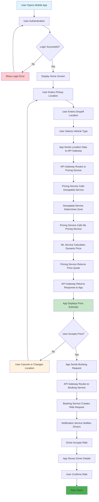

# Diagram 01: User Journey Flow

## Overview
This diagram illustrates the complete user journey from mobile app interaction to dynamic pricing calculation and ride booking.

## User Journey Flow

## Key User Journey Steps

### 1. **Authentication Phase**
- User opens mobile app
- Login with credentials (email/password)
- JWT token generation and storage
- Role-based access control

### 2. **Location Input Phase**
- User enters pickup location (GPS or manual)
- User enters dropoff location
- Location validation and geocoding
- Vehicle type selection

### 3. **Price Calculation Phase**
- Real-time price estimation request
- Geospatial zone determination
- ML-based dynamic pricing calculation
- Price quote with 30-second validity

### 4. **Booking Phase**
- User accepts price quote
- Ride request creation
- Driver notification and matching
- Ride confirmation and start

## User Experience Touchpoints

| Step | User Action | System Response | Expected Time |
|------|-------------|-----------------|---------------|
| 1 | App Launch | Authentication Screen | < 2s |
| 2 | Login | Home Screen | < 3s |
| 3 | Location Input | Location Validation | < 1s |
| 4 | Price Request | Price Quote Display | < 5s |
| 5 | Price Acceptance | Driver Matching | < 10s |
| 6 | Ride Confirmation | Ride Start | < 2s |

## Error Handling Flows

### Authentication Errors
- Invalid credentials → Retry login
- Token expiration → Auto-refresh or re-login
- Network error → Offline mode or retry

### Pricing Errors
- Location not found → Manual location entry
- Service unavailable → Cached pricing or retry
- Price calculation timeout → Fallback pricing

### Booking Errors
- No drivers available → Wait or expand search area
- Driver cancellation → Re-match with new driver
- Payment failure → Retry payment or alternative method

## Performance Requirements

- **App Launch**: < 2 seconds
- **Authentication**: < 3 seconds
- **Price Calculation**: < 5 seconds
- **Driver Matching**: < 10 seconds
- **Overall Journey**: < 30 seconds

## Mobile App Features

### Core Features
- GPS location detection
- Real-time price updates
- Push notifications
- Offline mode support
- Multi-language support

### Advanced Features
- Price history tracking
- Favorite locations
- Ride scheduling
- Split fare calculation
- Driver rating system

---

*This user journey ensures a smooth, fast, and reliable experience for users booking rides through the Equilibrium platform.*
