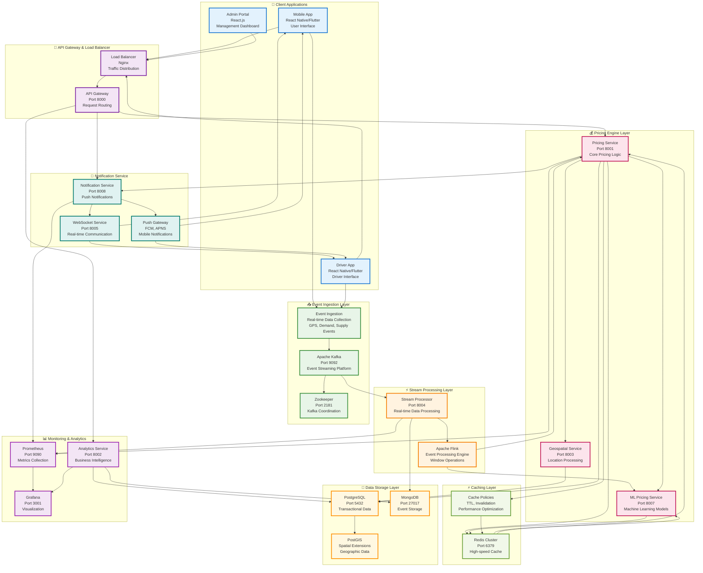
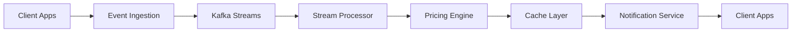
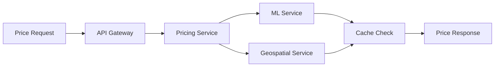
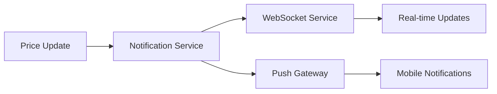

# Diagram 02: System Architecture (Updated)

## Overview
This diagram illustrates the core system architecture of the Equilibrium Dynamic Pricing Platform, focusing on the main components, data flows, and key services including Event Ingestion, Stream Processing, Pricing Engine, Caching Layer, and Notification Service.

## System Architecture with Key Components

## Component Descriptions

### 📱 Client Applications
- **Mobile App**: User interface for ride requests and price estimation
- **Driver App**: Driver interface for ride acceptance and navigation
- **Admin Portal**: Management dashboard for system monitoring and control

### 🚪 API Gateway & Load Balancer
- **Load Balancer**: Distributes incoming traffic across multiple service instances
- **API Gateway**: Central entry point for all API requests with routing and authentication

### 📥 Event Ingestion Layer
- **Event Ingestion**: Collects real-time events from mobile apps and external sources
- **Apache Kafka**: High-throughput event streaming platform for data ingestion
- **Zookeeper**: Coordinates Kafka cluster and manages configuration

### ⚡ Stream Processing Layer
- **Stream Processor**: Processes real-time data streams for pricing calculations
- **Apache Flink**: Distributed stream processing engine with window operations

### 💰 Pricing Engine Layer
- **Pricing Service**: Core pricing logic and surge calculation algorithms
- **ML Pricing Service**: Machine learning models for predictive pricing
- **Geospatial Service**: Location-based processing and zone management

### ⚡ Caching Layer
- **Redis Cluster**: High-speed in-memory cache for frequently accessed data
- **Cache Policies**: TTL management and cache invalidation strategies

### 📢 Notification Service
- **Notification Service**: Manages push notifications and alerts
- **WebSocket Service**: Real-time bidirectional communication
- **Push Gateway**: Integrates with FCM and APNS for mobile notifications

### 💾 Data Storage Layer
- **PostgreSQL**: Primary transactional database with ACID compliance
- **PostGIS**: Spatial database extensions for geographic data processing
- **MongoDB**: Document database for event storage and analytics

### 📊 Monitoring & Analytics
- **Prometheus**: Metrics collection and monitoring system
- **Grafana**: Data visualization and dashboard platform
- **Analytics Service**: Business intelligence and reporting

## Data Flows Between Services

### 1. **Real-time Event Processing Flow**

### 2. **Pricing Calculation Flow**

### 3. **Notification Flow**

## Key Service Interactions

### Event Ingestion → Stream Processor
- **Data Flow**: Real-time events from mobile apps and external sources
- **Processing**: Event filtering, validation, and enrichment
- **Output**: Structured events for downstream processing

### Stream Processor → Pricing Engine
- **Data Flow**: Processed events with location and demand data
- **Processing**: Real-time pricing calculations and surge detection
- **Output**: Updated pricing information and market conditions

### Pricing Engine → Caching Layer
- **Data Flow**: Calculated prices and market data
- **Processing**: Cache storage with TTL and invalidation policies
- **Output**: Fast access to pricing data for API responses

### Caching Layer → Notification Service
- **Data Flow**: Cache invalidation events and price updates
- **Processing**: Real-time notification triggers
- **Output**: Push notifications and WebSocket updates

## Performance Characteristics

| Component | Latency | Throughput | Availability |
|-----------|---------|------------|--------------|
| Event Ingestion | < 10ms | 100K+ events/s | 99.9% |
| Stream Processor | < 50ms | 50K+ events/s | 99.9% |
| Pricing Engine | < 100ms | 10K+ requests/s | 99.9% |
| Caching Layer | < 5ms | 100K+ ops/s | 99.9% |
| Notification Service | < 200ms | 5K+ notifications/s | 99.9% |

## Scalability Features

### Horizontal Scaling
- **Event Ingestion**: Kafka partitions for parallel processing
- **Stream Processor**: Flink task managers for distributed processing
- **Pricing Engine**: Multiple service instances with load balancing
- **Caching Layer**: Redis cluster with sharding
- **Notification Service**: Multiple notification workers

### Vertical Scaling
- **Resource Allocation**: CPU and memory optimization per service
- **Connection Pooling**: Database and cache connection management
- **Memory Management**: Efficient data structures and garbage collection

## Security Considerations

### Data Protection
- **Encryption**: TLS 1.3 for data in transit
- **Authentication**: JWT tokens and OAuth 2.0
- **Authorization**: Role-based access control (RBAC)
- **Rate Limiting**: API throttling and DDoS protection

### Privacy
- **Data Anonymization**: Personal data protection
- **Audit Logging**: Comprehensive activity tracking
- **Compliance**: GDPR and data protection regulations

---

*This architecture provides a scalable, real-time dynamic pricing platform with high availability and performance for ride-sharing services.*
