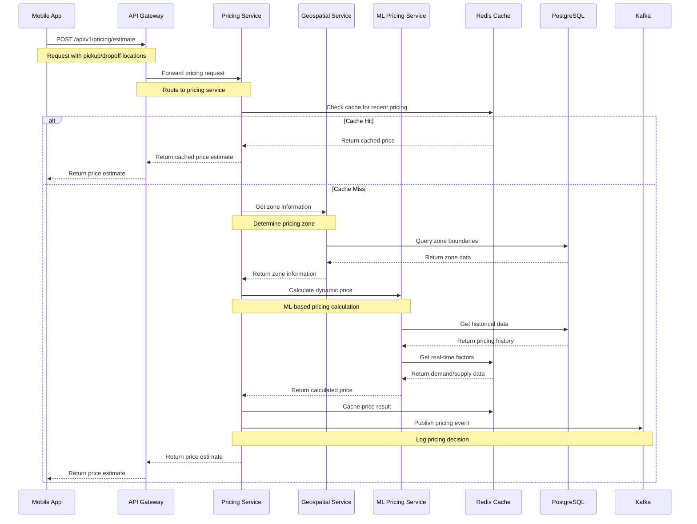
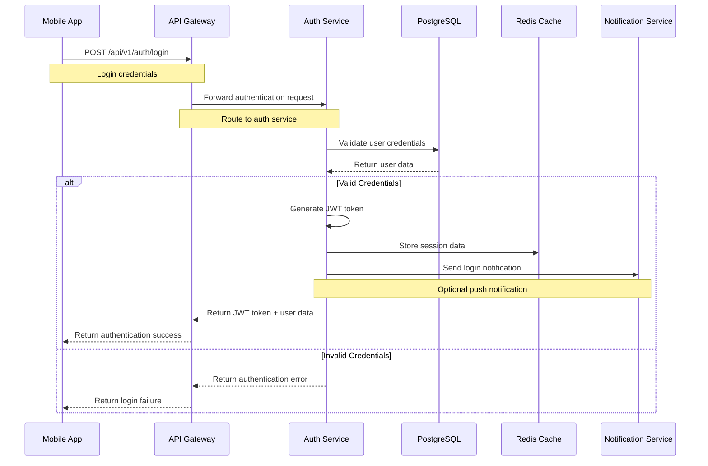
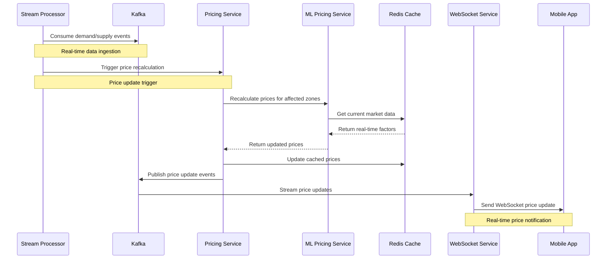
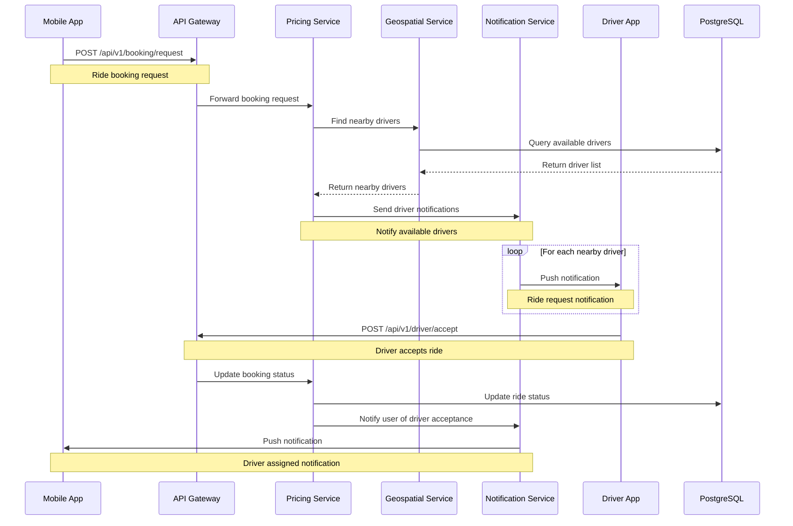
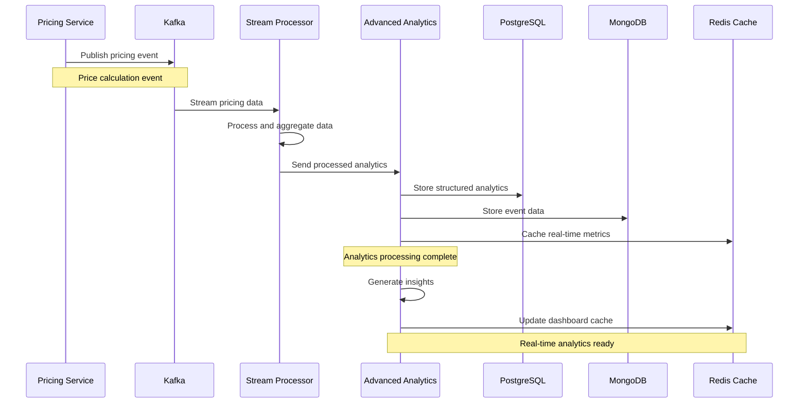
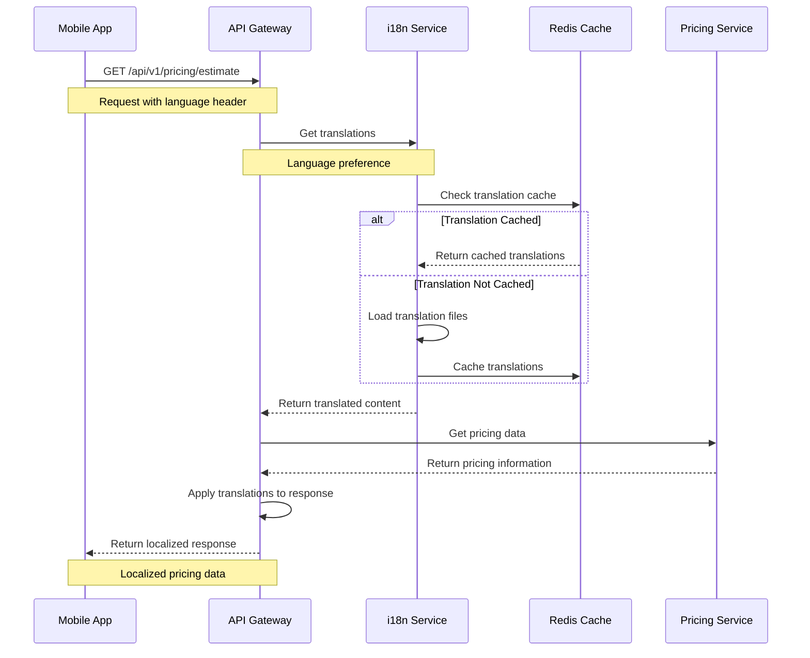
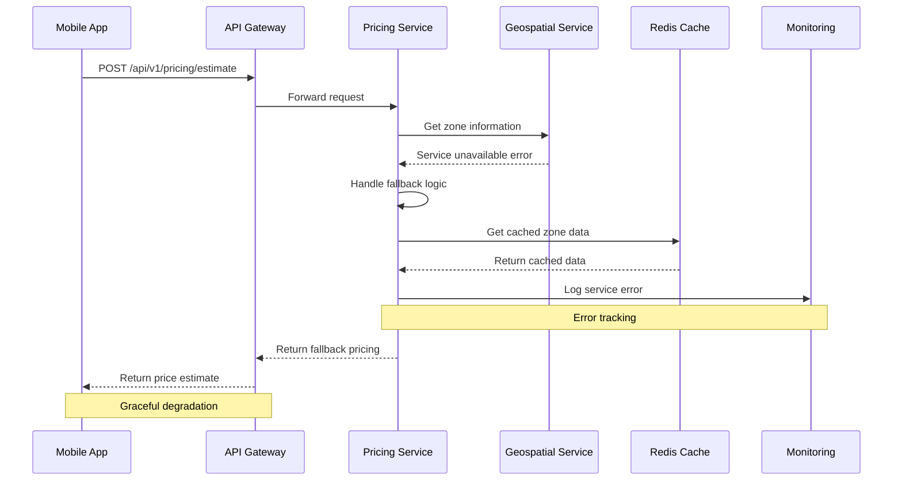
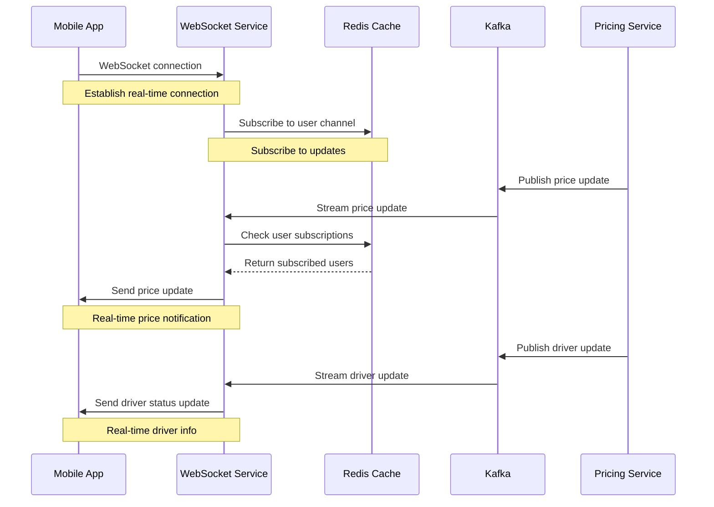

# Diagram 03: Service Sequence Diagrams

## Overview
This document contains sequence diagrams showing the interaction patterns between different services in the Equilibrium Dynamic Pricing Platform.

## 1. Price Estimation Sequence

## 2. User Authentication Sequence

## 3. Real-time Price Update Sequence

## 4. Driver Matching Sequence

## 5. Analytics Data Collection Sequence

## 6. Multi-language Support Sequence

## 7. Error Handling Sequence

## 8. WebSocket Real-time Updates Sequence

## Service Interaction Patterns

### 1. **Request-Response Pattern**
- Used for synchronous operations
- API Gateway routes requests to appropriate services
- Services return immediate responses
- Examples: Price estimation, user authentication

### 2. **Event-Driven Pattern**
- Used for asynchronous operations
- Services publish events to Kafka
- Other services consume and react to events
- Examples: Price updates, analytics collection

### 3. **Real-time Communication Pattern**
- WebSocket connections for live updates
- Redis pub/sub for message distribution
- Push notifications for mobile apps
- Examples: Price changes, driver locations

### 4. **Caching Pattern**
- Redis for high-speed data access
- Cache-aside pattern for frequently accessed data
- Cache invalidation on data updates
- Examples: Price quotes, user sessions

## Performance Considerations

### Latency Optimization
- Service calls: < 100ms
- Database queries: < 20ms
- Cache access: < 5ms
- WebSocket updates: < 50ms

### Throughput Optimization
- Concurrent request handling
- Connection pooling
- Async processing where possible
- Load balancing across service instances

### Error Handling
- Circuit breaker pattern
- Retry mechanisms with exponential backoff
- Graceful degradation
- Comprehensive error logging

---

*These sequence diagrams illustrate the complex interactions between services in the Equilibrium platform, ensuring reliable and performant dynamic pricing operations.*
