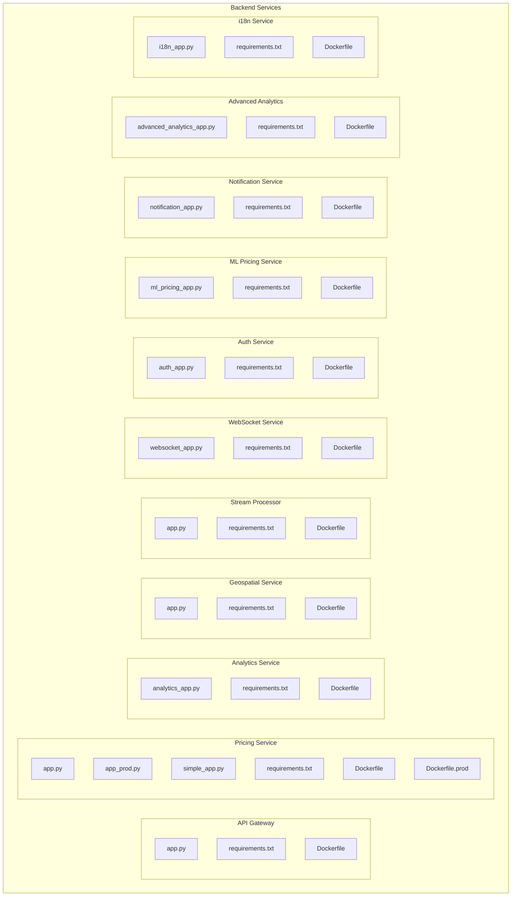
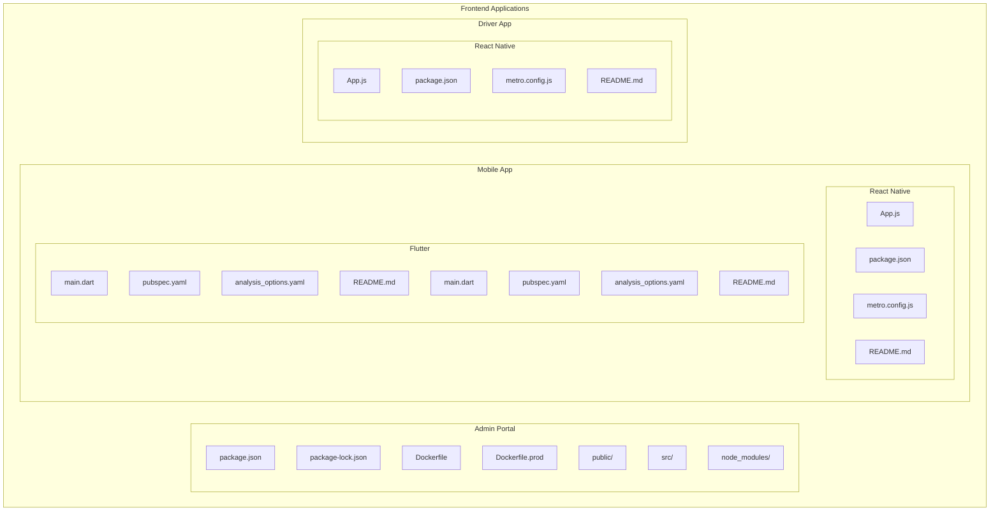
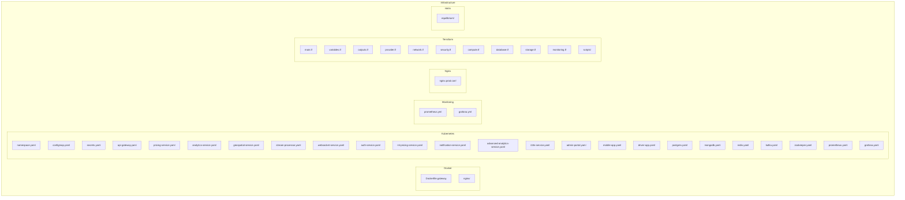
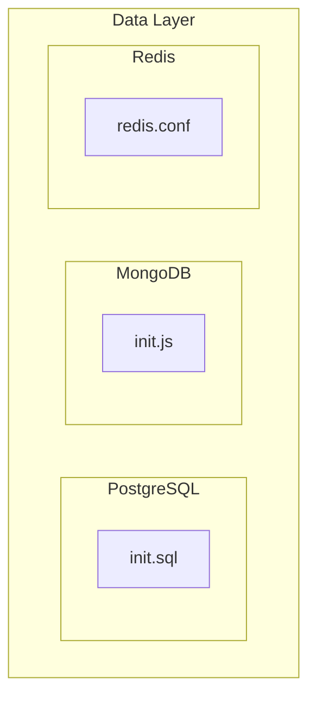
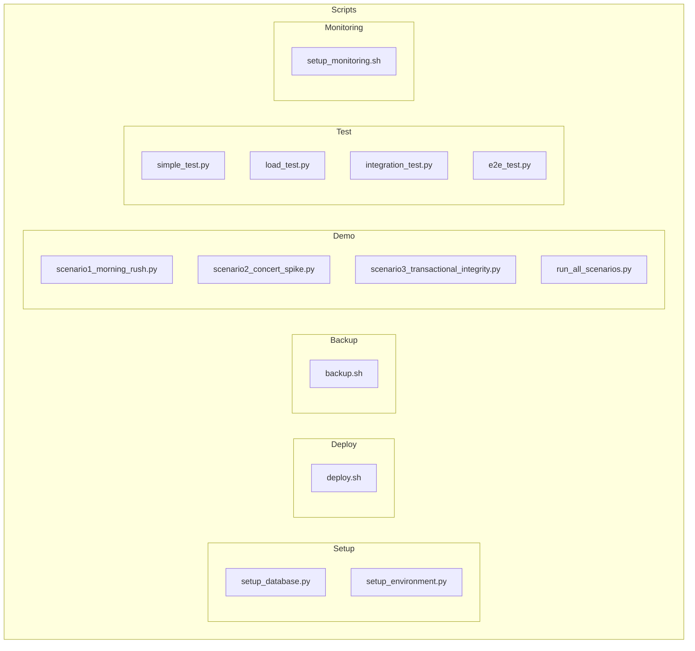
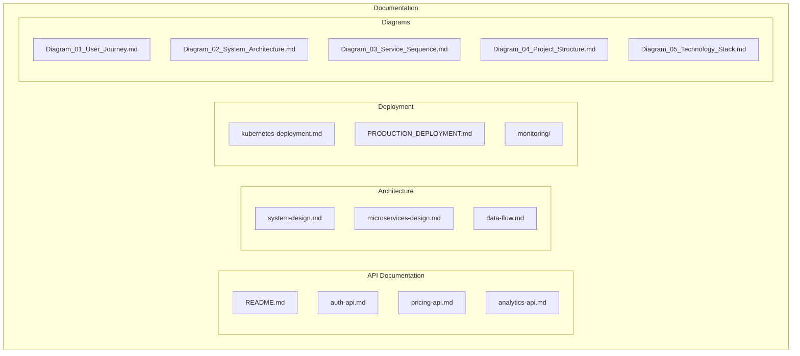

# Diagram 04: Project Structure

## Overview
This diagram visualizes the complete project structure of the Equilibrium Dynamic Pricing Platform, showing the organization of directories, files, and their relationships.

## Project Structure Visualization

```mermaid
graph TD
    ROOT[equilibrium/] --> BACKEND[backend/]
    ROOT --> FRONTEND[frontend/]
    ROOT --> INFRA[infrastructure/]
    ROOT --> DATA[data/]
    ROOT --> SCRIPTS[scripts/]
    ROOT --> DOCS[docs/]
    ROOT --> TESTS[tests/]
    ROOT --> CONFIG[Configuration Files]
    
    %% Backend Services
    BACKEND --> API_GW[api-gateway/]
    BACKEND --> PRICING[pricing-service/]
    BACKEND --> ANALYTICS[analytics-service/]
    BACKEND --> GEOSPATIAL[geospatial-service/]
    BACKEND --> STREAM[stream-processor/]
    BACKEND --> WEBSOCKET[websocket-service/]
    BACKEND --> AUTH[auth-service/]
    BACKEND --> ML[ml-pricing-service/]
    BACKEND --> NOTIF[notification-service/]
    BACKEND --> ADV_ANALYTICS[advanced-analytics-service/]
    BACKEND --> I18N[i18n-service/]
    
    %% Frontend Applications
    FRONTEND --> ADMIN[admin-portal/]
    FRONTEND --> MOBILE[mobile-app/]
    FRONTEND --> DRIVER[driver-app/]
    
    %% Mobile App Structure
    MOBILE --> MOBILE_RN[mobile-app/react-app/]
    MOBILE --> MOBILE_FLUTTER[mobile-app/flutter-app/]
    
    %% Driver App Structure
    DRIVER --> DRIVER_RN[driver-app/react-app/]
    DRIVER --> DRIVER_FLUTTER[driver-app/flutter-app/]
    
    %% Infrastructure
    INFRA --> DOCKER[docker/]
    INFRA --> K8S[k8s/]
    INFRA --> MONITORING[monitoring/]
    INFRA --> NGINX[nginx/]
    INFRA --> TERRAFORM[terraform/]
    INFRA --> HELM[helm/]
    
    %% Data
    DATA --> POSTGRES[postgres/]
    DATA --> MONGODB[mongodb/]
    DATA --> REDIS[redis/]
    
    %% Scripts
    SCRIPTS --> SETUP[setup/]
    SCRIPTS --> DEPLOY[deploy/]
    SCRIPTS --> BACKUP[backup/]
    SCRIPTS --> DEMO[demo/]
    SCRIPTS --> TEST[test/]
    SCRIPTS --> MONITORING_SCRIPTS[monitoring/]
    
    %% Documentation
    DOCS --> API_DOCS[api/]
    DOCS --> ARCH_DOCS[architecture/]
    DOCS --> DEPLOY_DOCS[deployment/]
    DOCS --> DIAGRAMS[diagrams/]
    
    %% Tests
    TESTS --> UNIT[unit/]
    TESTS --> INTEGRATION[integration/]
    TESTS --> E2E[e2e/]
    
    %% Configuration Files
    CONFIG --> DOCKER_COMPOSE[docker-compose.yml]
    CONFIG --> DOCKER_PROD[docker-compose.prod.yml]
    CONFIG --> ENV[env.example]
    CONFIG --> ENV_PROD[env.prod.example]
    CONFIG --> MAKEFILE[Makefile]
    CONFIG --> REQUIREMENTS[requirements.txt]
    
    %% Styling
    classDef backendService fill:#e8f5e8
    classDef frontendApp fill:#e3f2fd
    classDef infrastructure fill:#fff3e0
    classDef data fill:#f3e5f5
    classDef scripts fill:#fce4ec
    classDef docs fill:#f1f8e9
    classDef tests fill:#e0f2f1
    classDef config fill:#fff8e1
    
    class API_GW,PRICING,ANALYTICS,GEOSPATIAL,STREAM,WEBSOCKET,AUTH,ML,NOTIF,ADV_ANALYTICS,I18N backendService
    class ADMIN,MOBILE,DRIVER,MOBILE_RN,MOBILE_FLUTTER,DRIVER_RN,DRIVER_FLUTTER frontendApp
    class DOCKER,K8S,MONITORING,NGINX,TERRAFORM,HELM infrastructure
    class POSTGRES,MONGODB,REDIS data
    class SETUP,DEPLOY,BACKUP,DEMO,TEST,MONITORING_SCRIPTS scripts
    class API_DOCS,ARCH_DOCS,DEPLOY_DOCS,DIAGRAMS docs
    class UNIT,INTEGRATION,E2E tests
    class DOCKER_COMPOSE,DOCKER_PROD,ENV,ENV_PROD,MAKEFILE,REQUIREMENTS config
```

## Detailed Directory Structure

### Backend Services Structure

### Frontend Applications Structure

### Infrastructure Structure

### Data Structure

### Scripts Structure

### Documentation Structure

## File Organization Principles

### 1. **Separation of Concerns**
- Backend services are isolated in their own directories
- Frontend applications are separated by platform and purpose
- Infrastructure configurations are centralized
- Documentation is organized by topic

### 2. **Consistency**
- Each service follows the same structure pattern
- Docker files are consistently named
- Configuration files follow naming conventions
- Documentation follows markdown standards

### 3. **Scalability**
- Microservices can be developed independently
- New services can be added following existing patterns
- Infrastructure can be scaled horizontally
- Documentation can be extended easily

### 4. **Maintainability**
- Clear directory structure
- Consistent file naming
- Comprehensive documentation
- Modular design

## Key Configuration Files

| File | Purpose | Location |
|------|---------|----------|
| `docker-compose.yml` | Development environment | Root |
| `docker-compose.prod.yml` | Production environment | Root |
| `env.example` | Environment variables template | Root |
| `env.prod.example` | Production environment template | Root |
| `Makefile` | Build and deployment commands | Root |
| `requirements.txt` | Python dependencies | Root |

## Service Dependencies

### Backend Services
- Each service has its own `requirements.txt`
- Each service has its own `Dockerfile`
- Services communicate via HTTP APIs and Kafka
- Shared configuration via environment variables

### Frontend Applications
- Each app has its own `package.json`
- Each app has its own `Dockerfile`
- Apps communicate with backend via REST APIs
- Shared UI components and utilities

### Infrastructure
- Kubernetes manifests for each service
- Terraform for cloud infrastructure
- Helm charts for package management
- Monitoring configurations

---

*This project structure provides a scalable, maintainable, and well-organized codebase for the Equilibrium Dynamic Pricing Platform.*
