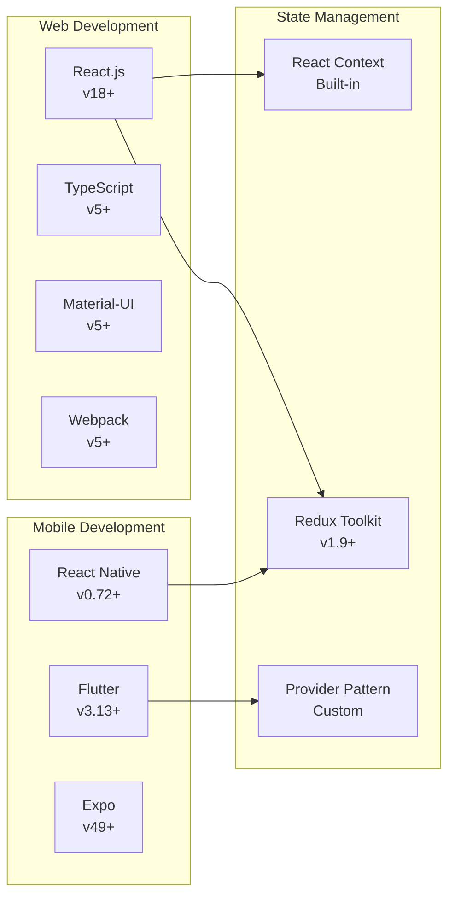
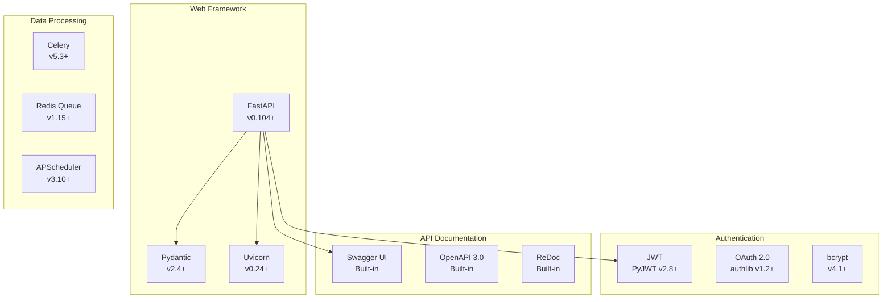
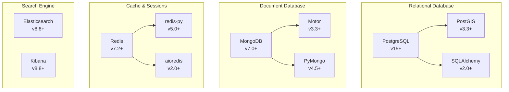
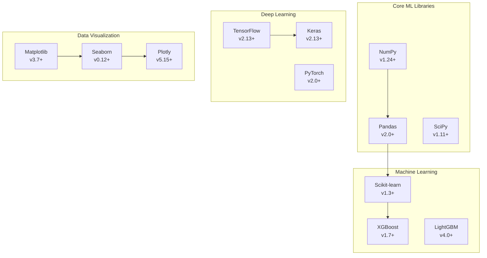
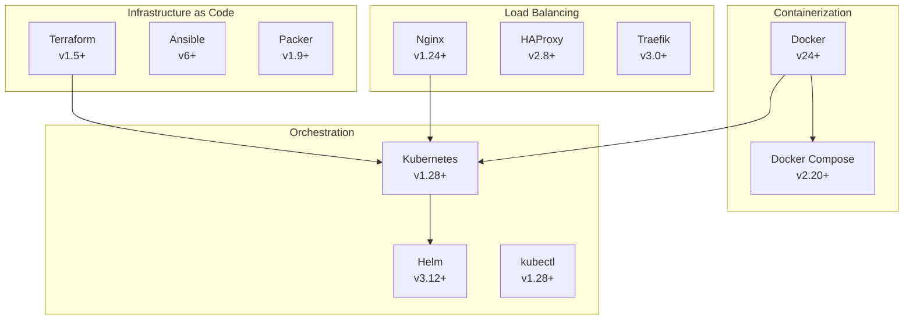
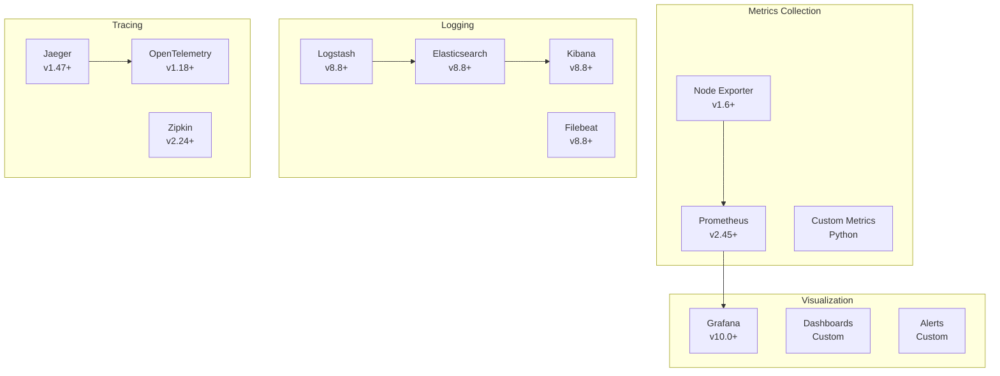

# Diagram 05: Technology Stack (Fixed)

## Overview
This diagram illustrates the complete technology stack used in the Equilibrium Dynamic Pricing Platform, showing the relationships between different technologies and their roles in the system.

## Complete Technology Stack

```mermaid
graph TB
    subgraph CLIENT["Client Layer"]
        subgraph MOBILE["Mobile Applications"]
            RN["React Native<br/>Cross-platform mobile"]
            FLUTTER["Flutter<br/>Cross-platform mobile"]
            EXPO["Expo<br/>Development platform"]
        end
        
        subgraph WEB["Web Applications"]
            REACT["React.js<br/>Web framework"]
            TYPESCRIPT["TypeScript<br/>Type safety"]
            MATERIAL_UI["Material-UI<br/>Component library"]
        end
    end
    
    subgraph API["API Layer"]
        FASTAPI["FastAPI<br/>Python web framework"]
        PYDANTIC["Pydantic<br/>Data validation"]
        UVCORN["Uvicorn<br/>ASGI server"]
        JWT["JWT<br/>Authentication"]
    end
    
    subgraph MQ["Message Queue & Streaming"]
        KAFKA["Apache Kafka<br/>Event streaming"]
        ZOOKEEPER["Zookeeper<br/>Coordination"]
        WEBSOCKET["WebSocket<br/>Real-time communication"]
    end
    
    subgraph DB["Database Layer"]
        POSTGRESQL["PostgreSQL<br/>Primary database"]
        POSTGIS["PostGIS<br/>Spatial extensions"]
        MONGODB["MongoDB<br/>Document database"]
        REDIS["Redis<br/>Cache & sessions"]
    end
    
    subgraph ML["Machine Learning"]
        NUMPY["NumPy<br/>Numerical computing"]
        PANDAS["Pandas<br/>Data manipulation"]
        SKLEARN["Scikit-learn<br/>ML algorithms"]
        TENSORFLOW["TensorFlow<br/>Deep learning"]
    end
    
    subgraph INFRA["Infrastructure & DevOps"]
        DOCKER["Docker<br/>Containerization"]
        K8S["Kubernetes<br/>Orchestration"]
        NGINX["Nginx<br/>Load balancer"]
        TERRAFORM["Terraform<br/>Infrastructure as Code"]
        HELM["Helm<br/>Package manager"]
    end
    
    subgraph MONITOR["Monitoring & Observability"]
        PROMETHEUS["Prometheus<br/>Metrics collection"]
        GRAFANA["Grafana<br/>Visualization"]
        ELK["ELK Stack<br/>Logging"]
        JAEGER["Jaeger<br/>Distributed tracing"]
    end
    
    subgraph DEV["Development Tools"]
        GIT["Git<br/>Version control"]
        GITHUB["GitHub<br/>Repository hosting"]
        VSCODE["VS Code<br/>IDE"]
        POSTMAN["Postman<br/>API testing"]
    end
    
    subgraph CLOUD["Cloud & Deployment"]
        AWS["AWS<br/>Cloud platform"]
        GCP["Google Cloud<br/>Cloud platform"]
        AZURE["Azure<br/>Cloud platform"]
        CI_CD["CI/CD<br/>Continuous integration"]
    end
    
    %% Connections
    RN --> FASTAPI
    FLUTTER --> FASTAPI
    REACT --> FASTAPI
    
    FASTAPI --> POSTGRESQL
    FASTAPI --> MONGODB
    FASTAPI --> REDIS
    FASTAPI --> KAFKA
    
    KAFKA --> ZOOKEEPER
    
    FASTAPI --> NUMPY
    FASTAPI --> PANDAS
    FASTAPI --> SKLEARN
    
    DOCKER --> K8S
    K8S --> NGINX
    TERRAFORM --> K8S
    HELM --> K8S
    
    PROMETHEUS --> GRAFANA
    ELK --> GRAFANA
    
    GIT --> GITHUB
    GITHUB --> CI_CD
    CI_CD --> K8S
    
    %% Styling
    classDef clientLayer fill:#e3f2fd,stroke:#1976d2,stroke-width:2px
    classDef apiLayer fill:#e8f5e8,stroke:#388e3c,stroke-width:2px
    classDef dataLayer fill:#fff3e0,stroke:#f57c00,stroke-width:2px
    classDef mlLayer fill:#f3e5f5,stroke:#7b1fa2,stroke-width:2px
    classDef infraLayer fill:#fce4ec,stroke:#c2185b,stroke-width:2px
    classDef monitorLayer fill:#f1f8e9,stroke:#689f38,stroke-width:2px
    classDef devLayer fill:#e0f2f1,stroke:#00796b,stroke-width:2px
    classDef cloudLayer fill:#fff8e1,stroke:#ff8f00,stroke-width:2px
    
    class RN,FLUTTER,EXPO,REACT,TYPESCRIPT,MATERIAL_UI clientLayer
    class FASTAPI,PYDANTIC,UVCORN,JWT apiLayer
    class POSTGRESQL,POSTGIS,MONGODB,REDIS,KAFKA,ZOOKEEPER,WEBSOCKET dataLayer
    class NUMPY,PANDAS,SKLEARN,TENSORFLOW mlLayer
    class DOCKER,K8S,NGINX,TERRAFORM,HELM infraLayer
    class PROMETHEUS,GRAFANA,ELK,JAEGER monitorLayer
    class GIT,GITHUB,VSCODE,POSTMAN devLayer
    class AWS,GCP,AZURE,CI_CD cloudLayer
```

## Technology Stack by Layer

### 1. **Client Layer Technologies**

### 2. **Backend Technologies**

### 3. **Database Technologies**

### 4. **Machine Learning Stack**

### 5. **Infrastructure & DevOps**

### 6. **Monitoring & Observability**

## Technology Dependencies

### Backend Dependencies

```mermaid
graph TD
    subgraph CORE["Core Dependencies"]
        FASTAPI["FastAPI"]
        PYDANTIC["Pydantic"]
        UVCORN["Uvicorn"]
        SQLALCHEMY["SQLAlchemy"]
        ALEMBIC["Alembic"]
    end
    
    subgraph DRIVERS["Database Drivers"]
        PSYCOPG2["psycopg2-binary"]
        PYMONGO["PyMongo"]
        REDIS_PY["redis"]
        AIOREDIS["aioredis"]
    end
    
    subgraph AUTH_DEPS["Authentication"]
        PYJWT["PyJWT"]
        PASSLIB["passlib"]
        BCRYPT["bcrypt"]
        OAUTH["authlib"]
    end
    
    subgraph ML_DEPS["ML Libraries"]
        NUMPY["NumPy"]
        PANDAS["Pandas"]
        SKLEARN["scikit-learn"]
        XGBOOST["XGBoost"]
    end
    
    subgraph UTILS["Utilities"]
        REQUESTS["requests"]
        AIOHTTP["aiohttp"]
        CELERY["Celery"]
        APSCHEDULER["APScheduler"]
    end
    
    FASTAPI --> PYDANTIC
    FASTAPI --> UVCORN
    FASTAPI --> SQLALCHEMY
    SQLALCHEMY --> ALEMBIC
    FASTAPI --> PSYCOPG2
    FASTAPI --> PYMONGO
    FASTAPI --> REDIS_PY
    FASTAPI --> PYJWT
    FASTAPI --> NUMPY
    FASTAPI --> REQUESTS
```

### Frontend Dependencies

```mermaid
graph TD
    subgraph REACT_DEPS["React Dependencies"]
        REACT["react"]
        REACT_DOM["react-dom"]
        REACT_ROUTER["react-router-dom"]
        REACT_QUERY["react-query"]
    end
    
    subgraph UI_DEPS["UI Libraries"]
        MATERIAL_UI["MUI Material<br/>@mui/material"]
        MATERIAL_ICONS["MUI Icons<br/>@mui/icons-material"]
        EMOTION["Emotion React<br/>@emotion/react"]
        EMOTION_STYLED["Emotion Styled<br/>@emotion/styled"]
    end
    
    subgraph STATE_DEPS["State Management"]
        REDUX_TOOLKIT["Redux Toolkit<br/>@reduxjs/toolkit"]
        REACT_REDUX["react-redux"]
        REDUX_PERSIST["redux-persist"]
    end
    
    subgraph DEV_DEPS["Development Tools"]
        TYPESCRIPT["typescript"]
        ESLINT["eslint"]
        PRETTIER["prettier"]
        WEBPACK["webpack"]
    end
    
    REACT --> REACT_DOM
    REACT --> REACT_ROUTER
    REACT --> MATERIAL_UI
    REACT --> REDUX_TOOLKIT
    REACT --> TYPESCRIPT
```

## Version Compatibility Matrix

| Technology | Version | Compatibility | Notes |
|------------|---------|---------------|-------|
| **Python** | 3.11+ | ✅ | Recommended for FastAPI |
| **Node.js** | 18+ | ✅ | Required for React 18+ |
| **Docker** | 24+ | ✅ | Latest stable |
| **Kubernetes** | 1.28+ | ✅ | Production ready |
| **PostgreSQL** | 15+ | ✅ | With PostGIS 3.3+ |
| **MongoDB** | 7.0+ | ✅ | Latest stable |
| **Redis** | 7.2+ | ✅ | Latest stable |
| **Kafka** | 3.5+ | ✅ | Latest stable |

## Performance Characteristics

### Backend Performance
- **FastAPI**: 10,000+ requests/second
- **PostgreSQL**: 1,000+ queries/second
- **Redis**: 50,000+ operations/second
- **Kafka**: 100,000+ messages/second

### Frontend Performance
- **React**: < 100ms render time
- **Flutter**: 60 FPS animations
- **React Native**: Native performance
- **WebSocket**: < 50ms latency

### Infrastructure Performance
- **Docker**: < 1s container startup
- **Kubernetes**: < 30s pod deployment
- **Nginx**: 10,000+ concurrent connections
- **Prometheus**: 1M+ metrics/second

## Security Considerations

### Authentication & Authorization
- JWT tokens with short expiration
- OAuth 2.0 for third-party integration
- Role-based access control (RBAC)
- API rate limiting

### Data Security
- TLS 1.3 encryption in transit
- AES-256 encryption at rest
- Database access controls
- Secrets management

### Network Security
- VPC isolation
- Firewall rules
- DDoS protection
- Intrusion detection

---

*This technology stack provides a modern, scalable, and maintainable foundation for the Equilibrium Dynamic Pricing Platform, ensuring high performance and reliability.*
