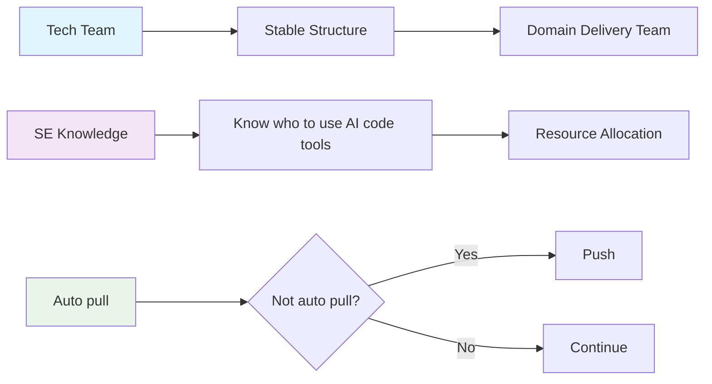

# 📋 Comprehensive Technology Team Management Guide

<div align="center">


</div>

## 📖 Overview

This document consolidates all knowledge and experience in managing technology teams of 20+ people, including organizational structure, management processes, talent development, and real-world best practices.

### 🎯 Objectives
- Build efficient and cohesive technology teams
- Develop talent and create learning environments
- Optimize workflows and delivery processes
- Manage risks and ensure continuity

### 📚 Main Content
- [🏗️ Organizational Structure](#-1-organizational-structure)
- [🔄 Management Processes](#-2-management-processes)
- [👥 Talent Development](#-3-talent-development--guidance)
- [🛠️ Tools & Technology](#-4-tools--technology-stack)
- [🎯 Team Culture](#-5-team-culture)
- [⚙️ Technical Processes](#-6-technical-processes)
- [📊 Metrics & KPIs](#-7-metrics--kpis)
- [🚨 Escalation & Problem Resolution](#-8-escalation--problem-resolution)
- [💰 Budget & Resource Planning](#-9-budget--resource-planning)
- [⚠️ Risk Management](#️-10-risk-management)
- [🎯 Best Practices](#-11-comprehensive-best-practices)

---

## 🏗️ 1. Organizational Structure

### 1.1 Ideal Organizational Model

#### 🏢 Tech Department Structure (20+ people)


#### 🎯 Domain Product Teams (5-7 people per team)

| Role | Responsibility | Count |
|------|----------------|-------|
| **Lead Developer** | Technical leadership, architecture decisions | 1 |
| **Senior Developer** | Complex features, mentoring | 1-2 |
| **Developer** | Feature development, bug fixing | 2-3 |
| **QC/QA** | Testing, quality assurance | 1 |
| **Designer** | UI/UX design, user experience | 1 |
| **Product Owner/PM/BA** | Requirements, stakeholder management | 1 |

### 1.2 👥 Role Division & Responsibilities

#### 🎯 Engineering Manager (1 person)
> **Role**: Technical leadership and personnel management

| Responsibility | Description | Time Allocation |
|----------------|-------------|-----------------|
| **Technical Vision** | Overall technical vision and strategy | 25% |
| **People Management** | People management and career development | 25% |
| **Communication** | Stakeholder communication | 20% |
| **Planning** | Resource planning and budgeting | 15% |
| **Evaluation** | Performance evaluation | 15% |

#### 🏗️ Solution Architect (1-2 people)
> **Role**: Solution design and technology research

| Responsibility | Description | Authority |
|----------------|-------------|-----------|
| **Research** | 50% research, can pick 1-2 assistants | ✅ |
| **Product** | 50% live product | ✅ |
| **Solutions** | Create complete solutions for team | ✅ |
| **Daily Meetings** | Meeting with dev and inter | ✅ |
| **Promotion Vote** | 3 points - Can vote dev to senior | ✅ |

#### 👨‍💻 Senior Developers (4-5 people)
> **Role**: Technical experts and mentors

| Responsibility | Description | Requirements |
|----------------|-------------|--------------|
| **Expertise** | Lead 1 project in domain | Domain expertise |
| **Full-stack** | Can work both frontend and backend | Technical breadth |
| **Mentoring** | Guide junior developers | Leadership skills |
| **Technical decisions** | Make technical decisions in domain | Decision making |
| **Code review** | Ensure code quality | Quality focus |
| **Promotion vote** | 3 points - Can vote dev to senior | Voting power |

#### 💻 Developers (8-10 people)
> **Role**: Feature development and product building

| Responsibility | Description | Rules |
|----------------|-------------|-------|
| **Specialization** | Specialize in frontend or backend | Specialization |
| **Cross-domain** | Can be assigned from other domains | Cross-team work |
| **Timeline** | Assigned by priority, first come first served | First come, first served |
| **Rotation** | Cannot be assigned consecutively in same domain | Fair rotation |

#### 🌱 Junior/Intern (4-5 people)
> **Role**: Learning and skill development

| Responsibility | Description | Support |
|----------------|-------------|---------|
| **Learning** | Can sit and listen in meetings | Learning opportunity |
| **Practice** | Work on simple tasks | Hands-on experience |
| **Mentoring** | Guided by seniors | Guidance |
| **Recruitment** | Selected by seniors | Selection process |

#### 🔧 DevOps/SRE (4-5 people)
> **Role**: System operations and maintenance

| Responsibility | Description | Tools |
|----------------|-------------|-------|
| **CI/CD** | Pipeline management | Jenkins, GitLab CI |
| **Infrastructure** | Infrastructure as Code | Terraform, Ansible |
| **Monitoring** | Monitoring and alerting | Prometheus, Grafana |
| **Security** | Security compliance | Security tools |
| **Performance** | Performance optimization | Performance tools |

#### 🧪 Quality Assurance (1-3 people)
> **Role**: Product quality assurance

| Responsibility | Description | Methods |
|----------------|-------------|---------|
| **Test planning** | Plan and execute testing | Test strategy |
| **Automation** | Automated testing | Automated testing |
| **Quality metrics** | Quality metrics | Quality metrics |
| **UAT coordination** | Coordinate user acceptance testing | User acceptance |

### 1.3 🔄 Cross-Domain Collaboration Model

#### 🏢 Domain/Product/Feature Structure


| Characteristics | Description | Benefits |
|----------------|-------------|----------|
| **Each Domain/Product/Feature** | 5-7 people | Optimized communication |
| **Domain Lead** | 1 tech lead responsible | Clear leadership |
| **Cross-functional** | Complete skills to deliver products | End-to-end ownership |
| **Autonomy** | Self-decision on technical matters | Empowerment |

#### 🔄 Cross-Domain Collaboration Rules


| Rule | Description | Example |
|------|-------------|---------|
| **Cross-pick** | SE can pick member from other domain teams | SE from Domain A picks Dev from Domain B |
| **Priority** | Pick by priority, first come first served | First come, first served |
| **Timeline** | Follow project timeline | No project delays |
| **Rotation** | Cannot pick same member consecutively | Fair distribution |
| **Full rotation** | Must pick different team members until full cycle | Complete cycle |

---

## 🔄 2. Management Processes

### 2.1 📅 Meeting Structure

#### 🌅 Daily Stand-ups (15 minutes)


| Information | Details | Notes |
|-------------|---------|-------|
| **Time** | Fixed daily (9:00 AM) | No changes |
| **Format** | 3 main questions | Structured |
| **Rules** | Strictly timeboxed | 15 minutes max |
| **Organization** | By small groups | Head-Senior, Senior-Dev, Inter |

##### 📋 Standard Format:
1. **Yesterday**: What was completed?
2. **Today**: What will be done?  
3. **Blockers**: What challenges are faced?

##### ⚠️ Important Rules:
- ❌ Don't solve detailed problems in stand-up
- 📝 Parking lot for post-meeting discussions
- ⏰ Strictly timeboxed
- 👥 For each group: Can organize by small groups

#### 🤝 1-on-1 Meetings (30-45 minutes, Lunch, Rotate all members)


| Information | Details | Requirements |
|-------------|---------|--------------|
| **Frequency** | Every 2 weeks | Mandatory |
| **Duration** | 30-45 minutes | Sufficient time |
| **Mandatory** | Must have 1-on-1 with members | Cannot skip |

##### 📝 Agenda template:
- 🎯 **Career goals and development**
- 🚧 **Current challenges**
- 💬 **Feedback on management and process**
- ⚖️ **Personal life balance**
- 📚 **Learning opportunities**

##### ✅ Best practices:
- **Preparation**: Both manager and team member prepare in advance
- **Follow-up**: Document action items and commitments
- **Consistency**: On time, on schedule

#### 🏗️ Solution Planning Meeting


| Phase | Participants | Purpose |
|-------|--------------|---------|
| **Planning** | Head + SE/SA | Create complete solution first |
| **Expansion** | Dev team | Feedback and suggestions |
| **Learning** | Inter team | Learn from experience |

#### 🏃‍♂️ Sprint Planning (4 hours for 2-week sprint)


| Phase | Duration | Activities | Output |
|-------|----------|------------|--------|
| **Part 1** | 2 hours | Product Owner present backlog | Clear requirements |
| **Part 2** | 2 hours | Technical breakdown and estimation | Technical plan |
| **Capacity** | - | Based on historical velocity | Resource allocation |
| **Definition** | - | Clear acceptance criteria | Ready criteria |
| **Risk** | - | Identify dependencies and blockers | Risk mitigation |

#### 🎯 Sprint Review & Demo (2 hours)

| Activity | Duration | Purpose | Participants |
|----------|----------|---------|--------------|
| **Live demo** | 1 hour | Showcase deliverables | Stakeholders |
| **Feedback** | 30 minutes | Collect feedback | All team |
| **Metrics** | 30 minutes | Review velocity, burndown | Management |

#### 🔄 Sprint Retrospective (1.5 hours)


| Question | Purpose | Output |
|----------|---------|--------|
| **What went well?** | Celebrate successes | Positive reinforcement |
| **What could be improved?** | Identify issues | Improvement plan |
| **Action items** | Set commitments | Clear ownership |
| **Process experiments** | Try new approaches | Innovation |
| **Team happiness** | Check morale | Team health |

### 2.2 📈 Performance Management

#### 🚀 Promotion Framework


| Level | Requirements | Vote System | Timeline |
|-------|-------------|-------------|----------|
| **Dev → SE** | 2 FE + 2 BE projects | SA/SE vote, majority | Every 6 months |
| **SE → SA** | Complete 4th year as SE | Similar vote | Every 6 months |
| **Special projects** | Long projects: 1FE + 1BE | Or projects with full domain | Flexible |

##### 🎯 Point system:
- **SE 1 year** = 1 point
- **SE 2-3 years** = 2-3 points  
- **3 points** = max
- **Senior over 3 years** = SA will evaluate like SE 1-3 years

#### 🎯 OKRs (Objectives and Key Results)


| Level | Purpose | Frequency | Process |
|-------|---------|-----------|---------|
| **Company** | Strategic direction | Quarterly | Cascade to teams |
| **Team** | Department goals | Quarterly | Align with company |
| **Individual** | Personal development | Monthly | Align with team |

#### 📊 Performance Reviews (Every 6 months)

| Component | Description | Method | Output |
|-----------|-------------|--------|--------|
| **360-degree feedback** | Multi-source evaluation | Surveys, interviews | Comprehensive view |
| **Technical skills** | Technical competency | Assessment, projects | Skill matrix |
| **Soft skills** | Communication, leadership | Observation, feedback | Development plan |
| **Career development** | Growth planning | 1-on-1 discussions | Career roadmap |
| **Compensation** | Salary review | Market analysis | Compensation adjustment |

### 2.3 🚀 Innovation & Research

#### 💡 Innovation Time


| Activity | Description | Benefits |
|----------|-------------|----------|
| **Private homelab** | Create private homelab for SA, SE, dev, inter research | Freedom to experiment |
| **New innovations** | If new innovations, should experiment with 2 technologies in parallel | Compare effectiveness |
| **Research allocation** | Must have technology improvement through self-research | Continuous improvement |
| **Head assigns topics** | Or head assigns research topics | Strategic direction |
| **Environment** | Create environment for homelab research, open source | Innovation culture |

#### 🛠️ Technology Stack Management



| Principle | Description | Application |
|-----------|-------------|-------------|
| **SE knows tools** | SE knows how to use AI code tools | Resource optimization |
| **Stable structure** | Tech team as stable structure, domain delivery team | Organizational stability |
| **Auto pull** | IF not auto pull will push | Performance optimization |

---

## 👥 3. Talent Development & Guidance

### 3.1 🤝 Mentoring System

#### 👫 Buddy Program


| Buddy Type | Description | Duration | Purpose |
|------------|-------------|----------|---------|
| **New hire buddy** | Support new employee | 3-6 months | Onboarding support |
| **Technical buddy** | Pair with senior developer | Ongoing | Technical growth |
| **Career buddy** | Different team to expand network | Ongoing | Career development |
| **Monthly feedback** | Track progress | Monthly | Continuous improvement |

#### 📚 Knowledge Transfer


| Activity | Frequency | Description | Benefits |
|----------|-----------|-------------|----------|
| **Code walkthrough** | Weekly | Technical deep-dives | Skill sharing |
| **Architecture reviews** | Monthly | System design discussions | Knowledge transfer |
| **Post-mortem learnings** | As needed | Share incident learnings | Continuous improvement |
| **Tech talks** | As needed | Internal presentations on new technologies | Innovation culture |

### 3.2 📚 Learning & Development

#### 💻 Technical Skills


| Type | Budget | Description | Benefits |
|------|--------|-------------|----------|
| **Learning budget** | $2000/person/year (50 million VND/person/year) | Free choice | Personal growth |
| **Conference attendance** | Encourage industry events | Networking, latest trends | Industry knowledge |
| **Certification support** | Cloud platforms, methodologies | Official recognition | Career advancement |
| **Internal training** | Lunch-and-learn sessions | Knowledge sharing | Team building |
| **Online courses** | Company subscriptions (Pluralsight, Udemy) | Flexible learning | Skill development |

#### 🗣️ Soft Skills


| Skill | Description | Target | Method |
|-------|-------------|--------|--------|
| **Communication** | Presentation and writing skills | All levels | Workshops, practice |
| **Leadership** | Development for senior members | Senior+ | Mentoring, projects |
| **Conflict resolution** | Team dynamics training | All levels | Training, mediation |
| **Project management** | Agile and methodologies | All levels | Certification, practice |

#### 🚀 Career Development


| Activity | Frequency | Description | Support |
|----------|-----------|-------------|---------|
| **Individual Development Plans** | Quarterly updates | Personal growth roadmap | Manager support |
| **Stretch assignments** | As needed | Cross-team projects | Challenge opportunities |
| **Innovation time** | 20% time | Personal projects | Company time |
| **Open source contributions** | Ongoing | Company support | Recognition |
| **Speaking opportunities** | As available | Conference talks | Professional development |

### 3.3 🚀 Onboarding Process

#### 📅 Onboarding Timeline Overview


#### 🏗️ Phase 1: Foundation (Week 1)


| Day | Activities | Deliverables | Success Criteria |
|-----|------------|--------------|------------------|
| **Day 1** | Company orientation, culture introduction | HR paperwork completed | Understanding of company values |
| **Day 2** | Development environment setup | Local environment running | Can run the application locally |
| **Day 3** | Team introductions, buddy assignment | Buddy relationship established | Knows team members and buddy |
| **Day 4** | First simple task assignment | Simple bug fix or feature | First code contribution |
| **Day 5** | Documentation review, process overview | Process checklist completed | Understands team processes |

#### 🔗 Phase 2: Integration (Week 2-4)


##### 📚 Week 2: Codebase Mastery
- **Deep dive into codebase**: Architecture patterns, coding standards
- **Pair programming sessions**: With senior developers
- **Documentation review**: Technical specifications, API docs
- **First feature implementation**: Under supervision

##### 🤝 Week 3: Team Integration
- **Code review participation**: Submit and review PRs
- **Team process understanding**: Standups, planning, retrospectives
- **Knowledge sharing**: Present learnings to team
- **Client interaction preparation**: Shadow senior team members

##### 🎯 Week 4: Process Mastery
- **Independent feature development**: With minimal supervision
- **Process improvement suggestions**: Contribute ideas
- **Stakeholder communication**: Attend client meetings
- **Performance goal setting**: Define 30-60-90 day objectives

#### 🚀 Phase 3: Contribution (Month 2-3)

```mermaid
mindmap
  root((Month 2-3 Goals))
    Independent Work
      Feature ownership
      Bug fixes
      Performance optimization
    Team Leadership
      Mentoring others
      Process improvements
      Knowledge sharing
    Client Interaction
      Requirements gathering
      Technical consultation
      Project updates
    Career Development
      Skill assessment
      Learning plan
      Promotion readiness
```

| Month | Focus Areas | Key Activities | Success Metrics |
|-------|-------------|----------------|-----------------|
| **Month 2** | Independent contribution | Feature ownership, client interaction | 80% independent work capability |
| **Month 3** | Team leadership | Mentoring, process improvement | Ready for next level responsibilities |

##### 🎯 30-60-90 Day Objectives

| Timeline | Technical Goals | Soft Skills | Business Impact |
|----------|-----------------|-------------|-----------------|
| **30 Days** | Complete first independent feature | Build relationships with team | Contribute to sprint goals |
| **60 Days** | Lead a small project | Present to stakeholders | Drive process improvements |
| **90 Days** | Mentor new team member | Lead technical discussions | Own end-to-end features |

#### 📋 Onboarding Checklist

```mermaid
flowchart TD
    A[Onboarding Checklist] --> B[Administrative]
    A --> C[Technical]
    A --> D[Social]
    A --> E[Performance]
    
    B --> B1[✅ HR paperwork]
    B --> B2[✅ Access & permissions]
    B --> B3[✅ Equipment setup]
    
    C --> C1[✅ Development environment]
    C --> C2[✅ Codebase understanding]
    C --> C3[✅ First contribution]
    
    D --> D1[✅ Team introductions]
    D --> D2[✅ Buddy relationship]
    D --> D3[✅ Company culture]
    
    E --> E1[✅ 30-day goals]
    E --> E2[✅ 60-day goals]
    E --> E3[✅ 90-day goals]
    
    style A fill:#4caf50
    style B fill:#2196f3
    style C fill:#ff9800
    style D fill:#9c27b0
    style E fill:#f44336
```

#### 🎯 Success Metrics

| Metric | Week 1 | Week 4 | Month 3 |
|--------|--------|--------|---------|
| **Environment Setup** | 100% | - | - |
| **First Contribution** | 100% | - | - |
| **Code Review Participation** | 0% | 100% | 100% |
| **Independent Work** | 0% | 60% | 90% |
| **Team Integration** | 20% | 80% | 100% |
| **Client Interaction** | 0% | 40% | 80% |

---

## 🛠️ 4. Tools & Technology Stack

### 4.1 📋 Project Management & Collaboration

```mermaid
flowchart TD
    A[Project Management] --> B[Jira]
    A --> C[Confluence]
    A --> D[Miro/Mural]
    
    E[Communication] --> F[Slack]
    E --> G[Zoom]
    E --> H[Microsoft Teams]
    
    I[Documentation] --> J[Confluence]
    I --> K[GitBook]
    I --> L[Notion]
    
    style A fill:#4caf50
    style E fill:#2196f3
    style I fill:#ff9800
```

#### 📊 Project Management Tools

| Tool | Purpose | Key Features | Team Size |
|------|---------|--------------|-----------|
| **Jira** | Epic, story, task tracking | Agile boards, Sprint planning, Burndown charts | 5-50+ |
| **Confluence** | Documentation & knowledge base | Wiki, templates, collaboration | All sizes |
| **Miro/Mural** | Collaborative design thinking | Whiteboarding, mind mapping, workshops | 2-20 |
| **Linear** | Modern issue tracking | Fast, clean interface, automation | 2-100 |
| **Monday.com** | Visual project management | Customizable workflows, automation | 5-200+ |

#### 💬 Communication Platforms

```mermaid
pie title Communication Tool Usage
    "Slack" : 45
    "Microsoft Teams" : 25
    "Zoom" : 15
    "Discord" : 10
    "Others" : 5
```

| Platform | Use Case | Features | Best For |
|----------|----------|----------|----------|
| **Slack** | Daily communication | Channels, integrations, bots | Tech teams |
| **Microsoft Teams** | Enterprise communication | Video calls, file sharing, Office integration | Enterprise |
| **Zoom** | Video conferencing | HD video, screen sharing, recording | Remote teams |
| **Discord** | Informal communication | Voice channels, gaming integration | Gaming/casual teams |

### 4.2 💻 Development Tools & CI/CD

```mermaid
flowchart LR
    A[Code Development] --> B[Git]
    B --> C[CI/CD Pipeline]
    C --> D[Testing]
    D --> E[Deployment]
    
    F[Code Quality] --> G[SonarQube]
    F --> H[ESLint/Prettier]
    F --> I[Code Review]
    
    J[Containerization] --> K[Docker]
    K --> L[Kubernetes]
    L --> M[Production]
    
    style A fill:#ffeb3b
    style F fill:#4caf50
    style J fill:#2196f3
```

#### 🔧 Core Development Tools

| Category | Tool | Purpose | Benefits |
|----------|------|---------|----------|
| **Version Control** | Git + GitHub/GitLab | Code versioning | Collaboration, history tracking |
| **CI/CD** | Jenkins/GitLab CI/GitHub Actions | Automated testing & deployment | Faster delivery, consistency |
| **Code Quality** | SonarQube, ESLint, Prettier | Code analysis & formatting | Maintainable code, standards |
| **Containerization** | Docker, Podman | Application packaging | Consistency, scalability |
| **Orchestration** | Kubernetes, Docker Swarm | Container management | Auto-scaling, high availability |

#### 🚀 CI/CD Pipeline Flow

```mermaid
flowchart TD
    A[Code Commit] --> B[Git Hook]
    B --> C[Build Trigger]
    C --> D[Code Quality Check]
    D --> E{Tests Pass?}
    E -->|Yes| F[Build Image]
    E -->|No| G[Notify Developer]
    F --> H[Security Scan]
    H --> I{Scan Clean?}
    I -->|Yes| J[Deploy to Staging]
    I -->|No| K[Block Deployment]
    J --> L[Integration Tests]
    L --> M{All Tests Pass?}
    M -->|Yes| N[Deploy to Production]
    M -->|No| O[Rollback]
    
    style A fill:#4caf50
    style F fill:#2196f3
    style N fill:#ff9800
    style G fill:#f44336
    style K fill:#f44336
```

### 4.3 📊 Monitoring & Analytics

```mermaid
graph TD
    A[Application Monitoring] --> B[NewRelic]
    A --> C[DataDog]
    A --> D[AppDynamics]
    
    E[Log Management] --> F[ELK Stack]
    E --> G[Fluentd]
    E --> H[Splunk]
    
    I[Error Tracking] --> J[Sentry]
    I --> K[Bugsnag]
    I --> L[Rollbar]
    
    M[Performance] --> N[Grafana]
    M --> O[Prometheus]
    M --> P[JMeter]
    
    style A fill:#4caf50
    style E fill:#2196f3
    style I fill:#ff9800
    style M fill:#9c27b0
```

#### 📈 Monitoring Stack Overview

| Category | Tool | Purpose | Key Features |
|----------|------|---------|--------------|
| **APM** | NewRelic, DataDog | Application performance | Real-time monitoring, alerts |
| **Logs** | ELK Stack, Splunk | Log aggregation & analysis | Search, visualization, alerts |
| **Errors** | Sentry, Bugsnag | Error tracking | Real-time error reporting |
| **Metrics** | Grafana, Prometheus | Metrics visualization | Dashboards, alerting |
| **Uptime** | PingDom, UptimeRobot | Availability monitoring | SLA tracking, notifications |

#### 🔍 Monitoring Dashboard Structure

```mermaid
flowchart TD
    A[Monitoring Dashboard] --> B[Infrastructure Layer]
    A --> C[Application Layer]
    A --> D[Business Layer]
    
    B --> B1[CPU, Memory, Disk]
    B --> B2[Network, Database]
    
    C --> C1[Response Time, Throughput]
    C --> C2[Error Rate, Availability]
    
    D --> D1[User Activity, Conversions]
    D --> D2[Revenue, KPIs]
    
    style A fill:#4caf50
    style B fill:#2196f3
    style C fill:#ff9800
    style D fill:#9c27b0
```

### 4.4 🔒 Security Tools & Practices

```mermaid
flowchart TD
    A[Security Framework] --> B[Static Analysis]
    A --> C[Dynamic Analysis]
    A --> D[Dependency Scanning]
    A --> E[Secret Management]
    
    B --> B1[SonarQube, Checkmarx]
    C --> C1[OWASP ZAP, Burp Suite]
    D --> D1[Snyk, WhiteSource]
    E --> E1[HashiCorp Vault, AWS Secrets]
    
    F[Infrastructure Security] --> G[Network Security]
    F --> H[Access Control]
    F --> I[Compliance]
    
    G --> G1[Firewalls, VPNs]
    H --> H1[IAM, RBAC]
    I --> I1[Audit logs, Compliance tools]
    
    style A fill:#f44336
    style F fill:#ff9800
```

#### 🛡️ Security Tool Categories

| Category | Tools | Purpose | Integration |
|----------|-------|---------|-------------|
| **SAST** | SonarQube, Checkmarx, Veracode | Static code analysis | CI/CD pipeline |
| **DAST** | OWASP ZAP, Burp Suite | Dynamic testing | Automated scans |
| **Dependency** | Snyk, WhiteSource, OWASP Dependency Check | Vulnerability scanning | Package managers |
| **Secrets** | HashiCorp Vault, AWS Secrets Manager | Secret management | Runtime injection |
| **IAM** | AWS IAM, Azure AD, Okta | Identity & access | SSO integration |
| **Compliance** | Qualys, Rapid7, Nessus | Vulnerability assessment | Regular scanning |

#### 🔐 Security Pipeline Integration

```mermaid
flowchart LR
    A[Code Commit] --> B[SAST Scan]
    B --> C[Build Process]
    C --> D[Dependency Scan]
    D --> E[Container Scan]
    E --> F[DAST Scan]
    F --> G[Deploy]
    G --> H[Runtime Protection]
    
    I[Security Gates] --> J[Block if Critical]
    I --> K[Alert if High]
    I --> L[Monitor if Medium]
    
    style A fill:#4caf50
    style B fill:#f44336
    style F fill:#ff9800
    style H fill:#2196f3
```

---

## 🎯 5. Team Culture

### 5.1 🌟 Core Values

#### 💡 Innovation

```mermaid
mindmap
  root((Innovation))
    Encourage Experimentation
      Try new technologies
      Test new approaches
      Pilot projects
    Failure Tolerance
      Learn from mistakes
      No blame culture
      Post-mortem reviews
    Research Time
      20% innovation time
      Homelab projects
      Technology exploration
    Innovation Challenges
      Hackathons
      Innovation competitions
      Cross-team projects
```

| Principle | Description | Application |
|-----------|-------------|-------------|
| **Encourage experimentation** | Try new technologies | R&D projects |
| **Failure tolerance** | Accept failure to learn | No blame culture |
| **Learning from mistakes** | Learn from mistakes | Post-mortem reviews |
| **Research time allocation** | Allocate research time | 20% innovation time |
| **Innovation challenges** | Innovation challenges | Hackathons, competitions |

#### 🤝 Collaboration

```mermaid
flowchart TD
    A[Collaboration] --> B[Cross-team Projects]
    A --> C[Knowledge Sharing]
    A --> D[Pair Programming]
    A --> E[Code Review Culture]
    A --> F[Open Communication]
    
    B --> B1[Domain collaboration]
    C --> C1[Tech talks, workshops]
    D --> D1[Knowledge transfer]
    E --> E1[Quality improvement]
    F --> F1[Transparency]
    
    style A fill:#4caf50
    style B fill:#2196f3
    style C fill:#ff9800
    style D fill:#9c27b0
    style E fill:#f44336
    style F fill:#00bcd4
```

| Activity | Description | Benefits |
|----------|-------------|----------|
| **Cross-team projects** | Cross-team projects | Knowledge sharing |
| **Knowledge sharing sessions** | Knowledge sharing sessions | Skill development |
| **Pair programming** | Pair programming | Quality improvement |
| **Code review culture** | Code review culture | Best practices |
| **Open communication** | Open communication | Transparency |

#### 🏆 Quality

```mermaid
graph TD
    A["Quality Focus"] --> B["Definition of Done"]
    A --> C["Test-driven Development"]
    A --> D["Code Review Standards"]
    A --> E["Performance Benchmarks"]
    A --> F["User Experience"]
    
    B --> B1["Clear criteria"]
    C --> C1["80% coverage minimum"]
    D --> D1["2+ reviewers"]
    E --> E1["Performance targets"]
    F --> F1["User-centric design"]
    
    style A fill:#4caf50
    style B fill:#2196f3
    style C fill:#ff9800
    style D fill:#9c27b0
    style E fill:#f44336
    style F fill:#00bcd4
```

| Standard | Requirements | Goals |
|----------|-------------|-------|
| **Definition of Done compliance** | Follow completion criteria | Quality assurance |
| **Test-driven development** | Test-driven development | Bug prevention |
| **Code review standards** | Code review standards | Code quality |
| **Performance benchmarks** | Performance benchmarks | Performance targets |
| **User experience focus** | Focus on user experience | User satisfaction |

#### 📈 Growth Mindset

```mermaid
flowchart TD
    A[Growth Mindset Journey] --> B[Continuous Learning]
    A --> C[Skill Development]
    A --> D[Industry Awareness]
    
    B --> B1[Embrace challenges]
    B --> B2[Seek feedback]
    B --> B3[Learn from failures]
    
    C --> C1[Technical skills]
    C --> C2[Soft skills]
    C --> C3[Leadership skills]
    
    D --> D1[Technology trends]
    D --> D2[Market changes]
    D --> D3[Best practices]
    
    style A fill:#4caf50
    style B fill:#2196f3
    style C fill:#ff9800
    style D fill:#9c27b0
```

| Attitude | Description | Result |
|----------|-------------|--------|
| **Continuous learning culture** | Continuous learning culture | Skill improvement |
| **Feedback acceptance** | Accept feedback | Personal growth |
| **Challenge seeking** | Seek challenges | Career advancement |
| **Skill diversification** | Diversify skills | Versatility |
| **Industry trend awareness** | Industry trend awareness | Competitive advantage |

### 5.2 🎉 Team Building Activities

#### 📅 Regular Events

```mermaid
gantt
    title Team Building Calendar
    dateFormat YYYY-MM-DD
    axisFormat %b
    
    section Monthly
    Team Lunch        :2024-01-15, 1d
    
    section Quarterly
    Offsite Activities :2024-03-01, 1d
    Hackathons        :2024-02-01, 2d
    
    section Annual
    Team Retreat      :2024-07-01, 7d
    Company Retreat   :2024-12-01, 3d
    Hackathon         :2024-08-15, 2d
```

| Event Type | Frequency | Purpose | Activities |
|------------|-----------|---------|------------|
| **Team lunch** | Monthly | Social bonding | Casual dining, games |
| **Tech talks** | Monthly | Knowledge sharing | Presentations, Q&A |
| **Team building** | Quarterly | Team cohesion | Outdoor activities, workshops |
| **Innovation day** | Quarterly | Creative thinking | Hackathons, brainstorming |
| **Company retreat** | Annually | Strategic planning | Offsite, team building |
| **Hackathon** | Annually | Innovation showcase | 24-48 hour coding events |

#### 🗣️ Sync Communication

```mermaid
timeline
    title Sync Communication Schedule
    
    section Daily
        Daily Stand-ups : 9:00 AM - 9:15 AM
                       : Team updates
                       : Blocker identification
    
    section Weekly
        Team Meetings : Friday 2:00 PM - 3:00 PM
                     : Sprint review
                     : Planning sessions
    
    section As Needed
        Complex Discussions : Video calls
                           : Architecture decisions
                           : Problem solving
        
        Sensitive Topics : In-person meetings
                        : Performance issues
                        : Conflict resolution
```

| Meeting Type | Purpose | Duration | Participants |
|--------------|---------|----------|--------------|
| **Daily stand-ups** | Progress updates | 15 minutes | Team members |
| **Planned meetings** | Structured discussions | 30-60 minutes | Relevant stakeholders |
| **Complex discussions** | Architecture, problem solving | Variable | Technical team |
| **Sensitive topics** | Performance, conflicts | Private | Manager + individual |

#### 🏆 Recognition Programs

```mermaid
flowchart TD
    A[Recognition System] --> B[Peer Nominations]
    A --> C[Monthly Highlights]
    A --> D[Public Appreciation]
    A --> E[Bonus Programs]
    A --> F[Career Celebrations]
    
    B --> B1[Team contributions]
    C --> C1[Outstanding work]
    D --> D1[Public recognition]
    E --> E1[Performance bonuses]
    F --> F1[Promotions, anniversaries]
    
    style A fill:#4caf50
    style B fill:#2196f3
    style C fill:#ff9800
    style D fill:#9c27b0
    style E fill:#f44336
    style F fill:#00bcd4
```

| Type | Frequency | Criteria | Reward |
|------|-----------|----------|--------|
| **Peer recognition** | Weekly | Team contributions | Public acknowledgment |
| **Manager recognition** | Monthly | Outstanding performance | Gift cards, time off |
| **Company recognition** | Quarterly | Major achievements | Bonus, promotion |
| **External recognition** | Annually | Industry contributions | Conference speaking, awards |

#### 🎯 Performance Incentives

| Category | Description | Frequency | Value |
|----------|-------------|-----------|-------|
| **Innovation projects** | Successful R&D projects | Quarterly | $500-2000 |
| **Open source contributions** | Significant contributions | Monthly | $200-1000 |
| **Knowledge sharing** | Tech talks, mentoring | Monthly | $100-500 |
| **Process improvements** | Efficiency gains | Quarterly | $300-1500 |
| **Client satisfaction** | High client ratings | Quarterly | $500-2000 |

### 5.3 💬 Communication Guidelines

#### 📱 Async Communication

```mermaid
graph LR
    A[Communication Needs] --> B{Urgency Level}
    B -->|High| C[Slack]
    B -->|Medium| D[Email]
    B -->|Low| E[Confluence]
    B -->|Task-related| F[Jira Comments]
    
    C --> C1[Quick questions]
    D --> D1[Formal communications]
    E --> E1[Documentation]
    F --> F1[Task discussions]
    
    style A fill:#4caf50
    style C fill:#2196f3
    style D fill:#ff9800
    style E fill:#9c27b0
    style F fill:#f44336
```

| Channel | Purpose | Response Time | Guidelines |
|---------|---------|---------------|------------|
| **Slack** | Quick questions, updates | < 1 hour | Keep concise |
| **Email** | Formal communications | < 24 hours | Professional tone |
| **Confluence** | Documentation, knowledge base | < 48 hours | Comprehensive |
| **Jira comments** | Task discussions | < 4 hours | Context-specific |

#### 🎉 Fun Activities

```mermaid
flowchart TD
    A[Fun Activities] --> B[Weekly Activities]
    A --> C[Monthly Activities]
    A --> D[Special Events]
    A --> E[Outdoor Activities]
    
    B --> B1[Game night]
    B --> B2[Lunch together]
    B --> B3[Team challenges]
    
    C --> C1[Birthday celebrations]
    C --> C2[Team building]
    C --> C3[Knowledge sharing sessions]
    
    D --> D1[Company retreat]
    D --> D2[Hackathons]
    D --> D3[Awards ceremonies]
    
    E --> E1[Sports activities]
    E --> E2[Cultural events]
    E --> E3[Community service]
    
    style A fill:#4caf50
    style B fill:#2196f3
    style C fill:#ff9800
    style D fill:#9c27b0
    style E fill:#f44336
```

| Activity Type | Frequency | Duration | Purpose | Budget |
|---------------|-----------|----------|---------|--------|
| **Game Night** | Weekly | 1 hour | Team bonding, entertainment | $50/week |
| **Lunch Together** | Weekly | 1 hour | Communication, connection | $200/week |
| **Team Building** | Monthly | 4 hours | Team building, skills | $500/month |
| **Birthday Celebrations** | As needed | 30 minutes | Recognition, fun | $100/event |
| **Company Retreat** | Annually | 2 days | Strategic planning, bonding | $10,000/year |

##### 🎮 Activity Details

###### 🌟 Game Night
- **Time**: Friday weekly, 5:00-6:00 PM
- **Activities**: Board games, video games, trivia
- **Location**: Office lounge or online
- **Goal**: Reduce stress, increase team spirit

###### 🍕 Lunch Together
- **Time**: Tuesday weekly, 12:00-1:00 PM
- **Activities**: Lunch together, casual conversation
- **Location**: Nearby restaurant or office
- **Goal**: Informal communication, connection

###### 🏆 Team Building
- **Time**: Last Friday of month, 2:00-6:00 PM
- **Activities**: Escape room, cooking class, outdoor activities
- **Location**: Off-site locations
- **Goal**: Build trust, communication, collaboration

###### 🎂 Birthday Celebrations
- **Time**: On team member's birthday
- **Activities**: Cake, gifts, team wishes
- **Location**: Office or online
- **Goal**: Recognition, create sense of belonging

##### 💡 Benefits of Fun Activities

```mermaid
pie title Benefits of Fun Activities
    "Increase Team Spirit" : 25
    "Reduce Stress" : 20
    "Improve Communication" : 20
    "Increase Creativity" : 15
    "Increase Retention" : 10
    "Improve Productivity" : 10
```


---

## ⚙️ 6. Technical Processes

### 6.1 🔄 Development Workflow

#### 📝 Git Workflow

```mermaid
flowchart TD
    A[Feature Branch] --> B[Development]
    B --> C[Local Testing]
    C --> D[Push to Remote]
    D --> E[Create Pull Request]
    E --> F[Code Review]
    F --> G{Approved?}
    G -->|Yes| H[Merge to Main]
    G -->|No| I[Address Feedback]
    I --> F
    H --> J[Deploy to Staging]
    J --> K[Integration Tests]
    K --> L{All Tests Pass?}
    L -->|Yes| M[Deploy to Production]
    L -->|No| N[Fix Issues]
    N --> B
    
    style A fill:#4caf50
    style H fill:#2196f3
    style M fill:#ff9800
    style I fill:#f44336
    style N fill:#f44336
```

| Step | Description | Requirements |
|------|-------------|--------------|
| **Feature branch** | Create from main | Descriptive naming |
| **Development** | Implement feature | Follow coding standards |
| **Local testing** | Test locally | All tests pass |
| **Pull request** | Create PR | Clear description |
| **Code review** | Peer review | 2+ approvals |
| **Merge** | Merge to main | CI/CD passes |
| **Deploy** | Deploy to staging | Automated deployment |
| **Production** | Deploy to production | All checks pass |

#### 🔍 Code Review Standards

```mermaid
flowchart TD
    A[Code Review] --> B[Automated Checks]
    A --> C[Manual Review]
    A --> D[Security Review]
    A --> E[Performance Review]
    
    B --> B1[Linting, formatting]
    C --> C1[Logic, architecture]
    D --> D1[Security vulnerabilities]
    E --> E1[Performance impact]
    
    style A fill:#4caf50
    style B fill:#2196f3
    style C fill:#ff9800
    style D fill:#f44336
    style E fill:#9c27b0
```

| Review Type | Focus Area | Tools | Criteria |
|-------------|------------|-------|----------|
| **Automated** | Code quality | ESLint, Prettier | Style compliance |
| **Manual** | Logic & design | Human review | Architecture, logic |
| **Security** | Vulnerabilities | SonarQube, Snyk | Security issues |
| **Performance** | Performance impact | Profiling tools | Performance metrics |

### 6.2 🧪 Quality Assurance

#### 📊 Testing Strategy

```mermaid
graph TD
    A[Testing Pyramid] --> B[Unit Tests - 80%]
    A --> C[Integration Tests - 15%]
    A --> D[E2E Tests - 5%]
    
    E[Additional Testing] --> F[Performance Tests]
    E --> G[Security Tests]
    E --> H[Load Tests]
    
    style A fill:#4caf50
    style B fill:#2196f3
    style C fill:#ff9800
    style D fill:#f44336
    style E fill:#9c27b0
    style F fill:#00bcd4
    style G fill:#795548
    style H fill:#607d8b
```

| Test Type | Coverage | Purpose | Tools |
|-----------|----------|---------|-------|
| **Unit tests** | 80% minimum | Component testing | Jest, Pytest |
| **Integration tests** | 15% | API testing | Postman, Newman |
| **End-to-end tests** | 5% | User journey | Cypress, Selenium |
| **Performance tests** | Critical paths | Load testing | JMeter, K6 |
| **Security tests** | All endpoints | Vulnerability scanning | OWASP ZAP |

#### ✅ Definition of Done

```mermaid
flowchart TD
    A[Definition of Done] --> B[Feature complete]
    A --> C[Tests written and passing]
    A --> D[Code reviewed]
    A --> E[Documentation updated]
    A --> F[Security review passed]
    A --> G[Performance benchmarks met]
    A --> H[Accessibility compliance]
    A --> I[Browser compatibility]
    A --> J[Mobile responsiveness]
    A --> K[Error handling implemented]
    
    style A fill:#4caf50
    style B fill:#2196f3
    style C fill:#ff9800
    style D fill:#9c27b0
    style E fill:#f44336
    style F fill:#00bcd4
    style G fill:#795548
    style H fill:#607d8b
    style I fill:#e91e63
    style J fill:#3f51b5
    style K fill:#009688
```

| Criteria | Requirements | Verification |
|----------|-------------|--------------|
| **Feature complete** | Full feature implementation | Product owner sign-off |
| **Tests written** | All tests pass | CI/CD pipeline |
| **Code reviewed** | 2+ approvals | PR reviews |
| **Documentation** | API docs updated | Documentation review |
| **Security review** | Security scan passed | Security tools |
| **Performance** | Benchmarks met | Performance testing |

### 6.3 🚀 DevSecOps Process

#### 🔒 Security Integration

```mermaid
flowchart TD
    A[Code Commit] --> B[SAST Scan]
    B --> C[Security Review]
    C --> D[Build Process]
    D --> E[DAST Scan]
    E --> F[Deployment]
    F --> G[Runtime Protection]
    
    H[Security Tools] --> I[SonarQube]
    H --> J[OWASP ZAP]
    H --> K[HashiCorp Vault]
    H --> L[Aqua Security]
    
    style A fill:#4caf50
    style B fill:#f44336
    style C fill:#ff9800
    style D fill:#2196f3
    style E fill:#9c27b0
    style F fill:#00bcd4
    style G fill:#795548
```

| Phase | Security Activity | Tools | Frequency |
|-------|------------------|-------|-----------|
| **Development** | SAST scanning | SonarQube, Checkmarx | Every commit |
| **Build** | Dependency scanning | Snyk, OWASP Dependency Check | Every build |
| **Testing** | DAST scanning | OWASP ZAP, Burp Suite | Every deployment |
| **Deployment** | Container scanning | Aqua Security, Twistlock | Every image |
| **Runtime** | Monitoring & protection | Falco, Sysdig | Continuous |

#### 🔐 Security Controls

```mermaid
mindmap
  root((Security Controls))
    Access Control
      IAM policies
      RBAC implementation
      Multi-factor authentication
      Privileged access management
    Data Protection
      Encryption at rest
      Encryption in transit
      Data classification
      Data loss prevention
    Infrastructure Security
      Network segmentation
      Firewall rules
      Intrusion detection
      Vulnerability management
    Application Security
      Input validation
      Output encoding
      Session management
      Error handling
```

| Control Category | Implementation | Monitoring |
|------------------|----------------|------------|
| **Access Control** | IAM, RBAC, MFA | Access logs |
| **Data Protection** | Encryption, DLP | Data flow monitoring |
| **Infrastructure** | Network security | SIEM alerts |
| **Application** | Secure coding | Runtime protection |

### 6.4 🚀 Deployment Process

#### 🎭 Staging Environment

```mermaid
flowchart LR
    A[Code Commit] --> B[CI Pipeline]
    B --> C[Unit Tests]
    C --> D[Integration Tests]
    D --> E[Build Image]
    E --> F[Security Scan]
    F --> G[Deploy to Staging]
    G --> H[E2E Tests]
    H --> I[Performance Tests]
    I --> J[Stakeholder Approval]
    
    style A fill:#4caf50
    style B fill:#2196f3
    style C fill:#ff9800
    style D fill:#9c27b0
    style E fill:#f44336
    style F fill:#00bcd4
    style G fill:#795548
    style H fill:#607d8b
    style I fill:#e91e63
    style J fill:#3f51b5
```

| Environment | Purpose | Validation | Approval |
|-------------|---------|------------|----------|
| **Staging** | Mirror production setup | Full test suite | Stakeholder |
| **UAT** | User acceptance testing | Business validation | Product owner |
| **Performance** | Load testing | Performance benchmarks | DevOps team |

#### 🌐 Production Deployment

```mermaid
graph TD
    A[Production Deployment] --> B[Blue-Green Strategy]
    B --> C[Health Checks]
    C --> D[Traffic Switch]
    D --> E[Monitoring]
    E --> F{Rollback Needed?}
    F -->|Yes| G[Rollback]
    F -->|No| H[Success]
    
    I[Deployment Tools] --> J[Kubernetes]
    I --> K[ArgoCD]
    I --> L[Prometheus]
    I --> M[Grafana]
    
    style A fill:#4caf50
    style B fill:#2196f3
    style C fill:#ff9800
    style D fill:#9c27b0
    style E fill:#f44336
    style F fill:#00bcd4
    style G fill:#795548
    style H fill:#4caf50
```

| Strategy | Benefits | Implementation |
|----------|----------|----------------|
| **Blue-green deployments** | Zero downtime | Kubernetes |
| **Database migrations** | Schema updates | Migration scripts |
| **Rollback procedures** | Quick recovery | Automated rollback |
| **Monitoring alerts** | Real-time monitoring | Prometheus + Grafana |
| **Post-deployment verification** | Quality assurance | Automated checks |

---

## 📊 7. Metrics & KPIs

### 7.1 📈 Team Performance Metrics

#### 🚀 Delivery Metrics

```mermaid
xychart-beta
    title "Delivery Metrics Dashboard"
    x-axis ["Sprint 1", "Sprint 2", "Sprint 3", "Sprint 4", "Sprint 5"]
    y-axis "Story Points" 0 --> 100
    bar [45, 52, 48, 58, 62]
    bar [40, 45, 42, 50, 55]
```

| Metric | Target | Current | Trend | Action |
|--------|--------|---------|-------|--------|
| **Sprint velocity** | 50+ points | 52 points | ↗️ | Maintain |
| **Story completion rate** | 95%+ | 96% | ↗️ | Good |
| **Bug escape rate** | <5% | 3% | ↘️ | Excellent |
| **Lead time** | <7 days | 5 days | ↘️ | Good |
| **Cycle time** | <3 days | 2.5 days | ↘️ | Good |

#### 🏆 Quality Metrics

```mermaid
pie title Quality Metrics Distribution
    "Code Coverage" : 85
    "Security Scan Pass" : 95
    "Performance Benchmarks" : 90
    "Accessibility Compliance" : 88
```

| Metric | Target | Current | Tools | Owner |
|--------|--------|---------|-------|--------|
| **Code coverage** | 80%+ | 85% | SonarQube | Dev Team |
| **Code review ratio** | 100% | 100% | GitHub | Tech Lead |
| **Production incidents** | <2/month | 1/month | PagerDuty | DevOps |
| **MTTR** | <2 hours | 1.5 hours | Monitoring | SRE |
| **Customer satisfaction** | 4.5+/5 | 4.7/5 | Surveys | PM |

#### 💚 Team Health Metrics

```mermaid
pie title Team Health Dashboard
    "Satisfaction" : 85
    "Retention" : 90
    "Learning" : 75
    "Innovation" : 80
    "Collaboration" : 88
    "Growth" : 82
```

| Metric | Target | Current | Frequency | Owner |
|--------|--------|---------|-----------|--------|
| **Employee satisfaction** | 4.0+/5 | 4.2/5 | Quarterly | HR |
| **Retention rate** | 90%+ | 92% | Annually | Manager |
| **Internal mobility** | 15%+ | 18% | Annually | HR |
| **Learning hours** | 40h/person/year | 45h | Monthly | Manager |
| **Innovation projects** | 2+/quarter | 3 | Quarterly | Tech Lead |

### 7.2 👤 Individual Performance Indicators

#### 💻 Technical Competency

```mermaid
graph TD
    A[Technical Competency] --> B[Code Quality]
    A --> C[Design Contributions]
    A --> D[Mentoring Skills]
    A --> E[Learning Goals]
    A --> F[Innovation]
    
    B --> B1[SonarQube scores]
    C --> C1[Architecture decisions]
    D --> D1[Junior feedback]
    E --> E1[Certifications]
    F --> F1[New technologies]
    
    style A fill:#4caf50
    style B fill:#2196f3
    style C fill:#ff9800
    style D fill:#9c27b0
    style E fill:#f44336
    style F fill:#00bcd4
```

| Indicator | Measurement | Weight | Target |
|-----------|-------------|--------|--------|
| **Code quality scores** | SonarQube metrics | 25% | A grade |
| **Technical design** | Architecture contributions | 20% | 2+/quarter |
| **Mentoring effectiveness** | Junior feedback | 15% | 4.0+/5 |
| **Learning goals** | Certification completion | 20% | 2/year |
| **Innovation contributions** | New tech adoption | 20% | 1+/quarter |

#### 🤝 Collaboration & Leadership

```mermaid
flowchart TD
    A[Collaboration & Leadership] --> B[Communication Skills]
    A --> C[Team Contribution]
    A --> D[Knowledge Sharing]
    A --> E[Conflict Resolution]
    A --> F[Initiative Taking]
    
    B --> B1[Presentation quality]
    C --> C1[Cross-team projects]
    D --> D1[Tech talks, mentoring]
    E --> E1[Mediation skills]
    F --> F1[Process improvements]
    
    style A fill:#4caf50
    style B fill:#2196f3
    style C fill:#ff9800
    style D fill:#9c27b0
    style E fill:#f44336
    style F fill:#00bcd4
```

| Indicator | Measurement | Weight | Target |
|-----------|-------------|--------|--------|
| **Communication effectiveness** | Peer feedback | 20% | 4.0+/5 |
| **Team contribution** | Cross-team projects | 25% | 2+/quarter |
| **Knowledge sharing** | Tech talks, mentoring | 20% | 1+/month |
| **Conflict resolution** | Mediation success | 15% | 90%+ success |
| **Initiative taking** | Process improvements | 20% | 1+/quarter |

### 7.3 📊 Business Impact Metrics

#### 💰 Financial Impact

| Metric | Target | Current | Impact |
|--------|--------|---------|--------|
| **Cost per feature** | <$10K | $8.5K | Cost efficiency |
| **Time to market** | <30 days | 25 days | Faster delivery |
| **Customer acquisition** | +20% | +25% | Business growth |
| **Revenue per engineer** | $500K+ | $520K | Productivity |
| **Technical debt ratio** | <15% | 12% | Maintainability |

#### 🎯 Customer Satisfaction

| Metric | Target | Current | Method |
|--------|--------|---------|--------|
| **NPS Score** | 50+ | 55 | Customer surveys |
| **Feature adoption** | 70%+ | 75% | Analytics |
| **Support tickets** | <100/month | 85/month | Support system |
| **User engagement** | 80%+ | 82% | Usage analytics |
| **Churn rate** | <5% | 3% | Customer data |

### 7.4 📈 Innovation Metrics

#### 🚀 Innovation Tracking

```mermaid
graph TD
    A[Innovation Metrics] --> B[Research Projects]
    A --> C[Technology Adoption]
    A --> D[Process Improvements]
    A --> E[Open Source]
    A --> F[Patents & IP]
    
    B --> B1[20% time projects]
    C --> C1[New tech integration]
    D --> D1[Efficiency gains]
    E --> E1[Contributions]
    F --> F1[Intellectual property]
    
    style A fill:#4caf50
    style B fill:#2196f3
    style C fill:#ff9800
    style D fill:#9c27b0
    style E fill:#f44336
    style F fill:#00bcd4
```

| Metric | Target | Current | Value |
|--------|--------|---------|-------|
| **Innovation projects** | 2+/person/quarter | 2.5 | R&D investment |
| **New technology adoption** | 3+/quarter | 4 | Technology advancement |
| **Process improvements** | 5+/quarter | 6 | Efficiency gains |
| **Open source contributions** | 1+/person/year | 1.2 | Community impact |
| **Patent applications** | 2+/year | 3 | Intellectual property |

---

## 🚨 8. Escalation & Problem Resolution

### 8.1 🔧 Technical Issues

#### 📊 Issue Classification

```mermaid
flowchart TD
    A[Technical Issue] --> B{Severity Level}
    B -->|Critical| C[P0 - System Down]
    B -->|High| D[P1 - Major Impact]
    B -->|Medium| E[P2 - Minor Impact]
    B -->|Low| F[P3 - Enhancement]
    
    C --> C1[<1 hour response]
    D --> D1[<4 hours response]
    E --> E1[<24 hours response]
    F --> F1[<1 week response]
    
    style A fill:#ffeb3b
    style C fill:#f44336
    style D fill:#ff9800
    style E fill:#2196f3
    style F fill:#4caf50
```

| Priority | Description | Response Time | Resolution Time | Escalation |
|----------|-------------|---------------|-----------------|------------|
| **P0 - Critical** | System down, business impact | <1 hour | <4 hours | Immediate |
| **P1 - High** | Major feature broken | <4 hours | <24 hours | 2 hours |
| **P2 - Medium** | Minor issues, workarounds | <24 hours | <3 days | 1 day |
| **P3 - Low** | Enhancements, nice-to-have | <1 week | <2 weeks | 1 week |

#### 🔄 Escalation Process

```mermaid
flowchart TD
    A[Issue Reported] --> B[Level 1 Support]
    B --> C{Can Resolve?}
    C -->|Yes| D[Resolution]
    C -->|No| E[Level 2 - Senior Dev]
    E --> F{Can Resolve?}
    F -->|Yes| D
    F -->|No| G[Level 3 - Tech Lead]
    G --> H{Can Resolve?}
    H -->|Yes| D
    H -->|No| I[External Consultant]
    I --> J[Solution Implementation]
    J --> K[Post-mortem Review]
    
    L[Escalation Criteria] --> M[Critical business impact]
    L --> N[Multiple team involvement]
    L --> O[External dependencies]
    L --> P[Budget approval needed]
    
    style A fill:#f44336
    style B fill:#ff9800
    style D fill:#4caf50
    style K fill:#2196f3
```

| Criteria | Trigger | Response Time | Owner |
|----------|---------|---------------|--------|
| **Critical impact** | Business down | <1 hour | Engineering Manager |
| **Cross-team** | Multiple teams affected | <4 hours | Tech Lead |
| **Vendor support** | External dependency | <24 hours | Vendor Manager |
| **External consultant** | Complex issue | <48 hours | Engineering Manager |

#### 🎯 Level 1: Individual Developer

```mermaid
flowchart TD
    A[Technical Issue] --> B[Individual Developer]
    B --> C{Self-debugging}
    C -->|Success| D[Problem Solved]
    C -->|Failure| E[Documentation]
    E --> F{Found Solution?}
    F -->|Yes| D
    F -->|No| G[Stack Overflow]
    G --> H{Found Solution?}
    H -->|Yes| D
    H -->|No| I[Peer Consultation]
    I --> J{2 hours elapsed?}
    J -->|No| C
    J -->|Yes| K[Escalate to Level 2]
    
    style A fill:#ffeb3b
    style D fill:#4caf50
    style K fill:#f44336
```

| Action | Time Limit | Resources | Success Criteria |
|--------|------------|-----------|------------------|
| **Self-debugging** | 2 hours max | IDE, logs | Problem identified |
| **Documentation** | 30 minutes | Internal docs | Solution found |
| **Stack Overflow** | 30 minutes | Online resources | Answer found |
| **Peer consultation** | 30 minutes | Team members | Guidance received |

#### 👥 Level 2: Team Support

```mermaid
flowchart LR
    A[Level 2 Escalation] --> B[Tech Lead Involvement]
    B --> C[Team Brainstorming]
    C --> D[Architecture Review]
    D --> E{Solution Found?}
    E -->|Yes| F[Implement Solution]
    E -->|No| G[External Expert]
    G --> H[Vendor Support]
    H --> I{Resolution?}
    I -->|Yes| F
    I -->|No| J[Escalate to Level 3]
    
    style A fill:#ff9800
    style F fill:#4caf50
    style J fill:#f44336
```

| Action | Participants | Duration | Expected Outcome |
|--------|--------------|----------|------------------|
| **Tech lead involvement** | Tech lead + developer | 1 hour | Technical guidance |
| **Team brainstorming** | Full team | 2 hours | Multiple solutions |
| **Architecture review** | Senior developers | 1 hour | Design validation |
| **External expert** | Consultant/Expert | Variable | Expert opinion |

#### 🏢 Level 3: Cross-team Escalation

```mermaid
graph TD
    A[Level 3 Escalation] --> B[Engineering Manager]
    B --> C[Cross-team Collaboration]
    C --> D[Vendor Support]
    D --> E[External Consultant]
    E --> F[Solution Implementation]
    F --> G[Post-mortem Review]
    
    H[Escalation Criteria] --> I[Critical business impact]
    H --> J[Multiple team involvement]
    H --> K[External dependencies]
    H --> L[Budget approval needed]
    
    style A fill:#f44336
    style B fill:#ff9800
    style F fill:#4caf50
    style G fill:#2196f3
```

| Criteria | Trigger | Response Time | Owner |
|----------|---------|---------------|--------|
| **Critical business impact** | Revenue loss, customer impact | < 1 hour | Engineering Manager |
| **Multiple team involvement** | Cross-functional issues | < 2 hours | Tech Lead |
| **External dependencies** | Vendor, third-party issues | < 4 hours | Product Manager |
| **Budget approval needed** | Cost > $10K | < 24 hours | Finance Team |

### 8.2 👥 People Issues

#### 📊 Performance Problems

```mermaid
flowchart TD
    A[Performance Issue] --> B[1-on-1 Discussion]
    B --> C[Identify Root Cause]
    C --> D{Issue Type}
    D -->|Skill Gap| E[Training Plan]
    D -->|Motivation| F[Mentoring]
    D -->|External| G[Support Resources]
    E --> H[Performance Improvement Plan]
    F --> H
    G --> H
    H --> I[Regular Check-ins]
    I --> J{Improvement?}
    J -->|Yes| K[Success]
    J -->|No| L[HR Involvement]
    
    style A fill:#ffeb3b
    style H fill:#ff9800
    style K fill:#4caf50
    style L fill:#f44336
```

| Stage | Action | Timeline | Participants |
|-------|--------|----------|--------------|
| **Initial discussion** | 1-on-1 meeting | Immediate | Manager + Employee |
| **Root cause analysis** | Problem identification | 1 week | Manager |
| **Improvement plan** | PIP creation | 2 weeks | Manager + HR |
| **Regular check-ins** | Progress monitoring | Weekly | Manager |
| **HR involvement** | If no improvement | 30 days | HR + Manager |

#### 🤝 Conflicts Resolution

```mermaid
flowchart LR
    A[Conflict Detected] --> B[Direct Conversation]
    B --> C{Resolution?}
    C -->|Yes| D[Conflict Resolved]
    C -->|No| E[Mediation Session]
    E --> F{Resolution?}
    F -->|Yes| D
    F -->|No| G[Team Dynamics Workshop]
    G --> H{Resolution?}
    H -->|Yes| D
    H -->|No| I[Role Clarification]
    I --> J{Resolution?}
    J -->|Yes| D
    J -->|No| K[Team Restructuring]
    
    style A fill:#ffeb3b
    style D fill:#4caf50
    style K fill:#f44336
```

| Level | Approach | Duration | Success Rate |
|-------|----------|----------|--------------|
| **Direct conversation** | Face-to-face discussion | 1 hour | 70% |
| **Mediation sessions** | Neutral facilitator | 2 hours | 85% |
| **Team dynamics workshop** | Group intervention | 4 hours | 90% |
| **Role clarification** | Job description review | 1 day | 95% |
| **Team restructuring** | Organizational change | 1 week | 99% |


---

## 💰 9. Budget & Resource Planning

### 9.1 📅 Annual Planning

#### 👥 Headcount Planning

```mermaid
gantt
    title Annual Headcount Planning
    dateFormat YYYY-MM-DD
    axisFormat %b
    
    section Q1
    Skill Gap Analysis    :2024-01-01, 30d
    Growth Projection     :2024-01-15, 45d
    
    section Q2
    Budget Allocation     :2024-04-01, 30d
    Recruitment Timeline  :2024-04-15, 60d
    
    section Q3
    Onboarding Capacity   :2024-07-01, 30d
    Training Programs     :2024-07-15, 45d
    
    section Q4
    Performance Review    :2024-10-01, 30d
    Next Year Planning    :2024-11-01, 60d
```

| Activity | Timeline | Owner | Deliverables |
|----------|----------|-------|--------------|
| **Skill gap analysis** | Q1 | HR + Tech Lead | Gap report |
| **Growth projection** | Q1-Q2 | Manager | Headcount plan |
| **Budget allocation** | Q2 | Finance | Budget approval |
| **Recruitment timeline** | Q2-Q3 | HR | Hiring plan |
| **Onboarding capacity** | Q3 | Manager | Onboarding plan |

#### 💻 Technology Investments

```mermaid
pie title Technology Budget Distribution
    "Infrastructure" : 40
    "Software Licenses" : 25
    "Training & Development" : 20
    "Equipment" : 10
    "Conferences" : 5
```

| Category | Budget | Purpose | ROI |
|----------|--------|---------|-----|
| **Infrastructure costs** | $100K/year | Cloud services, servers | 300% |
| **Software licenses** | $60K/year | Development tools | 250% |
| **Training budgets** | $50K/year | Skill development | 200% |
| **Conference attendance** | $20K/year | Industry knowledge | 150% |
| **Equipment upgrades** | $30K/year | Hardware refresh | 100% |

### 9.2 📊 Quarterly Reviews

#### 💰 Budget Tracking

```mermaid
xychart-beta
    title "Budget vs Actual Spending"
    x-axis ["Q1", "Q2", "Q3", "Q4"]
    y-axis "Amount ($K)" 0 --> 100
    line "Planned" [80, 85, 90, 95]
    line "Actual" [75, 88, 92, 97]
```

| Metric | Q1 | Q2 | Q3 | Q4 | Target |
|--------|----|----|----|----|--------|
| **Planned spending** | $80K | $85K | $90K | $95K | $350K |
| **Actual spending** | $75K | $88K | $92K | $97K | $352K |
| **Variance** | -6% | +4% | +2% | +2% | ±5% |
| **ROI measurement** | 250% | 280% | 300% | 320% | 300%+ |
| **Resource utilization** | 85% | 90% | 92% | 88% | 90%+ |

#### 📈 Productivity Metrics

```mermaid
pie title Quarterly Performance
    "Velocity" : 85
    "Quality" : 90
    "Innovation" : 75
    "Collaboration" : 88
    "Learning" : 82
```

| Metric | Q1 | Q2 | Q3 | Q4 | Trend |
|--------|----|----|----|----|-------|
| **Sprint velocity** | 45 pts | 52 pts | 48 pts | 55 pts | ↗️ |
| **Code quality** | 4.2/5 | 4.5/5 | 4.3/5 | 4.6/5 | ↗️ |
| **Innovation projects** | 2 | 3 | 2 | 4 | ↗️ |
| **Team satisfaction** | 4.0/5 | 4.2/5 | 4.1/5 | 4.4/5 | ↗️ |

### 9.3 🛡️ Backup Planning

#### 🔄 Team Continuity

```mermaid
pie title Team Backup Distribution
    "Core Members (20%)" : 20
    "Important Members (50%)" : 50
    "Regular Members (30%)" : 30
```

| Category | Percentage | Count | Replacement Difficulty | Backup Strategy |
|----------|------------|-------|----------------------|-----------------|
| **Core team members** | 20% | 4 people | Cannot be replaced | Knowledge transfer |
| **Important members** | 50% | 10 people | Replaceable but difficult | Cross-training |
| **Regular members** | 30% | 6 people | Easy to replace | Documentation |

#### 🔄 Backup Strategies

```mermaid
flowchart TD
    A[Backup Planning] --> B[Knowledge Documentation]
    A --> C[Cross-training Programs]
    A --> D[Succession Planning]
    A --> E[External Partnerships]
    
    B --> B1[Technical documentation]
    C --> C1[Skill rotation]
    D --> D1[Leadership development]
    E --> E1[Consultant network]
    
    style A fill:#4caf50
    style B fill:#2196f3
    style C fill:#ff9800
    style D fill:#9c27b0
    style E fill:#f44336
```

| Strategy | Implementation | Timeline | Success Rate |
|----------|----------------|----------|--------------|
| **Knowledge documentation** | Technical docs, runbooks | Ongoing | 80% |
| **Cross-training** | Skill rotation program | 6 months | 90% |
| **Succession planning** | Leadership development | 12 months | 85% |
| **External partnerships** | Consultant network | Immediate | 95% |

### 9.4 💡 Resource Optimization

#### 📊 Capacity Planning

```mermaid
graph TD
    A[Resource Optimization] --> B[Capacity Analysis]
    A --> C[Skill Mapping]
    A --> D[Workload Distribution]
    A --> E[Performance Monitoring]
    
    B --> B1[Current vs required capacity]
    C --> C1[Skill gaps identification]
    D --> D1[Balanced workload]
    E --> E1[Real-time adjustments]
    
    style A fill:#4caf50
    style B fill:#2196f3
    style C fill:#ff9800
    style D fill:#9c27b0
    style E fill:#f44336
```

| Activity | Frequency | Purpose | Output |
|----------|-----------|---------|--------|
| **Capacity analysis** | Monthly | Resource planning | Capacity report |
| **Skill mapping** | Quarterly | Skill assessment | Skill matrix |
| **Workload distribution** | Weekly | Balance workload | Assignment plan |
| **Performance monitoring** | Daily | Real-time tracking | Performance metrics |

#### 🎯 Cost Optimization

| Area | Current Cost | Optimized Cost | Savings | Method |
|------|-------------|----------------|---------|--------|
| **Infrastructure** | $100K/year | $80K/year | 20% | Cloud optimization |
| **Software licenses** | $60K/year | $45K/year | 25% | License consolidation |
| **Training** | $50K/year | $40K/year | 20% | Internal training |
| **Equipment** | $30K/year | $25K/year | 17% | Equipment sharing |
| **Total** | $240K/year | $190K/year | 21% | Overall optimization |

---

## ⚠️ 10. Risk Management

### 10.1 🔧 Technical Risks

#### 🚨 Common Risks

```mermaid
graph TD
    A[Technical Risks] --> B[Technical Debt]
    A --> C[Key Person Dependencies]
    A --> D[Technology Obsolescence]
    A --> E[Security Vulnerabilities]
    A --> F[Performance Bottlenecks]
    
    B --> B1[Code quality degradation]
    C --> C1[Single point of failure]
    D --> D1[Outdated frameworks]
    E --> E1[Security breaches]
    F --> F1[System slowdown]
    
    style A fill:#f44336
    style B fill:#ff9800
    style C fill:#ff5722
    style D fill:#795548
    style E fill:#d32f2f
    style F fill:#607d8b
```

| Risk | Impact | Probability | Severity | Priority |
|------|--------|-------------|----------|----------|
| **Technical debt accumulation** | High | Medium | High | 🔴 High |
| **Key person dependencies** | High | Low | Critical | 🔴 High |
| **Technology obsolescence** | Medium | Medium | Medium | 🟡 Medium |
| **Security vulnerabilities** | Critical | Low | Critical | 🔴 High |
| **Performance bottlenecks** | Medium | Medium | Medium | 🟡 Medium |

#### 📊 Risk Assessment Matrix

```mermaid
graph TD
    A[Technical Risks] --> B[Technical Debt]
    A --> C[Technology Obsolescence]
    A --> D[Security Vulnerabilities]
    A --> E[Performance Issues]
    A --> F[Scalability Concerns]
    
    B --> B1[Code quality degradation]
    B --> B2[Maintenance costs]
    B --> B3[Feature delivery delays]
    
    C --> C1[Legacy system support]
    C --> C2[Skill availability]
    C --> C3[Migration complexity]
    
    D --> D1[Data breaches]
    D --> D2[Compliance violations]
    D --> D3[Reputation damage]
    
    E --> E1[User experience impact]
    E --> E2[System downtime]
    E --> E3[Customer churn]
    
    F --> F1[Growth limitations]
    F --> F2[Infrastructure costs]
    F --> F3[Competitive disadvantage]
    
    style A fill:#4caf50
    style B fill:#2196f3
    style C fill:#ff9800
    style D fill:#f44336
    style E fill:#9c27b0
    style F fill:#00bcd4
```

| Risk Category | Impact | Probability | Mitigation Strategy | Owner |
|---------------|--------|-------------|-------------------|--------|
| **Technical debt** | High | High | Regular refactoring sprints | Tech Lead |
| **Technology obsolescence** | Medium | Medium | Technology roadmap | Architecture Team |
| **Security vulnerabilities** | Critical | Low | Security audits, training | Security Team |
| **Performance issues** | High | Medium | Performance monitoring | DevOps Team |
| **Scalability concerns** | High | Medium | Capacity planning | Engineering Manager |

#### 🛡️ Mitigation Strategies

```mermaid
flowchart TD
    A[Mitigation Strategies] --> B[Technical Debt Management]
    A --> C[Technology Updates]
    A --> D[Security Measures]
    A --> E[Performance Optimization]
    A --> F[Scalability Planning]
    
    B --> B1[Regular refactoring]
    B --> B2[Code reviews]
    B --> B3[Quality gates]
    
    C --> C1[Technology roadmap]
    C --> C2[Skill development]
    C --> C3[Migration planning]
    
    D --> D1[Security audits]
    D --> D2[Penetration testing]
    D --> D3[Security training]
    
    E --> E1[Performance monitoring]
    E --> E2[Load testing]
    E --> E3[Capacity planning]
    
    F --> F1[Architecture reviews]
    F --> F2[Infrastructure scaling]
    F --> F3[Load balancing]
    
    style A fill:#4caf50
    style B fill:#2196f3
    style C fill:#ff9800
    style D fill:#f44336
    style E fill:#9c27b0
    style F fill:#00bcd4
```

| Strategy | Implementation | Timeline | Effectiveness |
|----------|----------------|----------|---------------|
| **Regular tech debt sprints** | 20% time allocation | Monthly | 90% |
| **Knowledge documentation** | Runbooks, wikis | Ongoing | 85% |
| **Technology roadmap** | Annual planning | Yearly | 80% |
| **Security audit schedule** | Quarterly reviews | Quarterly | 95% |
| **Performance monitoring** | Real-time dashboards | Continuous | 90% |

### 10.2 👥 People Risks

#### ⚠️ Retention Risks

```mermaid
mindmap
  root((People Risks))
    High Performer Departure
      Loss of expertise
      Project delays
      Team morale impact
      Knowledge gap
    Team Burnout
      Reduced productivity
      Increased errors
      Health issues
      Higher turnover
    Skill Gaps
      Project bottlenecks
      Quality issues
      Training needs
      External dependencies
    Cultural Misalignment
      Team conflicts
      Reduced collaboration
      Values mismatch
      Communication issues
    Career Stagnation
      Low motivation
      Job dissatisfaction
      External opportunities
      Reduced engagement
```

| Risk | Impact | Probability | Warning Signs | Mitigation |
|------|--------|-------------|---------------|------------|
| **High performer departure** | Critical | Medium | Job searching, disengagement | Career development |
| **Team burnout** | High | Medium | Overtime, stress indicators | Work-life balance |
| **Skill gaps** | Medium | High | Project delays, errors | Training programs |
| **Cultural misalignment** | Medium | Low | Conflicts, low collaboration | Team building |
| **Career stagnation** | High | Medium | Low motivation, complaints | Growth opportunities |

#### 🎯 Prevention Measures

```mermaid
flowchart LR
    A[Prevention Measures] --> B[Satisfaction Surveys]
    A --> C[Competitive Compensation]
    A --> D[Career Development]
    A --> E[Work-Life Balance]
    A --> F[Recognition Programs]
    
    B --> B1[Quarterly surveys]
    B --> B2[Exit interviews]
    B --> B3[Feedback sessions]
    
    C --> C1[Market benchmarking]
    C --> C2[Performance bonuses]
    C --> C3[Equity programs]
    
    D --> D1[Learning budgets]
    D --> D2[Promotion paths]
    D --> D3[Mentoring programs]
    
    E --> E1[Flexible hours]
    E --> E2[Remote work]
    E --> E3[Vacation policies]
    
    F --> F1[Peer recognition]
    F --> F2[Achievement awards]
    F --> F3[Public appreciation]
    
    style A fill:#4caf50
    style B fill:#2196f3
    style C fill:#ff9800
    style D fill:#9c27b0
    style E fill:#f44336
    style F fill:#00bcd4
```

| Measure | Implementation | Frequency | Success Rate |
|---------|----------------|-----------|--------------|
| **Satisfaction surveys** | Anonymous feedback | Quarterly | 85% |
| **Competitive compensation** | Market benchmarking | Annually | 90% |
| **Career development** | Individual growth plans | Ongoing | 80% |
| **Work-life balance** | Flexible policies | Ongoing | 75% |
| **Recognition programs** | Peer and manager recognition | Monthly | 70% |

### 10.3 💼 Business Risks

#### 📈 Market & Competitive Risks

```mermaid
graph TD
    A[Business Risks] --> B[Market Changes]
    A --> C[Competitive Pressure]
    A --> D[Technology Disruption]
    A --> E[Regulatory Changes]
    A --> F[Economic Factors]
    
    B --> B1[Customer demand shifts]
    B --> B2[Market saturation]
    B --> B3[New market entrants]
    
    C --> C1[Feature competition]
    C --> C2[Price pressure]
    C --> C3[Talent competition]
    
    D --> D1[New technologies]
    D --> D2[Platform changes]
    D --> D3[Industry standards]
    
    E --> E1[Compliance requirements]
    E --> E2[Data protection laws]
    E --> E3[Industry regulations]
    
    F --> F1[Economic downturns]
    F --> F2[Funding constraints]
    F --> F3[Cost pressures]
    
    style A fill:#4caf50
    style B fill:#2196f3
    style C fill:#ff9800
    style D fill:#f44336
    style E fill:#9c27b0
    style F fill:#00bcd4
```

| Risk | Impact | Probability | Mitigation Strategy | Owner |
|------|--------|-------------|-------------------|--------|
| **Market changes** | High | Medium | Market research, adaptability | Product Manager |
| **Competitive pressure** | High | High | Innovation, differentiation | Engineering Manager |
| **Technology disruption** | Critical | Medium | Technology monitoring | CTO |
| **Regulatory changes** | Medium | Low | Compliance monitoring | Legal Team |
| **Economic factors** | Medium | Medium | Cost optimization | Finance Team |

#### 🎯 Risk Monitoring

```mermaid
flowchart TD
    A[Risk Monitoring] --> B[Early Warning Systems]
    A --> C[Regular Assessments]
    A --> D[Stakeholder Communication]
    A --> E[Contingency Planning]
    
    B --> B1[KPI monitoring]
    B --> B2[Market intelligence]
    B --> B3[Competitive analysis]
    
    C --> C1[Monthly risk reviews]
    C --> C2[Quarterly assessments]
    C --> C3[Annual risk planning]
    
    D --> D1[Executive updates]
    D --> D2[Team communication]
    D --> D3[Stakeholder reports]
    
    E --> E1[Scenario planning]
    E --> E2[Response procedures]
    E --> E3[Recovery plans]
    
    style A fill:#4caf50
    style B fill:#2196f3
    style C fill:#ff9800
    style D fill:#9c27b0
    style E fill:#f44336
```

| Activity | Frequency | Purpose | Output |
|----------|-----------|---------|--------|
| **Risk assessment** | Monthly | Identify new risks | Risk register |
| **Mitigation review** | Quarterly | Evaluate effectiveness | Action plan |
| **Stakeholder updates** | Monthly | Communication | Risk report |
| **Contingency testing** | Annually | Preparedness | Test results |

---

## 🎯 11. Best Practices

### 11.1 🎯 Effective Management

#### 👥 Small Group Division (Domain/Product/Feature)

```mermaid
graph TD
    A[Tech Team 20+ people] --> B[Domain A - 6 people]
    A --> C[Domain B - 6 people]
    A --> D[Domain C - 5 people]
    A --> E[Domain D - 5 people]
    
    B --> B1[Domain Lead A]
    C --> C1[Domain Lead B]
    D --> D1[Domain Lead C]
    E --> E1[Domain Lead D]
    
    F[Cross-Domain Benefits] --> F1[Knowledge Sharing]
    F --> F2[Skill Transfer]
    F --> F3[Backup Coverage]
    F --> F4[Innovation Spread]
    
    style A fill:#4caf50
    style F fill:#2196f3
```

| Principle | Implementation | Benefits |
|-----------|----------------|----------|
| **Domain-based Structure** | Divide into 3-4 domains (4-6 people/domain) | Clear ownership |
| **Domain Lead** | 1 SE/SA responsible for each domain | Technical leadership |
| **Cross-domain Rotation** | Members cannot work consecutively in same domain | Knowledge sharing |
| **Autonomy** | Domain makes own technical decisions | Empowerment & ownership |

#### 🏗️ Establish Clear Hierarchy

```mermaid
flowchart TD
    A[Clear Hierarchy] --> B[Role Definition]
    A --> C[Career Path]
    A --> D[Responsibilities]
    A --> E[Decision Authority]
    
    B --> B1[Head: Department Manager]
    B --> B2[SA: Solution Architect]
    B --> B3[SE: Senior Developer]
    B --> B4[DEV: Developer]
    B --> B5[INTER: Junior/Fresher]
    
    C --> C1[INTER → DEV → SE → SA]
    C --> C2[Technical Track]
    C --> C3[Management Track]
    C --> C4[6-month Review Cycle]
    
    D --> D1[Clear job descriptions]
    D --> D2[Performance expectations]
    D --> D3[Domain ownership]
    
    E --> E1[Head: Strategic decisions]
    E --> E2[SA: Architecture decisions]
    E --> E3[SE: Domain decisions]
    E --> E4[DEV: Feature decisions]
    
    style A fill:#4caf50
    style B fill:#2196f3
    style C fill:#ff9800
    style D fill:#9c27b0
    style E fill:#f44336
```

| Level | Role | Responsibilities | Career Path | Decision Authority |
|-------|------|------------------|-------------|-------------------|
| **Head** | Department Manager | Strategic planning, budget | → VP/Director | Strategic decisions |
| **SA** | Solution Architect | Architecture, design | → Principal SA | Architecture decisions |
| **SE** | Senior Developer | Domain leadership, mentoring | → SA/Manager | Domain decisions |
| **DEV** | Developer | Feature implementation | → SE | Feature decisions |
| **INTER** | Junior/Fresher | Learning, simple tasks | → DEV | Task execution |

### 11.2 💬 Communication and Meetings

#### 📅 Meeting Structure & Best Practices

```mermaid
gantt
    title Weekly Meeting Schedule
    dateFormat HH:mm
    axisFormat %H:%M
    
    section Monday
    Team Stand-ups     :09:00, 15m
    
    section Tuesday
    1-on-1 Meetings    :14:00, 45m
    
    section Wednesday
    Solution Planning  :10:00, 2h
    
    section Thursday
    Code Reviews       :15:00, 1h
    
    section Friday
    Retrospective     :16:00, 1h
```

##### 🌅 Daily Stand-ups (15 minutes)
- **Time**: Fixed daily (9:00 AM)
- **Format**: 3 main questions (Yesterday, Today, Blockers)
- **Organization**: By small domain (5-6 people)
- **Rules**: Strictly timeboxed, no detailed problem solving

##### 🤝 1-on-1 Meetings (30-45 minutes)
- **Frequency**: Every 2 weeks, lunch, rotating through all members
- **Agenda**: Career goals, challenges, feedback, personal balance
- **Best Practices**: Preparation, follow-up, consistency

##### 🏗️ Solution Planning Meeting
- **Participants**: Head + SE/SA
- **Process**: Create complete solution first, then expand to team
- **Purpose**: Technical architecture, domain decisions

##### 🎯 Sprint Planning & Retrospective
- **Planning**: 4 hours for 2-week sprint
- **Review**: 2 hours demo and feedback
- **Retrospective**: 1.5 hours continuous improvement

#### 📞 Sync Communication

```mermaid
flowchart TD
    A[Sync Communication] --> B[Daily Sync]
    A --> C[Weekly Sync]
    A --> D[Monthly Sync]
    A --> E[Emergency Sync]
    
    B --> B1[Team stand-ups]
    B --> B2[Domain sync]
    B --> B3[Cross-team updates]
    
    C --> C1[All-hands meeting]
    C --> C2[Progress reviews]
    C --> C3[Planning sessions]
    
    D --> D1[Department sync]
    D --> D2[Stakeholder updates]
    D --> D3[Strategic alignment]
    
    E --> E1[Incident response]
    E --> E2[Critical issues]
    E --> E3[Escalation meetings]
    
    style A fill:#4caf50
    style B fill:#2196f3
    style C fill:#ff9800
    style D fill:#9c27b0
    style E fill:#f44336
```

| Sync Type | Frequency | Duration | Participants | Purpose |
|-----------|-----------|----------|--------------|---------|
| **Daily Stand-ups** | Daily | 15 min | Domain team (5-6) | Progress update, blockers |
| **Weekly All-hands** | Weekly | 1 hour | Full team (20+) | Progress, announcements, alignment |
| **Monthly Department** | Monthly | 2 hours | All departments | Strategic updates, planning |
| **Emergency Sync** | As needed | 30 min | Relevant stakeholders | Crisis response, critical issues |

##### 🔄 Sync Best Practices
- **Preparation**: Agenda shared 24h in advance
- **Time Management**: Strict timeboxing, no overruns
- **Action Items**: Clear ownership and deadlines
- **Follow-up**: Summary and next steps documented
- **Tools**: Consistent communication platform (Slack, Teams)

### 11.3 🚀 Mentoring and Talent Development

#### 👫 Mentorship System

```mermaid
flowchart TD
    A[Mentorship Program] --> B[New Hire Buddy]
    A --> C[Technical Buddy]
    A --> D[Career Buddy]
    
    B --> B1[3-6 months support]
    B --> B2[Onboarding guidance]
    
    C --> C1[Pair with senior developer]
    C --> C2[Technical growth]
    
    D --> D1[Different team to expand network]
    D --> D2[Career development]
    
    E[Knowledge Transfer] --> F[Code Walkthrough]
    E --> G[Architecture Reviews]
    E --> H[Tech Talks]
    
    style A fill:#4caf50
    style E fill:#2196f3
```

##### 📚 Learning & Development Framework

| Program | Duration | Purpose | Benefits |
|---------|----------|---------|----------|
| **Buddy Program** | 3-6 months | Onboarding support | Faster integration |
| **Technical Mentoring** | Ongoing | Skill development | Knowledge transfer |
| **Career Coaching** | Monthly | Career planning | Professional growth |
| **Knowledge Sharing** | Weekly | Team learning | Collective expertise |

##### 💻 Technical Skills Development

```mermaid
pie title Learning Budget Allocation
    "Conference Attendance" : 30
    "Online Courses" : 25
    "Certification Support" : 20
    "Internal Training" : 15
    "Books & Resources" : 10
```

- **Learning Budget**: $2000/person/year (50 million VND/person/year)
- **Conference Attendance**: Encourage industry events
- **Certification Support**: Cloud platforms, methodologies
- **Internal Training**: Lunch-and-learn sessions
- **Online Courses**: Company subscriptions (Pluralsight, Udemy)

##### 🗣️ Soft Skills Development

| Skill | Training Method | Target Audience | Frequency |
|-------|----------------|-----------------|-----------|
| **Communication** | Workshops, practice | All levels | Monthly |
| **Leadership** | Mentoring, projects | Senior+ | Quarterly |
| **Conflict Resolution** | Training, mediation | All levels | As needed |
| **Project Management** | Certification, practice | All levels | Bi-annually |

### 11.4 🛠️ Technical Processes

#### 💻 Development Workflow

```mermaid
flowchart TD
    A[Code Commit] --> B[Git Hook]
    B --> C[Build Trigger]
    C --> D[Code Quality Check]
    D --> E{Tests Pass?}
    E -->|Yes| F[Build Image]
    E -->|No| G[Notify Developer]
    F --> H[Security Scan]
    H --> I{Scan Clean?}
    I -->|Yes| J[Deploy to Staging]
    I -->|No| K[Block Deployment]
    J --> L[Integration Tests]
    L --> M{All Tests Pass?}
    M -->|Yes| N[Deploy to Production]
    M -->|No| O[Rollback]
    
    style A fill:#4caf50
    style F fill:#2196f3
    style N fill:#ff9800
    style G fill:#f44336
    style K fill:#f44336
```

##### 🔀 Git Workflow Best Practices
- **Feature branches**: From develop branch
- **Pull request**: Code review from 2+ developers
- **Merge strategy**: Squash and merge
- **Branch protection**: Main branch protection rules

##### ✅ Definition of Done

```mermaid
flowchart TD
    A[Definition of Done] --> B[Feature complete]
    A --> C[Tests written and passing]
    A --> D[Code reviewed]
    A --> E[Documentation updated]
    A --> F[Security review passed]
    A --> G[Performance benchmarks met]
    A --> H[Accessibility compliance]
    A --> I[Browser compatibility]
    A --> J[Mobile responsiveness]
    A --> K[Error handling implemented]
    
    style A fill:#4caf50
    style B fill:#2196f3
    style C fill:#ff9800
    style D fill:#9c27b0
    style E fill:#f44336
    style F fill:#00bcd4
    style G fill:#795548
    style H fill:#607d8b
    style I fill:#e91e63
    style J fill:#3f51b5
    style K fill:#009688
```

### 11.5 📊 Performance & Quality Management

#### 🎯 Performance Review System

```mermaid
flowchart TD
    A[Performance Review] --> B[360-degree Feedback]
    A --> C[Technical Assessment]
    A --> D[Goal Achievement]
    A --> E[Career Development]
    
    B --> B1[Peer feedback]
    B --> B2[Manager feedback]
    B --> B3[Self-assessment]
    
    C --> C1[Code quality metrics]
    C --> C2[Project delivery]
    C --> C3[Knowledge sharing]
    
    D --> D1[OKR completion]
    D --> D2[Timeline adherence]
    D --> D3[Quality standards]
    
    E --> E1[Skill development]
    E --> E2[Career progression]
    E --> E3[Learning goals]
    
    style A fill:#4caf50
    style B fill:#2196f3
    style C fill:#ff9800
    style D fill:#9c27b0
    style E fill:#f44336
```

##### 📈 Quality Metrics & KPIs

| Category | Metric | Target | Measurement |
|----------|--------|--------|-------------|
| **Code Quality** | SonarQube score | 8.5+/10 | Automated |
| **Test Coverage** | Unit test coverage | 80%+ | CI/CD pipeline |
| **Performance** | Page load time | <2s | Monitoring tools |
| **Security** | Vulnerability count | 0 critical | SAST/DAST |
| **Delivery** | Sprint velocity | Consistent | Jira metrics |

### 11.6 🚀 Innovation & Continuous Improvement

#### 💡 Innovation Framework

```mermaid
mindmap
  root((Innovation))
    Innovation Time
      20% time
      Personal projects
      Research allocation
    Technology Stack
      Private homelab
      Experimentation freedom
      Open source contributions
    Process Improvement
      Retrospective actions
      Tool evaluation
      Workflow optimization
    Knowledge Sharing
      Tech talks
      Documentation
      Best practices
```

##### 🛠️ Innovation Practices
- **Innovation Time**: 20% time for personal projects
- **Homelab**: Private research environment for experimentation
- **Technology Evaluation**: Parallel testing of 2 technologies
- **Open Source**: Company support for contributions
- **Tech Talks**: Internal presentations on new technologies

##### 🔄 Continuous Improvement Process

| Phase | Activities | Frequency | Output |
|-------|------------|-----------|--------|
| **Identify** | Retrospective, feedback | Sprint | Improvement opportunities |
| **Plan** | Action items, ownership | Sprint | Implementation plan |
| **Execute** | Process changes, experiments | Ongoing | Process updates |
| **Measure** | Metrics, feedback | Monthly | Success indicators |
| **Refine** | Adjustments, scaling | Quarterly | Optimized processes |

#### 📊 Monitoring and Metrics
- Productivity, code quality
- Team satisfaction
- Appropriate tools

### 💡 Final Advice

> **"Managing a technology team of 20+ people is a great challenge but also a wonderful opportunity to build a strong and efficient team."**

#### 🎯 Key Takeaways:

```mermaid
graph LR
    A[Challenge] --> B[Opportunity]
    B --> C[Strong Team]
    C --> D[High Efficiency]
    
    E[Individual Value] --> F[Development Potential]
    F --> G[Suitable Environment]
    G --> H[Maximum Potential]
    
    style A fill:#ffeb3b
    style B fill:#4caf50
    style E fill:#2196f3
    style H fill:#ff9800
```

- **Each member** in the team has their own value and development potential
- **The manager's task** is to create an environment where they can maximize their abilities
- **Success** is measured by individual development and team efficiency

---

## 🎉 Conclusion

### Most Important Things
- **Listen to the team**: Understand the needs and concerns of each member
- **Be flexible**: Adjust management style to suit each individual
- **Develop employees**: Always prioritize employee development

### 🎯 Core Principles

```mermaid
flowchart TD
    A[Team Management Success] --> B[🏗️ Clear Structure]
    A --> C[💬 Effective Communication]
    A --> D[📈 Continuous Development]
    A --> E[🎨 Positive Culture]
    A --> F[⚙️ Standardized Processes]
    A --> G[📊 Performance Measurement]
    A --> H[⚠️ Risk Management]
    
    B --> B1[Specific role and responsibility division]
    C --> C1[Meeting structure and communication guidelines]
    D --> D1[Mentoring, training, and career development]
    E --> E1[Innovation, collaboration, and quality focus]
    F --> F1[Development workflow and quality assurance]
    G --> G1[Metrics and KPIs to track progress]
    H --> H1[Backup planning and risk mitigation]
    
    style A fill:#4caf50
    style B fill:#2196f3
    style C fill:#ff9800
    style D fill:#9c27b0
    style E fill:#f44336
    style F fill:#00bcd4
    style G fill:#795548
    style H fill:#607d8b
```

1. **🏗️ Clear Structure**: Specific role and responsibility division
2. **💬 Effective Communication**: Meeting structure and communication guidelines
3. **📈 Continuous Development**: Mentoring, training, and career development
4. **🎨 Positive Culture**: Innovation, collaboration, and quality focus
5. **⚙️ Standardized Processes**: Development workflow and quality assurance
6. **📊 Performance Measurement**: Metrics and KPIs to track progress
7. **⚠️ Risk Management**: Backup planning and risk mitigation

### 🔄 Unique Content

#### 🌟 Unique Features of Equilibrium Team

```mermaid
mindmap
  root((Unique Features))
    Cross-domain Collaboration
      Cross-pick members
      Between domains
      Knowledge sharing
      Skill transfer
    Vote System
      SE vote dev
      To senior
      Fair promotion
      Peer evaluation
    Innovation Time
      20% time
      For research
      Continuous innovation
      Personal projects
    Backup Planning
      20/50/30 ratio
      Team continuity
      Risk mitigation
      Succession planning
    Homelab
      Private research environment
      Experimentation freedom
      Innovation culture
      Technology exploration
    Rotation System
      No consecutive picks
      Must be different domain
      Cross-training
    DevSecOps Integration
      Security by design
      Automated security
      Compliance automation
      Risk reduction
```

#### 📊 Detailed Unique Features

| Feature | Detailed Description | Benefits | Implementation |
|---------|---------------------|----------|----------------|
| **🔄 Cross-domain Collaboration** | Dev members between domains cannot work consecutively in same domain, ensuring rotation | Knowledge sharing, skill transfer, backup coverage | SE assigns members according to rotation schedule |
| **🗳️ Vote System** | SE votes for dev to become senior, ensuring fair promotion based on peer evaluation | Fair promotion, peer recognition, quality assurance | 6-month review cycle with peer voting |
| **💡 Innovation Time** | 20% time for research, personal projects, and technology exploration | Continuous innovation, employee satisfaction, technical growth | Weekly allocation, project showcase |
| **🛡️ Backup Planning** | 20/50/30 ratio for team continuity and succession planning | Risk mitigation, business continuity, talent development | Cross-training, documentation, knowledge transfer |
| **🏠 Homelab** | Private research environment with experimentation freedom | Experimentation freedom, innovation culture, technology evaluation | Company-funded homelab setup |
| **🔄 Rotation System** | SE cannot pick same domain consecutively, must be different domain | Fair distribution, cross-training, knowledge sharing | Rotation tracking, assignment rules |
| **🔒 DevSecOps Integration** | Security integration in development pipeline with automated security checks | Security by design, compliance automation, risk reduction | SAST/DAST integration, security gates |

#### 🎯 Overall Benefits

```mermaid
flowchart TD
    A[Unique Features Benefits] --> B[Team Efficiency]
    A --> C[Innovation Culture]
    A --> D[Risk Mitigation]
    A --> E[Employee Satisfaction]
    
    B --> B1[Faster knowledge transfer]
    B --> B2[Better skill distribution]
    B --> B3[Improved collaboration]
    
    C --> C1[Continuous innovation]
    C --> C2[Technology exploration]
    C --> C3[Creative freedom]
    
    D --> D1[Business continuity]
    D --> D2[Backup coverage]
    D --> D3[Succession planning]
    
    E --> E1[Career development]
    E --> E2[Fair opportunities]
    E --> E3[Work-life balance]
    
    style A fill:#4caf50
    style B fill:#2196f3
    style C fill:#ff9800
    style D fill:#f44336
    style E fill:#9c27b0
```

#### 📈 Success Metrics

| Metric | Current | Target | Measurement |
|--------|---------|--------|-------------|
| **Cross-domain knowledge** | 60% | 80% | Skill matrix assessment |
| **Innovation projects** | 2/month | 4/month | Project completion rate |
| **Backup coverage** | 70% | 90% | Role coverage percentage |
| **Employee satisfaction** | 4.2/5 | 4.5/5 | Quarterly surveys |
| **Promotion fairness** | 85% | 95% | Peer evaluation scores |
| **Security compliance** | 90% | 99% | Automated security scans |

### 💡 Final Advice

> **"Managing a technology team of 20+ people is a great challenge but also a wonderful opportunity to build a strong and efficient team."**

#### 🎯 Key Takeaways:

```mermaid
graph LR
    A[Challenge] --> B[Opportunity]
    B --> C[Strong Team]
    C --> D[High Efficiency]
    
    E[Individual Value] --> F[Development Potential]
    F --> G[Suitable Environment]
    G --> H[Maximum Potential]
    
    style A fill:#ffeb3b
    style B fill:#4caf50
    style E fill:#2196f3
    style H fill:#ff9800
```

- **Each member** in the team has their own value and development potential
- **The manager's task** is to create an environment where they can maximize their abilities
- **Success** is measured by individual development and team efficiency

---

<div align="center">

### 📚 Reference Documentation

*This document should be reviewed and updated regularly to align with organizational and technological changes. This is a **living document** that needs frequent updates based on real-world experience and team feedback.*

---

**📅 Last Updated**: $(date)  
**👥 Team Size**: 20+ Members  
**📋 Version**: 3.0  
**🔄 Status**: Living Document

</div>
